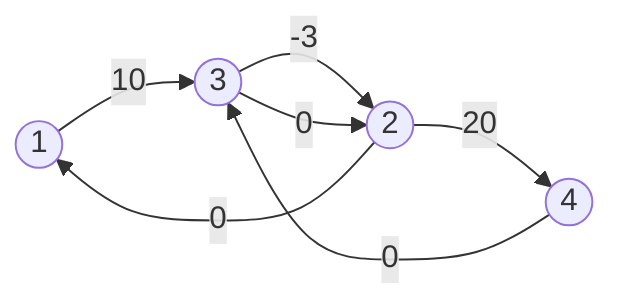

[[TOC]]

## 形式化题目

给定 $N$ 个实数变量 $x_1, x_2, \dots, x_N$，满足以下三种不等式约束：

1. **顺序约束**：对于所有 $1 \le i < N$，满足 $x_i \le x_{i+1}$；
2. **上限约束**：给出 $M_L$ 条限制，每条指定两个变量 $A, B$（不妨设 $A < B$），满足 $x_B - x_A \le D$；
3. **下限约束**：给出 $M_D$ 条限制，每条指定两个变量 $A, B$（不妨设 $A < B$），满足 $x_B - x_A \ge D$。

求：
- 若该不等式系统无可行解，输出 `-1`；
- 若在满足所有约束的情况下，$x_N - x_1$ 可以任意大，输出 `-2`；
- 否则输出 $x_N - x_1$ 的最大可能值。

## 正解

### 思路

本题求变量差值的最大值，且所有约束均为形如 $x_v - x_u \le w$ 的两元一次差分不等式，这是标准的**差分约束系统**。

#### 1. 建图转换

在单源最短路中，三角形不等式为：
$$dist[v] \le dist[u] + w$$

变形后即为：
$$dist[v] - dist[u] \le w$$

因此，每个不等式 $x_v - x_u \le w$ 都可以转化为一条从节点 $u$ 指向节点 $v$、权值为 $w$ 的有向边：

1. **顺序约束**：$x_i \le x_{i+1} \iff x_i - x_{i+1} \le 0$，从节点 $i+1$ 向节点 $i$ 连一条边权为 $0$ 的边。
2. **好感限制**：$x_B - x_A \le D$（保证 $A < B$），从节点 $A$ 向节点 $B$ 连一条边权为 $D$ 的边。
3. **反感限制**：$x_B - x_A \ge D \iff x_A - x_B \le -D$（保证 $A < B$），从节点 $B$ 向节点 $A$ 连一条边权为 $-D$ 的边。

#### 2. 两阶段 SPFA 判定与求解

因为图可能存在多个不连通的分量，且 $1$ 号节点不一定能到达所有节点，需要分为两个阶段处理：

- **第一阶段（全局负环检测）**：
  若整个不等式组中存在相互矛盾（即图中存在负权环），则无解。
  为了检测整张图中是否存在负权环，引入超级源点（或初始化时将所有节点 $1 \sim N$ 的初始距离设为 $0$ 并全部推入队列），运行一次 SPFA。若有任意节点入队次数达到 $N$，说明存在负权环，直接输出 `-1`。

- **第二阶段（求最大距离）**：
  在排除负环后，以 $1$ 号节点为单源起点（令 $dist[1] = 0$，其余为 $+\infty$）运行 SPFA。
  - 若 $dist[N] = +\infty$，说明从 $1$ 出发无法到达 $N$，$x_N - x_1$ 不受任何上界路径约束，可以任意大，输出 `-2`；
  - 否则，$dist[N]$ 就是在满足所有约束条件下 $x_N - x_1$ 的最大值，输出 $dist[N]$。

### 代码

Python 版：

@include-code(./main.py, python)

C++ 版（同一算法）：

@include-code(./main.cpp, cpp)

### 复杂度

- **时间复杂度**：图中有 $V = N \le 1000$ 个节点，$E = (N - 1) + M_L + M_D \le 21000$ 条边。SPFA 的平均运行时间为 $O(kE)$（$k$ 为常数），最坏情况下为 $O(VE)$。在本题数据规模下运行耗时通常在 20ms 以内，远低于时限要求。
- **空间复杂度**：存储邻接表、距离数组和队列状态需要 $O(V + E)$ 的额外空间，内存开销在数兆字节级别。

## 总结

差分约束的核心在于统一不等式方向：
- 求变量差的最大值时，统一转化为 $x_v - x_u \le w$ 的形式建图求最短路；
- 判断系统整体可行性时，必须做全局负环检测（全点初始入队）；在系统有解的前提下，再以指定点为单源起点求最短路。

## 图示解析

以样例输入为例：
- $N=4, M_L=2, M_D=1$
- 好感约束：$x_3 - x_1 \le 10$，$x_4 - x_2 \le 20$
- 反感约束：$x_3 - x_2 \ge 3 \implies x_2 - x_3 \le -3$
- 顺序约束：$x_1 - x_2 \le 0$，$x_2 - x_3 \le 0$，$x_3 - x_4 \le 0$

建图后各节点之间的边权关系如下图所示：

计算最短路时：
- 从 $1$ 到 $3$ 最短路径为 $1 \xrightarrow{10} 3$，距离为 $10$；
- 从 $3$ 到 $2$ 边权为 $-3$，故 $1$ 到 $2$ 的最短路为 $10 + (-3) = 7$；
- 从 $2$ 到 $4$ 边权为 $20$，故 $1$ 到 $4$ 的最短路为 $7 + 20 = 27$。
- 因此 $x_4 - x_1$ 的最大可能值为 $27$。
