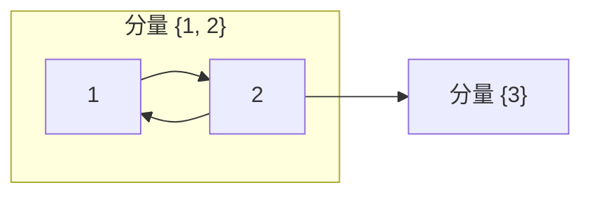
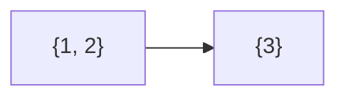

[[TOC]]

## 形式化题目

给定 $N$ 个点、$M$ 条有向边的图（$1 \leqslant N \leqslant 10^4$，$1 \leqslant M \leqslant 5 \times 10^4$，边可重复），边 $A \to B$ 表示「牛 A 认为牛 B 受欢迎」，可达性按有向路径传递。

求有多少个点 $v$ 满足：**其余每个点 $u \neq v$ 都有 $u \to^* v$ 的有向路径**（即 $v$ 被除自己外的所有牛认可）。

#### 样例说明

样例输入的边为 $1 \to 2$、$2 \to 1$、$2 \to 3$。下图标出分组：$1$ 与 $2$ 互相可达，同属一个强连通分量；$3$ 单独一个分量。

$1$ 沿 $1 \to 2 \to 3$ 认为 $3$ 受欢迎，$2$ 沿 $2 \to 3$ 认为 $3$ 受欢迎，所以 $3$ 被 $1$、$2$ 认可；反过来 $3$ 没有出边，不认为 $1$、$2$ 受欢迎，故 $1$、$2$ 都不满足「被除自己外所有牛认可」。答案为 $1$，即第 $3$ 头牛。

## 正解

### 思路

**朴素做法与瓶颈。** 对每个点 $v$ 单独判断「所有点是否都能到达 $v$」（如从每个点各 BFS 一遍），需要 $O(N(N+M))$ 时间与 $O(N^2)$ 的可达性记录；$N = 10^4$ 时 $N^2 = 10^8$，时间和空间都不可接受。瓶颈在于把大量结构相同的点当成独立个体逐个查询。

**关键观察：互相可达是等价关系。** 若 $u$ 与 $v$ 互相可达，则对任意 $w$，$w$ 能到达 $u$ 当且仅当 $w$ 能到达 $v$（一个方向的路径可以接上环换到另一个点）。因此「被谁可达」的信息在整个强连通分量（SCC）内完全一致，可以把每个 SCC 缩成一个点——缩点后的图一定是 DAG（若缩点后仍有环，环上各点应属同一个 SCC）。

**汇点判定。** 在缩点 DAG 中，一个分量被全体可达 $\iff$ 它是**唯一出度为 $0$ 的汇点**：

- 若汇点唯一：从任意分量沿出边前进，DAG 无环必然终止，只能终止在该汇点，即所有分量都能到达它；
- 若存在第二个汇点 $C'$：两个汇点之间没有路径，原汇点不被 $C'$ 可达，答案为 $0$。

缩点后所有点在一个分量内互达，所以**答案 = 唯一汇点分量的大小**（汇点不唯一则为 $0$）。下图是样例缩点后的 DAG，唯一汇点是分量 $\{3\}$：

**求 SCC 用 Kosaraju 两遍 DFS。** 第一遍在原图上求后序序列；第二遍按逆后序在**反图**上 DFS，每次从反图能走到的点集恰为一个 SCC。$N = 10^4$ 若用递归 DFS 有爆栈风险，因此用显式栈把两遍 DFS 都写成迭代：栈元素为「当前点 + 已走到第几条出边」，走完一个点的全部出边才记入后序。

最后扫一遍边：`comp[u] != comp[v]` 即缩点图上有边，记下这些分量；全体分量编号减去它们就是汇点集合，大小为 $1$ 时统计该分量的点数。

### 代码

@include-code(./main.py, python)

### 复杂度

- **时间** $O(N + M)$：两遍 DFS 各访问每点每边常数次，出度统计再扫 $M$ 条边。与 C++ 正解（Kosaraju / Tarjan）同阶。
- **空间** $O(N + M)$：正图、反图邻接表与若干 $O(N)$ 数组。

## 总结

「被全员认可的点」是传递闭包查询，逐点求可达性是 $O(N^2)$ 瓶颈；利用互相可达的等价性把图缩成 DAG 后，问题坍缩成一个常数级判定——**唯一出度为 $0$ 的汇点是否存在，存在则答案为其分量大小**。整题即「Kosaraju 缩点 + 汇点计数」，$O(N + M)$ 一步到位。

验证：仓库真实数据 `data/popular1..13` 全部 PASS（`verify.sh`，13/13，最长 0.034s / 峰值 25.1MB）。
