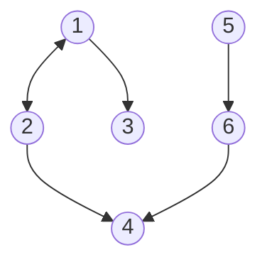
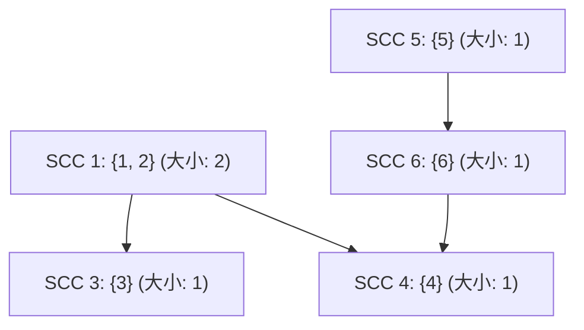

[[TOC]]

## 形式化题目

给定一个包含 $N$ 个节点、$M$ 条有向边的有向图 $G = (V, E)$，以及模数 $X$。

定义：
1. **半连通图**：若有向图满足对任意节点对 $u, v \in V$，至少存在一条 $u \to v$ 或 $v \to u$ 的有向路径，则称该图是半连通的。
2. **半连通导出子图**：选出点集 $V' \subseteq V$ 构成的导出子图 $G[V']$，若 $G[V']$ 是半连通的，则称其为半连通子图。

计算任务：
1. 求最大半连通导出子图包含的最大节点数 $K$；
2. 求节点数等于 $K$ 的不同最大半连通导出子图的数量 $C \pmod X$。

---

## 样例说明与图示

以样例为例：
```
6 6 20070603
1 2
2 1
1 3
2 4
5 6
6 4
```

原图的结构如下：



分析原图中的连通性：
- 节点 $1$ 与节点 $2$ 互相可达，构成一个大小为 $2$ 的强连通分量 (SCC)。
- 其余节点 $\{3\}, \{4\}, \{5\}, \{6\}$ 各自构成大小为 $1$ 的强连通分量。

将各强连通分量缩点后的 DAG 结构如下（括号内为分量包含的原图节点数）：



寻找包含最多原图节点数的半连通子图，即寻找 DAG 上点权和最大的路径：
1. 路径 `SCC 1 -> SCC 3`：包含原图点 $\{1, 2, 3\}$，点数为 $2 + 1 = 3$。
2. 路径 `SCC 1 -> SCC 4`：包含原图点 $\{1, 2, 4\}$，点数为 $2 + 1 = 3$。
3. 路径 `SCC 5 -> SCC 6 -> SCC 4`：包含原图点 $\{5, 6, 4\}$，点数为 $1 + 1 + 1 = 3$。

因此，最大半连通子图的点数为 $3$，方案共有 $3$ 种，输出 `3` 和 `3`。

---

## 解法：Tarjan 缩点 + DAG 拓扑排序 DP

### 思路

#### 1. 强连通分量 (SCC) 的性质
在同一个强连通分量中，任意两个节点之间都双向可达。因此，同一个强连通分量内部天然满足半连通性质。
若某个半连通导出子图包含了某个强连通分量内的某一个点，那么将该分量内的所有其余点也加入该子图，子图仍然保持半连通：
- 对于该分量内部的点，互相有路径。
- 对于外部点，若已有路径连接该分量的某个点，则通过分量内部的双向连通性，也可通达该分量内的所有点。

为了让子图包含的节点数最大，**同一个强连通分量中的节点在最大半连通子图中必然“要么全选，要么全不选”**。

#### 2. DAG 上的半连通性等价于“链”
利用 Tarjan 算法将原图中的强连通分量缩点，得到一个有向无环图 (DAG)，每个新节点的权值为对应强连通分量的节点数。

在 DAG 中，若选出一组节点 $V'_{scc}$ 构成半连通导出子图：
- 任意两点 $u, v \in V'_{scc}$ 必须有一方能够到达另一方；
- 在无环的有向图中，这意味着选出的所有点在拓扑序上必须构成一条严格前趋后继的单向路径（即简单链 $u_1 \to u_2 \to \dots \to u_k$）。
- 若存在两个选出的节点没有路径可达，则不符合半连通要求。

因此，**原图的最大半连通子图与缩点后 DAG 上的“最大点权路径（最长链）”一一对应**！

#### 3. 边的去重与拓扑 DP
在原图中，可能有多个跨分量的边连接相同的两个 SCC，缩点后会产生重边与自环。
- 自环无需保留；
- 重边如果保留，在拓扑 DP 累加路径方案数时会导致同一条转移路径被重复计数，因此**必须对缩点后的边去重**。

去重后，在 DAG 上通过拓扑排序进行动态规划：
- 设 $dp\_len[u]$ 表示以 DAG 节点 $u$ 结尾的最长链点权和；
- 设 $dp\_cnt[u]$ 表示以 $u$ 结尾、且点权和达到 $dp\_len[u]$ 的链方案数。

状态初始化：
- 对于所有入度为 $0$ 的节点 $u$：
  $$dp\_len[u] = scc\_size[u],\quad dp\_cnt[u] = 1$$

状态转移：
对于每条 DAG 有向边 $u \to v$：
- 若 $dp\_len[u] + scc\_size[v] > dp\_len[v]$：
  $$dp\_len[v] = dp\_len[u] + scc\_size[v],\quad dp\_cnt[v] = dp\_cnt[u]$$
- 若 $dp\_len[u] + scc\_size[v] == dp\_len[v]$：
  $$dp\_cnt[v] = (dp\_cnt[v] + dp\_cnt[u]) \pmod X$$

遍历完成后，全图最大点数 $K = \max_{u} dp\_len[u]$；最大点数的方案总数 $C = \sum_{dp\_len[u] = K} dp\_cnt[u] \pmod X$。

### 代码

@include-code(./main.py, python)

### 复杂度

- **时间复杂度**：$O(N + M \log M)$。Tarjan 缩点遍历全图所有点和边需 $O(N + M)$ 时间；对缩点后的边进行排序去重需 $O(M \log M)$；DAG 拓扑排序及 DP 遍历每个点与去重后的边需 $O(N + M)$。总时间可在 1 秒内高效完成。
- **空间复杂度**：$O(N + M)$。需要存储原图和 DAG 的邻接表、Tarjan 显式栈、时间戳数组以及 DP 状态数组。

---

## 总结

1. **模型转化**：通过对图的连通性分析，发现强连通分量内的节点具有“全选或全不选”的属性，从而将有向图问题通过 Tarjan 缩点转化为 DAG 问题。
2. **结构等价**：利用有向无环图的拓扑偏序特性，将半连通性约束自然规约为 DAG 上的“一条简单路径”，将复杂子图选择问题转化为经典的最长路问题。
3. **细节严谨**：统计路径方案数时，缩点后产生的重边会干扰计数，必须预先进行边去重以避免重复累计方案。
