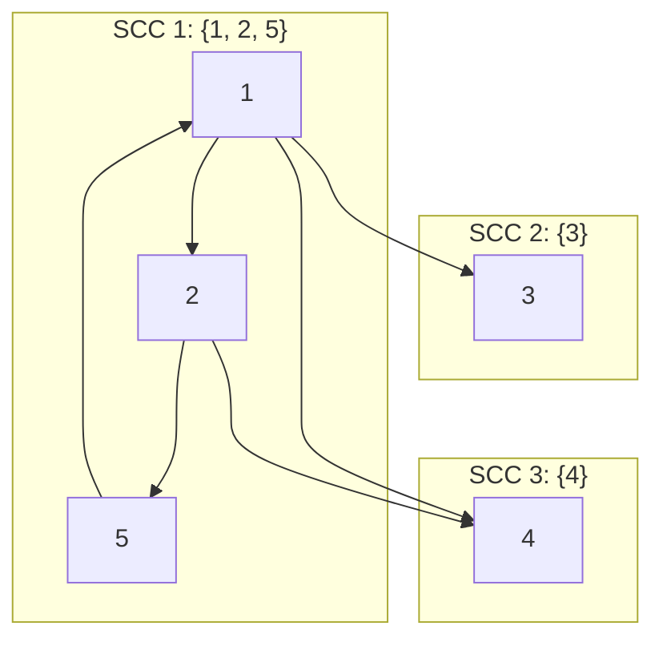
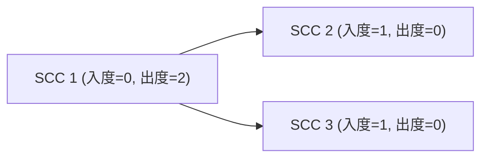

[[TOC]]

## 形式化题目

给定一个包含 $n$ 个顶点的有向图 $G = (V, E)$。求：
1. **任务 A**：选取最少的起点集合 $S \subseteq V$，使得从 $S$ 出发能够遍历全图所有顶点。
2. **任务 B**：最少添加多少条有向边，使得整张图变成强连通图（任意两点之间互相可达）。

## 正解

### 思路

#### 1. 强连通分量与 DAG 缩点
在有向图中，如果一组顶点两两互相可达，则它们构成一个**强连通分量（SCC）**。显然：
- 如果一个强连通分量内的某个节点获得了软件，那么该分量内的所有节点都可以通过内部路径获得软件。
- 如果新加的边连向分量内的任意一个节点，整个分量都能联通。

因此，我们可以利用 **Tarjan 算法** 找出所有的强连通分量，并将每个分量缩成一个超级节点，原本跨分量的边保留，得到一个**有向无环图（DAG）**。

#### 2. 任务 A：最少分发软件数
在缩点后的 DAG 中：
- 如果一个节点的入度为 $0$（称作起点分量/源点），没有任何其他节点能够到达它。因此，必须至少给每个入度为 $0$ 的分量中的某一个学校直接提供软件。
- 只要给所有入度为 $0$ 的分量分发软件，由于 DAG 中任意非零入度的节点都可以由某个入度为 $0$ 的节点顺着有向边到达，全图所有学校就都能获得软件。

因此，**任务 A 的答案即为缩点后 DAG 中入度为 $0$ 的强连通分量个数**。

#### 3. 任务 B：使图强连通最少添加的边数
设缩点后的强连通分量总数为 $scc\_cnt$：
- **特判**：如果 $scc\_cnt = 1$，说明原图本身已经是强连通图，无需添加任何边，答案为 $0$。
- **一般情况**：设入度为 $0$ 的分量数为 $P$，出度为 $0$ 的分量数为 $Q$。
  - 每个出度为 $0$ 的分量（汇点）都必须连出至少一条边，否则它无法到达其他分量；
  - 每个入度为 $0$ 的分量（源点）都必须有至少一条边连入，否则其他分量无法到达它。
  - 要将 DAG 变成强连通图，我们应当尽量将出度为 $0$ 的汇点连向入度为 $0$ 的源点，形成一个大的环流。每次添加一条从出度为 $0$ 连向入度为 $0$ 的边，可以同时解决一个出度为 $0$ 和一个入度为 $0$ 的需求。
  - 剩余未配对的孤立入度或出度分量，分别再各连一条边，即可使得整个图强连通。
  - 因此，最少需要添加的边数为 $\max(P, Q)$。

### 代码

@include-code(./main.py, python)

### 复杂度

- **时间复杂度**：$\mathcal{O}(n + m)$。Tarjan 算法对图遍历一次的时间为 $\mathcal{O}(n + m)$，统计缩点后入度和出度的时间为 $\mathcal{O}(n + m)$。由于 $n \le 100$，$m \le n(n - 1) \le 10^4$，可以在毫秒级完成。
- **空间复杂度**：$\mathcal{O}(n + m)$。邻接表、Tarjan 栈、DFS 深度数组以及缩点度数数组的开销均为 $\mathcal{O}(n + m)$。

## 总结

本题是典型的有向图强连通分量缩点应用题。通过 Tarjan 算法将原图的有向环收缩为单点，将原图转化为结构简单的有向无环图（DAG）。任务 A 本质是 DAG 的源点计数；任务 B 本质是将 DAG 转化为强连通图的最小加边问题，其关键结论是当分量数大于 1 时，答案为源点数与汇点数的较大值 $\max(P, Q)$。

## 图示解析

以样例输入为例：
- 学校 $1$ 支援 $2, 4, 3$；学校 $2$ 支援 $4, 5$；学校 $3$ 无支援；学校 $4$ 无支援；学校 $5$ 支援 $1$。
- 顶点 $1, 2, 5$ 构成一个环：$1 \to 2 \to 5 \to 1$，属于同一个强连通分量 $S_1 = \{1, 2, 5\}$。
- 顶点 $3$ 和顶点 $4$ 分别独立，各自构成强连通分量 $S_2 = \{3\}$ 和 $S_3 = \{4\}$。

缩点后的 DAG 结构如下：

- 入度为 0 的分量集合：$\{S_1\}$，共 $1$ 个，任务 A 答案为 $1$。
- 出度为 0 的分量集合：$\{S_2, S_3\}$，共 $2$ 个。
- 任务 B 答案为 $\max(1, 2) = 2$。添加边 $3 \to 1$ 和 $4 \to 1$ 即可使全图强连通。
