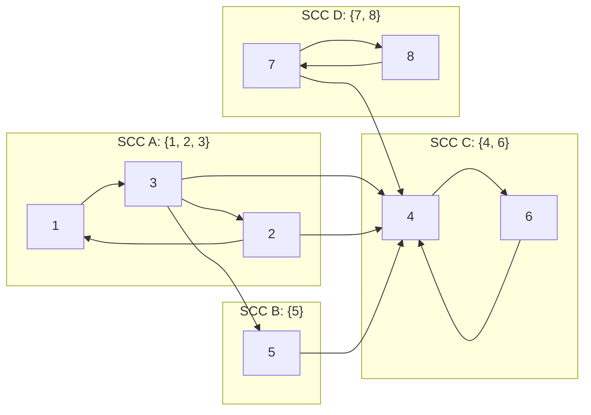
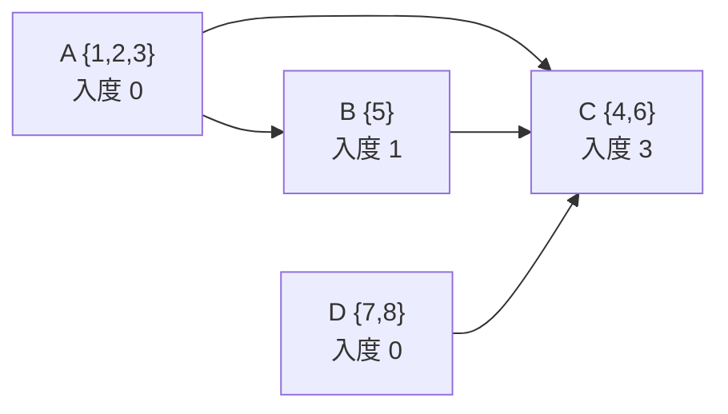

[[TOC]]

## 形式化题目

给定 $n$ 个点的有向图 $G=(V,E)$（$C_{i,j}=1$ 表示存在有向边 $i \to j$），求最小的起点集合 $S \subseteq V$，使得从 $S$ 出发沿有向边可达的点覆盖全部 $n$ 个点，输出 $|S|$。

样例中 8 个点的传递关系为：$1 \to 3$，$2 \to 1,\ 2 \to 4$，$3 \to 2,\ 3 \to 4,\ 3 \to 5$，$4 \to 6$，$5 \to 4$，$6 \to 4$，$7 \to 4,\ 7 \to 8$，$8 \to 7$，输出 $2$。

## 正解

### 思路

**朴素想法**：逐点 BFS 求单点可达集，再贪心选覆盖最多的点、删掉已覆盖点反复进行。这既没有利用图的结构，贪心本身也不保证最优——问题的正确粒度根本不是"点"。

**关键观察：互相可达的点是不可分割的传播单元。** 若 $u$ 与 $v$ 互相可达，传给其中一个，另一个必然收到；所以把每个**强连通分量（SCC）**收缩成一个超级点、保留跨分量的边，得到的**缩点 DAG**（凝聚图无环）才是应该处理的对象，且这种缩点不改变可达关系、不改变最优解。

缩点之后问题退化为 DAG 上的平凡计数：

- **必要性**：入度为 0 的分量没有任何分量能到达它，不在其中放起点，该分量内的点永远收不到消息——每个源点分量至少放一个起点。
- **充分性**：对任意分量 $T$，若 $T$ 不是源点，沿入边不断逆推 $T \to T_1 \to T_2 \to \cdots$；DAG 无环，这条链必在有限步后停在某个源点 $S$。起点放在 $S$，消息顺着缩点路径就能传到 $T$。因此只选源点足以覆盖全图。

上下界相等，**答案 = 缩点 DAG 中入度为 0 的强连通分量个数**。缩点用经典 Kosaraju 算法：第一遍在正图上按后序（离开时间）记录所有点，第二遍在反图上按后序**倒序**起跑 DFS，每棵 DFS 树恰好是一个 SCC。下图是本题"缩点 + 数源点"的整体流程：

两遍 DFS 都写成显式栈（记录"当前点还有第几条边没走"），$n=1000$ 的链状深图也不会触顶 Python 递归深度限制。

### 代码

`solve()` 读矩阵同时建正/反邻接表；`post_order` / `assign_components` 分别对应 Kosaraju 的两遍 DFS；最后的双重循环只统计**跨分量**边（$comp[u]=comp[v]$ 的分量内边与自环不产生 DAG 入度）。

@include-code(./main.py, python)

### 复杂度

- **时间复杂度**：$O(n^2)$。读入矩阵本身是 $\Theta(n^2)$；建表、两遍 DFS、扫边统计各 $O(n+m)$，$m \leqslant n^2 = 10^6$，与 C++ 正解同阶。
- **空间复杂度**：$O(n^2)$。正反两张邻接表最坏共 $2m$ 个下标；实测最大测例（$n=1000$）峰值 57.5 MB，低于 128 MB 限制。

## 总结

本题是"最少起点使全图可达"的标准结论题：**处理单位是强连通分量而不是点**。互相可达的点在传播意义上等价，缩点成 DAG 后，必要性（源点进不来）与充分性（非源点沿入边逆推必达源点）夹逼出唯一答案——缩点后入度为 0 的分量个数。实现上用 Kosaraju 两遍迭代 DFS 找 SCC，再扫一遍跨分量边计数即可；注意分量内部的边（含自环）不能计入度。实测 10 组真实数据全部一致，最大测例 0.092 s / 57.5 MB，相对 1000 ms / 128 MB 限制十分宽裕。

## 图示解析

先看样例原图的 SCC 划分：$1 \to 3 \to 2 \to 1$ 构成环，$7 \to 8 \to 7$ 构成环，$4 \leftrightarrow 6$（经 $4 \to 6$、$6 \to 4$ 互达），$5$ 单独成点。因此 8 个点缩成 4 个分量：

缩点后的 DAG 与入度如下（注意 $4 \to 6$ 是 SCC C 的内部边，不出现在 DAG 中）：

观察重点：入度为 0 的分量只有 A 和 D，所以答案为 $2$——告诉 $\{1,2,3\}$ 中任意一人、$\{7,8\}$ 中任意一人即可传遍全图；B、C 都能沿 $A \to B \to C$、$A \to C$、$D \to C$ 的路径被覆盖，无需再传。这与样例输出 $2$ 一致。
