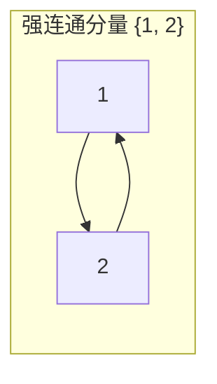
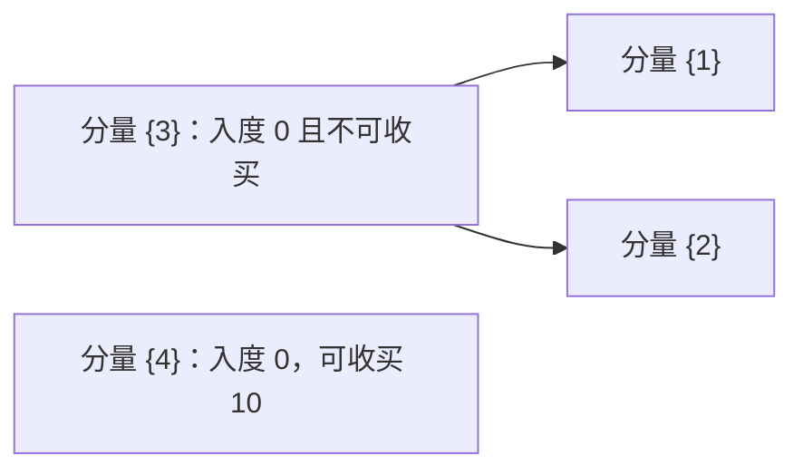

[[TOC]]

## 形式化题目

给定 $n$ 个点的有向图，边 $A \to B$ 表示逮捕 $A$ 后获得其情报、可继续逮捕 $B$，控制沿有向路径传递。其中 $p$ 个点各带一个非负收买金额，收买等价于把该点作为零成本的初始入口。

求费用最小的收买集合，使其出发沿有向边可达全部点；若不存在这样的集合，输出**任何收买方案都到达不了的点中编号最小者**。

#### 样例说明

样例的边为 $1 \to 2$、$2 \to 1$，只有间谍 2 可收买（金额 512）。下图按互相可达关系分组：$1$ 与 $2$ 同属一个强连通分量。

两个点互相可达，控制其中一个即控制另一个；分量内唯一的可收买者是 2，收买他即控制全场，故输出 `YES / 512`。

## 正解

### 思路

**朴素做法与瓶颈。** 直观做法是把"控制"当传递闭包算：从每个可收买点各 BFS 一遍（或用 Floyd 求可达矩阵），统计能到达的点。而"哪些点必须自己收买"想在**原图**上用入度判断——入度为 0 的点没人能到达，只能买。这里有两个瓶颈：① 环会让入度判断**概念性失效**：互相指向的环上每点都有入边，看起来"会被别人控制"，实际环外无人能到时，环内一个都控制不了；② 可达性记录需要 $O(n^2)$ 空间，$n = 3000$ 时约 $9 \times 10^6$ 项，Python 下不可接受。

**缩点：把环压成点。** 互相可达是等价关系：若 $u \leftrightarrow v$，则任意 $w$ 能到达 $u$ 当且仅当能到达 $v$。因此"能否被控制"在强连通分量内完全一致，把每个 SCC 缩成一个点后得到 DAG（若缩点后仍有环，环上各点本应属同一分量）。收买分量内任一成员即可控制全分量，所以每个分量只需回答两件事：**分量内最低可收买金额**是多少、**缩点后入度**是否为 $0$。

**源点判定与最优花费。** 缩点 DAG 中入度为 $0$ 的分量没有任何外界能到达，要控制它只能收买其内部成员——**源点必须买**；另一方面，DAG 中任一分量沿入边逆推必然终止在某个源点分量，所以**买齐所有源点分量即可覆盖全图**，不多不少。于是：

- 有解 $\iff$ 每个源点分量内至少有一个可收买者；
- 最小花费 $=$ 各源点分量最低价之和（源点一个不能少，非源点全被覆盖，无需多买）。

样例缩点后只有分量 $\{1, 2}$ 这一个源点，最低价 512，即答案。

**无解输出的坑。** `NO` 的答案是"任何方案都控制不到的点"的最小编号。死源点（入度 0 且不可收买）的成员一定不可控，但**死源点下游、且不被任何可收买分量到达的点同样不可控，编号可能更小**。正确做法：从**所有含可收买者的分量**出发在 DAG 上做可达性标记——收买者只能买可收买分量内的点，任一方案的控制范围都不超过这个并集，而买下全部可收买分量恰好达到它——未被标记的分量即全不可控集，取 `min(分量内最小编号)`。下图是无解的最小例子：可收买者只有 4，分量 $\{3\}$ 是死源点，点 1、2 只被 $\{3\}$ 可达，点 4 只控制自己：

不可控集是 $\{1, 2, 3\}$，答案为 $1$——若只取死源点 $\{3\}$ 的成员会误答 $3$。存在死源点时这个补集必非空，补集为空时所有源点又都能被收买，所以代码直接用**补集是否为空**判定有解，两个条件是等价的。

**实现要点。** $n = 3000$ 超过 Python 默认递归上限，Tarjan 用显式栈写成迭代：栈元素为「当前点 + 下一条待走的边」，一个点的全部出边走完才判根弹分量。读入用单一整数迭代器，边表只扫两遍（建缩点图 + 建入度）。

### 代码

@include-code(./main.py, python)

### 复杂度

- **时间** $O(n + r)$：Tarjan 每点每边访问常数次，建缩点图与入度、可达性标记各扫一遍边表。与 C++ 正解（Kosaraju / Tarjan 缩点）同阶。
- **空间** $O(n + r)$：邻接表与缩点图各一份，加上若干 $O(n)$ 数组和显式栈。

## 总结

"收买 → 可达"的控制传播天然是有向图问题；互相指向的环使原图入度失效，而互相可达的等价性恰好允许把图缩成 DAG。缩点后答案坍缩成两句话：**源点必须买、买齐即全控，有解时花费就是各源点最低价之和**；无解时输出从可收买分量出发不可达的最小编号（注意包含死源点下游）。整题即「Tarjan 缩点 + 源点贪心 + 可达性标记」，$O(n + r)$ 一步到位。

验证：题面样例输出 `YES / 512`；仓库真实数据 `data/net1..12` 全部 PASS（`verify.sh`，12/12，单测例 ≤ 0.05s、峰值 ≤ 20MB，远低于 1000ms / 128MB），含 7 组 `NO` 用例。
