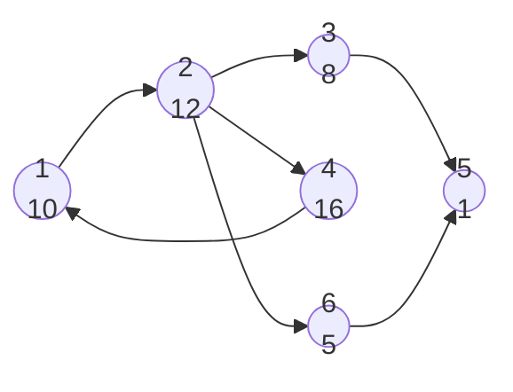
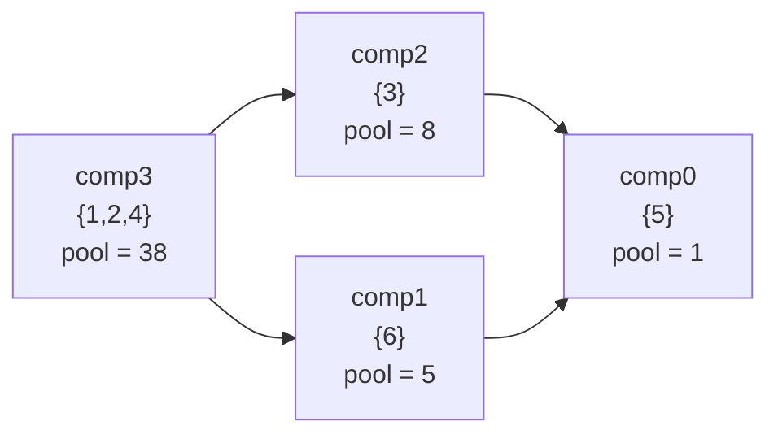

[[TOC]]

## 形式化题目

给定一张 $N$ 个点、$M$ 条边的有向图，每个点 $v$ 有权值 $w_v \geqslant 0$。
给定起点 $S$ 和酒吧集合 $B$。

Banditji 从 $S$ 出发沿有向边行走，可以重复经过任意点与边，最终停在 $B$ 中的某个点。
每经过一个点可以获得它的权值，但**同一点的权值只能获得一次**。
求这条行走路线能获得的最大权值和：

$$\max_{P} \sum_{v \in P} w_v ,$$

其中 $P$ 取遍所有"从 $S$ 可达、且终点属于 $B$"的点集。

### 样例

题面样例的图如下（节点编号写在圆圈内，权值写在节点下方）：

$S = 1$，酒吧为 $\{4, 3, 5, 6\}$（除去路口 1、2 之外全是酒吧）。
题面给出的最优路线是 $1 - 2 - 4 - 1 - 2 - 3 - 5$，经过的**不同**路口是
$\{1, 2, 4, 3, 5\}$，收益 $10 + 12 + 16 + 8 + 1 = 47$。

这条路线把 $1 \to 2 \to 4 \to 1$ 这个环完整走了一遍——这正是本题的突破口：
**环上的点可以全部拿到**。

---

## 正解

### 思路

#### 朴素想法的困境

最直接的思路是枚举从 $S$ 出发、终点在 $B$ 中的所有路径，比较点权和。
但题目允许重复经过路口，图里一旦有环，路径长度就没有上界，枚举无从谈起。
更本质地看，"抢过的 ATM 不再出钱"意味着收益只取决于**路过的点集**，与顺序无关，
所以应该换一个视角：不是选路径，而是选点集。

#### 关键观察：强连通分量内部可以全部扫空

设 $u, v$ 属于同一个强连通分量（SCC）。按定义 $u$ 可达 $v$、$v$ 也可达 $u$，
所以只要走进这个分量，就能依次拜访分量内的每一个点再从容离开。
金额非负，多拿不会变差，于是每个分量的贡献恰好是分量内权值之和：

$$\text{pool}[c] = \sum_{v \in c} w_v .$$

这一步消掉了唯一的自由度——"分量内部怎么走"不再是一个需要决策的问题。

#### 缩点，把问题变成 DAG 最长路

把每个 SCC 收缩成一个新点，跨分量的边保留。缩点后的图一定是 DAG：
若仍有环 $c_1 \to c_2 \to \dots \to c_1$，环上所有分量本就互相可达，
按定义它们应该被合并成同一个 SCC。

于是原问题严格等价于：在缩点 DAG 上，从 $\text{comp}[S]$ 出发走到某个
$\text{has\_bar}[c] = 1$ 的分量，最大化路径上的权和。

样例缩点后得到 4 个分量（括号内为权和）：

缩点前 6 个点、3 条跨分量边，缩点后只剩 4 个点。注意 $\{1,2,4\}$ 合成了一个点，
它贡献 38 分，是答案的主要来源。

#### DP 转移

在 DAG 上做最长路，转移为

$$dp[c] = \text{pool}[c] + \max\bigl(\{dp[u] : u \to c,\ u \ne c\}\bigr),$$

初值 $dp[\text{comp}[S]] = \text{pool}[\text{comp}[S]]$，其余为不可达 $-\infty$；
答案取所有酒吧分量的 $dp$ 最大值。

因为权值非负，我们已经把"能到的分量全都拿"内建进了 $\text{pool}$，DP 只需要处理
分量之间的连接顺序。

| 处理顺序 | 当前分量的 $dp$ | 松弛后 $dp[\text{comp0}]$ | $dp[\text{comp1}]$ | $dp[\text{comp2}]$ | $dp[\text{comp3}]$ |
| :---: | :---: | :---: | :---: | :---: | :---: |
| 初始 | — | $-\infty$ | $-\infty$ | $-\infty$ | $38$ |
| $c = 3$ | $38$ | $-\infty$ | $38+5=43$ | $38+8=46$ | $38$ |
| $c = 2$ | $46$ | $46+1=47$ | $43$ | $46$ | $38$ |
| $c = 1$ | $43$ | $43+1=44 < 47$，不变 | $43$ | $46$ | $38$ |
| $c = 0$ | $47$ | $47$ | $43$ | $46$ | $38$ |

表中每行是"处理完编号为 $c$ 的分量"之后的 $dp$ 状态，列是各分量的 $dp$ 值。
四个分量都是酒吧（样例中 $4,3,5,6$ 全是酒吧），最终答案取 $\max = 47$，
与题面一致。可以看到 $c=3$ 处理时同时向 comp1、comp2 两条分支松弛，
而 comp0 被两条路径分别更新过（$43+1 = 44$ 与 $46+1 = 47$），DP 保留了较大的那个。

#### 一个实现上的便利：Tarjan 的编号自带拓扑序

不必真的把缩点图建出来再拓扑排序。Tarjan 是在**子树全部处理完**之后才弹出分量并
给它编号的，因此后继分量一定先拿到更小的编号：

$$\text{边上 } u \to v \text{ 且 } \text{comp}[u] \ne \text{comp}[v] \implies \text{comp}[u] > \text{comp}[v].$$

所以让 $c$ 从 $C-1$ 递减扫到 $0$，天然就是拓扑序，省掉了一整轮拓扑排序和建图。
分量内部的边（$\text{comp}[u] = \text{comp}[v]$）直接跳过，不参与松弛。

#### 其余实现要点

- **迭代 DFS**：$N$ 可达 50 万，递归 Tarjan 会爆栈，用显式 `work` 栈模拟；
- **保护邻接表**：Tarjan 需要"下一条待处理边"的游标，用 `head` 的副本承载，
  DP 阶段还要用完整的 `head` 再扫一遍出边；
- **分桶遍历分量成员**：DP 要按分量编号顺序访问分量内的点，用计数排序分桶做到 $O(N)$；
- **64 位**：分量权和最大约 $2 \times 10^9$，超出 32 位，`dp` 用 `array('q')`。

### 代码

@include-code(./main.py, python)

`tarjan_scc()` 用人工栈实现 Tarjan，`cur` 是 `head` 的副本，承载"每个点下一条未处理
出边"的游标，因此调用方的 `head` 不会被破坏。`solve()` 读入后依次做：缩点聚合
`pool`/`has_bar`、计数排序分桶、按 `range(ncomp - 1, -1, -1)` 的降序做 DP。
`NEG = -(1 << 60)` 是不可达哨兵，用来把"没走到过的分量"与"收益为 0"区分开。

### 复杂度

- **时间**：Tarjan $O(N + M)$；缩点聚合 $O(N)$；分桶 $O(N + C)$；
  DP 阶段每个点、每条出边各扫一次 $O(N + M)$。总计 $O(N + M)$ 线性。
- **空间**：邻接表与各辅助数组均为 $O(N + M)$，以 `array`/`bytearray` 存放。
  本地实测最大规模数据（$N = 480000$、$M = 499972$）峰值内存约 16 MB，
  远低于 128 MB 限制；单组耗时约 0.02 s，远低于 1000 ms 限制。

---

## 总结

题目允许重复走点却只计一次钱，说明收益由**点集**决定而非路径。于是沿两条线索推进：
其一，同一个强连通分量内的点必然可以全部走到，收益直接合并成 $\text{pool}[c]$；
其二，把分量缩点后图必为 DAG，问题退化成 DAG 最长路。最后利用 Tarjan 编号降序
即拓扑序这一性质，省掉显式的建图与拓扑排序，整体做到 $O(N + M)$。

核心不变量：**每个分量的收益等于其内部权值和，且一旦可达就必定全拿**（因为权值非负）。
