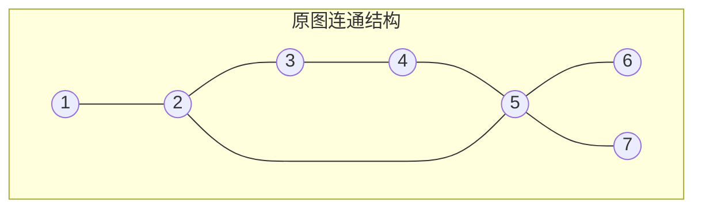
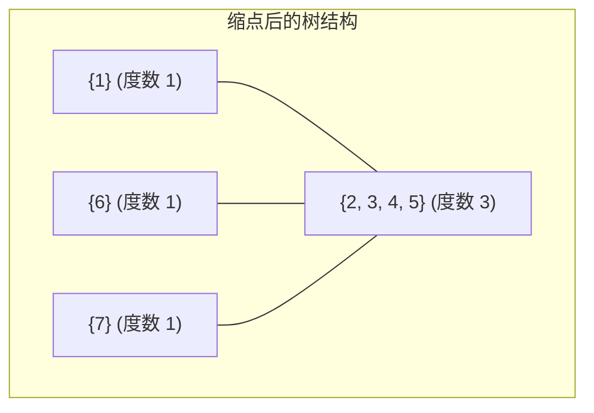

[[TOC]]

## 形式化题目

给定一个包含 $F$ 个顶点、$R$ 条边的无向连通图（可能存在重边）。

求最少添加多少条无向边，使得整张图变成**边双连通图**（即任意两点之间至少存在两条没有公共边的路径，换言之，图中不存在割边/桥）。

## 正解

### 思路

#### 1. 问题等价转化与缩点

“任意两个草场之间至少有两条边不相交的路径”在图论中等价于**整张图不存在桥（割边）**，即图是边双连通的。

原图中若已经存在一些边双连通分量（$e\text{-DCC}$），这些分量内部任意两点间已经满足存在至少两条分离路径。因此：
1. 我们可以用 Tarjan 算法找出原图所有的边双连通分量，并将每个分量**缩成一个点**。
2. 缩点后，只有原图的“桥”连接不同的双连通分量。因为原图是连通图，缩点后的新图必然是一棵**无向树**（若原图本身就是边双连通图，则缩点后只有一个点）。

#### 2. 树上最少加边问题

现在问题转化为：在一棵树上最少添加多少条边，能使其变为一个边双连通图？

- 树上的所有边都是桥。当我们在树上任意两点 $u, v$ 之间添加一条新边时，会将 $u$ 到 $v$ 的树上路径覆盖在一个简单环中，这条路径上的所有桥边都会被消除。
- 考察树上的叶子节点（度数为 $1$ 的节点）：连接叶子节点与父节点的边是桥，若没有任何新边以该叶子节点为端点，则这条边永远不可能被包含在环中。因此，**每个叶子节点必须至少作为一条新边的端点**。
- 一条新边连接两个节点，最多只能同时为两个叶子节点提供覆盖。
- 设缩点后树中度数为 $1$ 的叶子节点数量为 $L$：
  - 每条新边最多减少 $2$ 个度为 $1$ 的节点，因此至少需要 $\lceil L / 2 \rceil = \lfloor (L + 1) / 2 \rfloor$ 条新边。
  - 构造性证明表明：按 DFS 序将叶子节点排列，令前半部分叶子与后半部分叶子两两跨树根/重心相连，恰好只需 $\lceil L / 2 \rceil$ 条边即可覆盖树上的所有边。

综上，算法流程为：
1. Tarjan 算法求出所有边双连通分量，注意使用边的编号记录反向边以正确处理重边；
2. 统计缩点后各分量在新图中的度数；
3. 统计度数为 $1$ 的分量个数 $L$，答案即为 $\lfloor (L + 1) / 2 \rfloor$。

### 可视化解析

以样例输入为例：
```text
7 7
1 2
2 3
3 4
2 5
4 5
5 6
5 7
```

原图中存在环 $\{2, 3, 4, 5\}$，它们属于同一个边双连通分量。



进行边双连通分量缩点后：
- 分量 A: $\{1\}$，度数为 1（叶子）
- 分量 B: $\{2, 3, 4, 5\}$，度数为 3（内部节点）
- 分量 C: $\{6\}$，度数为 1（叶子）
- 分量 D: $\{7\}$，度数为 1（叶子）



度数为 $1$ 的叶子节点共有 $L = 3$ 个（$\{1\}, \{6\}, \{7\}$），最少需要添加的新边数为：
$$\lfloor (3 + 1) / 2 \rfloor = 2$$

样例中连接 $(1, 6)$ 与 $(4, 7)$（即分量 A 与 C、B 与 D），即可消除所有的桥。

### 代码

@include-code(./main.py, python)

### 复杂度

- **时间复杂度**：$O(F + R)$。Tarjan 算法对每个点和每条边访问常数次，缩点及度数统计遍历所有边一次，总时间复杂度与点数和边数呈线性关系。
- **空间复杂度**：$O(F + R)$。主要为邻接表、Tarjan 辅助数组（`dfn`, `low`, `dcc`）及递归调用栈的开销。

## 总结

本题是边双连通分量与树上性质结合的经典模型：
1. 要求在图中加边消除所有的桥使之边双连通，标准套路是**求出所有边双连通分量并缩点**，将原图转化为一棵树。
2. 树上加边消桥的充要下界由叶子节点决定：连接 $L$ 个叶子节点至少需要 $\lceil L / 2 \rceil$ 条边，直接统计叶子数即可得出答案。
