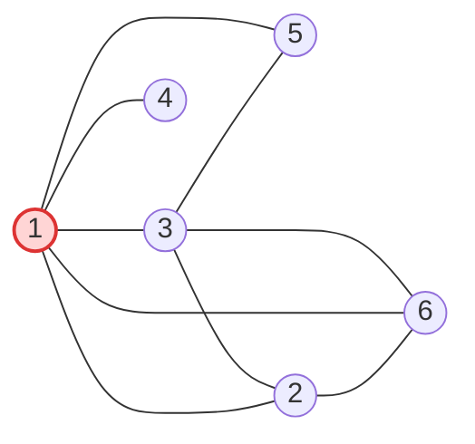

[[TOC]]

## 形式化题目

给定无向图 $G=(V,E)$。求最小的顶点集合 $X\subseteq V$，使得无论哪个顶点 $c$ 坍塌（从图中删去 $c$），其余每个顶点 $v$ 都能沿一条不经过 $c$ 的路径，到达 $X$ 中某个未坍塌的顶点；并求达到该最小值的 $X$ 的个数。图不保证连通；顶点全部由边引入，因此不存在孤立点。

## 正解

### 思路

**从枚举出口改成刻画"咽喉"。** 最朴素的想法是枚举出口集合 $X$：顶点数最多可达 1000，$2^{1000}$ 个子集根本不可行；即便给定一个 $X$，也要对每个坍塌点各查一遍连通性才能验证。瓶颈在于候选集合是指数级的，所以反过来问：哪些位置**不得不**放出口？

一个区域什么时候会与外界隔绝？当且仅当它进出的全部通道都经过被删掉的那个顶点——这正是**割点**的定义。于是把割点当作区域之间的公共咽喉，将图分解成**点双连通分量**（v-BCC）：极大的、内部任意删去一个顶点后仍然连通的子图（只有一条隧道连接的 $\{u,v\}$ 也算一个点双）。相邻的点双通过公共割点相连，每个割点至少属于两个点双。逐个点双 $B$ 按其包含的割点个数讨论：

| 点双内割点数 | 坍塌后的处境 | 最少出口 | 方案数 |
| --- | --- | --- | --- |
| 0（整个连通块就是一个点双） | 出口所在的点一坍塌，块内再无出口 | 2 | $\binom{\lvert B\rvert}{2}$ |
| 1（叶子点双） | 唯一割点一坍塌，块内与外界隔绝 | 1 | $\lvert B\rvert-1$ |
| $\geqslant 2$ | 总能从另一个存活割点绕出去 | 0 | 1 |

- **割点数 0**：连通块内部没有逃生咽喉。只放 1 个出口时，只要那个点坍塌出口就随之消失，其余点无处可去，所以至少要 2 个；任选两个顶点即可，共 $\binom{\lvert B\rvert}{2}$ 种选法。
- **割点数 1**：记唯一割点为 $c$。$c$ 坍塌时块内非割点与外界完全隔绝，所以块内必须有出口；而出口若建在 $c$ 上，$c$ 坍塌时出口会一起消失，因此出口只能建在 $\lvert B\rvert-1$ 个非割点上。选 1 个就够：无论哪个点坍塌，点双内部删一点仍连通，块内其余点总能走到这个出口。
- **割点数 $\geqslant 2$**：块内任意点坍塌，幸存者都能经块内另一个割点走到别的点双，出口由外面的叶子点双提供，本块一个也不用建，方案乘 1。

**这样放为什么一定够（充分性）。** 把点双与割点交替连成**块割树**：每个连通块上，"点双—割点"的相邻关系构成一棵树，且叶子全是点双（割点至少属于两个点双，不可能成为叶子）。任取坍塌点 $c$ 与存活点 $v$：

- 若 $c$ 是割点：块割树删去 $c$ 后分裂成若干子树，$v$ 所在的子树必然仍含一个叶子点双（树的每个分支都有叶子）。该叶子的出口建在非割点上，一定不是 $c$，且与 $v$ 同处一棵子树；沿子树逐段走，每一段都落在某个点双内部，而点双删掉一个点后仍连通，因此能安全到达出口。
- 若 $c$ 不是割点：块割树结构不变，从 $v$ 所在的点双向外走到任意叶子点双即可；若出口恰好建在 $c$ 上，就改走另一个叶子点双（一棵树至少有两个叶子），无割点连通块则直接用它的第二个出口。

**方案数为什么可以直接相乘。** 非割点只属于唯一一个点双（割点的定义就是至少属于两个点双），所以不同点双挑选出口互不干涉：最少出口数取各块贡献之**和**，方案数取各块方案之**积**，既不重复也不遗漏。

#### 样例 1 走查

下图是样例 1 的工地，红色顶点是全图唯一的割点 $1$（顶点 $4$ 只连着它一条隧道）：

删去顶点 $1$ 后 $4$ 变成孤岛，所以 $1$ 是割点；核心 $\{1,2,3,5,6\}$ 内部删任意一点仍然连通，它本身是一个点双，顶点 $4$ 与 $1$ 单独构成另一个点双——割点 $1$ 同时属于两者。按三分类公式逐块计算：

| 点双 $B$ | 包含的割点 | 割点数 | 贡献出口 | 贡献方案 |
| --- | --- | --- | --- | --- |
| $\{1,4\}$ | $1$ | 1 | 1 | $2-1=1$ |
| $\{1,2,3,5,6\}$ | $1$ | 1 | 1 | $5-1=4$ |
| 合计 | — | — | $2$ | $1\times4=4$ |

表中每行是一个点双，"贡献出口/贡献方案"由三分类公式直接代入，合计即输出 `Case 1: 2 4`。它与题面给出的四组解完全对应：$\{1,4\}$ 块唯一的非割点是 $4$，所以出口必须含 $4$；核心块的出口从 $2,3,5,6$ 里任选一个，即 $(2,4),(3,4),(4,5),(4,6)$。

样例 2 是一棵树：每条隧道自成一个点双，割点为 $1,2,3$；恰含 1 个割点的是 $\{2,4\},\{2,5\},\{3,6\},\{3,7\}$ 四条边，各块唯一的非割点就是四个叶子，而 $\{1,2\},\{1,3\}$ 都含两个割点、贡献 0，于是 $1+1+1+1=4$ 个出口，方案 $1\times1\times1\times1=1$，输出 `Case 2: 4 1`。

### 代码

@include-code(./main.py, python)

### 复杂度

- 时间复杂度：$O(\lvert V\rvert+\lvert E\rvert)$。Tarjan 的显式 DFS 栈让每条边入栈、出栈各一次，分类统计再遍历一遍所有点双。$N\leqslant 500$ 时每组实测约 $0.02\,\mathrm{s}$，远低于 1s 限制。
- 空间复杂度：$O(\lvert V\rvert+\lvert E\rvert)$，邻接表、`dfn/low/cut` 数组与两个栈，峰值约 15MB。
- 方案数可能接近 $2^{64}$，Python 的 `int` 是任意精度整数，直接承接。

## 总结

- 本题本质是"单点故障下的出口覆盖"：指数级枚举出口行不通，改用割点刻画"哪里必须放出口"。
- 把图分解成点双后按块内割点数三分类：$0 \to \big(2,\binom{\lvert B\rvert}{2}\big)$，$1 \to \big(1,\lvert B\rvert-1\big)$，$\geqslant 2 \to (0,1)$。
- 非割点独占一个点双，各块的选择互不影响，所以最少出口数按块求和、方案数按块连乘。
- 实现上用显式栈写 Tarjan，避开 Python 深递归的栈限制；顶点编号先压缩成 $0$ 基下标，邻接表携带边 id 以正确区分树边与回边。
