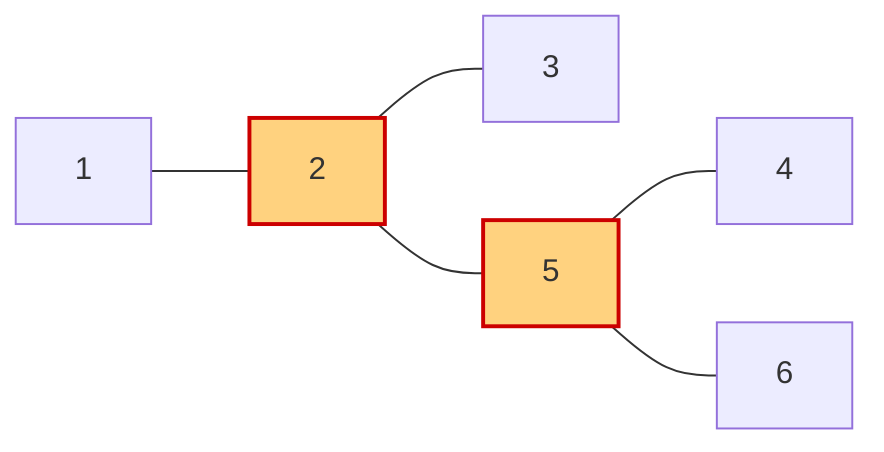

[[TOC]]

## 形式化题目

给定 $N$ 个顶点、$M$ 条边的无向连通图 $G=(V,E)$。称顶点 $u$ 为**灾区**：删去 $u$ 及其关联边后，剩下的顶点不再全部互相可达，即 $G-u$ 落在多于一个连通分量里；需要统计灾区的数量。图按行给出，每行 `u v1 v2 ...` 表示 $u$ 与 $v_1,v_2,\dots$ 相邻，每条边至少在某一行出现一次（可能只出现一次）。输入含多组数据，每组以单独一行 $0$ 结束，最后只剩一个 $0$。

样例第一组 $N=5$，只有一行 `5 1 2 3 4`，即边集 $(5,1),(5,2),(5,3),(5,4)$ 构成的星形图：删掉中心 5 后四片叶子互不相通，而删掉任一叶子其余四点仍然连通，所以只有 1 个灾区。

样例第二组 $N=6$，行 `2 1 3` 与 `5 4 6 2` 给出下图：

它是一棵树，橙红色的 2 和 5 是灾区：删掉 2，剩下的点分成 $\{1\},\{3\},\{4,5,6\}$ 三块；删掉 5，分成 $\{4\},\{6\},\{1,2,3\}$ 三块；删掉任何一片叶子，其余五个点仍互相可达。所以输出 2。

## 正解

### 思路

**朴素做法与它的瓶颈。** 最直接的想法是逐点验证：对每个地点 $u$，把它从图里删掉，再从任意剩余点做一次 BFS/DFS，看能否到达所有剩余点——走不到就说明 $u$ 是灾区。这个做法正确，但要把整张图从头重扫 $N$ 遍，复杂度 $O(N(N+M))$；而删掉一个点只破坏与它相邻的局部，其余部分的连通信息全被丢掉重算。本题 $N<100$，这个量级下朴素做法其实也跑得动，但作为正式解法，应当给出与图规模同阶的线性算法。

**观察：把"删掉 $u$ 后能否绕路"翻译成 DFS 树上的比较。** 对图做**一次** DFS，记每个点的访问序号 $dfn(u)$，以及它的子树内经回边能到达的最小序号 $low(u)$：

- 树边向下：孩子 $v$ 递归返回后，用 $low(v)$ 更新 $low(u)$；
- 回边（指向祖先的非树边）：直接用祖先的 $dfn$ 更新 $low(u)$。

于是"$u$ 的孩子子树能否绕开 $u$ 连到 $u$ 的祖先"就等于"$low$ 是否小于 $dfn(u)$"，得到两条判据：

1. **非根 $u$**：存在孩子 $v$ 满足 $low(v)\geqslant dfn(u)$，说明 $v$ 的子树最远只能回到 $u$ 自己、回不到更早的祖先，删掉 $u$ 它必然自成一块，$u$ 是灾区；
2. **DFS 树的根**：根没有祖先，"回不到祖先"的说法失效，改成数子树——根有 $\geqslant 2$ 棵子树时删根至少剩两块，根是灾区；只有 1 棵子树时剩余点仍在同一棵树里，不是。

两条判据都不必真的删点：所有点的 $dfn$ 和 $low$ 在同一次 DFS 里同时算完。星形样例里，中心若被搜成根就走判据 2（4 棵子树），若从某片叶子开始搜则是非根点、走判据 1；样例二从 1 开始搜，根 1 只有 1 棵子树被判据 2 正确排除，2 和 5 由判据 1 命中。**只写其中一条都会出错**：少了根判据，从星形中心开始搜会漏掉唯一的灾区；少了非根判据，几乎所有中间点都判不出来。

**样例二的一次 DFS**（从 1 出发的一种访问顺序：邻点按编号从小到大；换一种合法顺序会改变 $dfn/low$ 的具体数值，但判据结论不变）：

| 点 $u$ | $dfn$ | $low$ | DFS 树中的孩子 | 判定 |
| --- | --- | --- | --- | --- |
| 1 | 1 | 1 | 2 | 根，只有 1 棵子树 → 不是 |
| 2 | 2 | 2 | 3、5 | 孩子 3：$low=3\geqslant dfn=2$ → 是 |
| 3 | 3 | 3 | — | 叶子 → 不是 |
| 5 | 4 | 4 | 4、6 | 孩子 4：$low=5\geqslant dfn=4$ → 是 |
| 4 | 5 | 5 | — | 叶子 → 不是 |
| 6 | 6 | 6 | — | 叶子 → 不是 |

这张表里每个点的 $low$ 都等于自己的 $dfn$，因为样例二是树、没有回边：$low$ 的候选只有自己的 $dfn$ 与孩子的 $low$，而孩子的 $dfn$ 都比自己大，取 $\min$ 后必然是自己。一般图里回边会把 $low$ 压回更早的祖先——比如一个环上每点都能绕回环的起点，$low$ 永远小于除起点外所有点的 $dfn$，所以环上一个灾区也没有。表中被标为"是"的 2 和 5 正是样例输出。

### 代码

Python 版：

@include-code(./main.py, python)

C++ 版（同一算法）：

@include-code(./main.cpp, cpp)

### 复杂度

- 时间复杂度：$O(N+M)$，每个点入栈一次、每条边被两个端点各扫一次；最外层对 $1..N$ 逐点开搜只是兜底，连通图里只进一次。
- 空间复杂度：$O(N+M)$，邻接表共 $2M$ 条记录，`dfn` / `low` / `is_cut` 各 $N+1$ 个槽位，递归栈最深 $N<100$。
- 本题 $N<100$、时限 1000 ms：真实数据 202 组、最大 $N=99$、$M=245$，Python 实测约 0.03 s，无 TLE/MLE 风险。

## 总结

- 灾区就是无向图的**割点**：删点后剩余顶点不再全部互相可达。
- 朴素做法逐点删图、每次重扫是 $O(N(N+M))$；一次 Tarjan DFS 同时维护 $dfn/low$，把 $N$ 遍压成 1 遍，复杂度降到 $O(N+M)$。
- 两条判据必须配对使用：非根点看"是否存在孩子 $low\geqslant dfn$"，根看"DFS 子树数 $\geqslant 2$"。
- 输入每行只给单向邻居表，建图必须双向登记（`set` 顺带吸收重复出现的同一条边）；块终止符 $0$ 与从 1 起的顶点编号天然不冲突。
