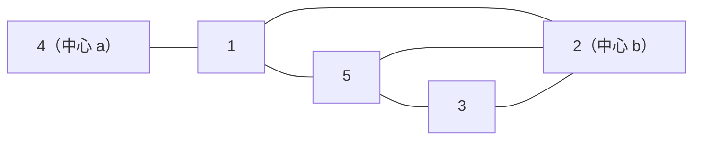

[[TOC]]

## 形式化题目

给定 $n$ 个点的无向图 $G = (V, E)$ 与两个指定点 $a$、$b$（两个信息中心）。求编号最小的顶点 $v \notin \{a, b\}$，使得任意一条从 $a$ 到 $b$ 的路径都必须经过 $v$（即安装在 $v$ 上的嗅探器能捕获全部数据包）；若不存在这样的点，输出 `No solution`。

#### 样例说明

样例的边为 $1$–$2$、$1$–$4$、$1$–$5$、$2$–$5$、$2$–$3$、$3$–$5$，两个中心是 $a = 4$、$b = 2$，下图画出这张图：

点 4 只与点 1 相连，任何从 4 出发的路径第一步都必须走到 1；从 4 到 2 的三条简单路径 $4$–$1$–$2$、$4$–$1$–$5$–$2$、$4$–$1$–$5$–$3$–$2$ 全部经过点 1，而删掉点 1 后点 4 变成孤立点，故答案为 $1$。

## 正解

### 思路

**朴素想法与瓶颈。** 最直观的做法是**枚举所有 $a \to b$ 的简单路径，取路径内部点的交集**——出现在每条路径上的点就是答案。这在有环图中是指数级的，$n = 100$、边数上千的数据完全跑不动。另一条路是先跑 Tarjan 求全局割点再筛，但"全局割点"与"$a$–$b$ 必经点"并不等价（全局割点可能只分隔别的点对），一整套 dfn/low 机制反而绕远。两个想法的共同瓶颈是：**在"路径"这一层做事**，而路径有指数多条，要回答的本质上却只是 $n$ 个独立的布尔问题。

**删除等价判据。** 把问题下沉到"点"这一层：

$$v \text{ 是 } a\text{–}b \text{ 必经点} \iff G - v \text{ 中 } a \text{ 与 } b \text{ 不连通}.$$

- ($\Rightarrow$) 若删掉 $v$ 后 $a$ 仍能到达 $b$，那条路径不含 $v$，与"每条 $a$–$b$ 路径都经过 $v$"矛盾。
- ($\Leftarrow$) 若存在一条不经过 $v$ 的 $a$–$b$ 路径，它完整留在 $G - v$ 中，$a$、$b$ 在 $G - v$ 中就连通，与前提矛盾。

于是"求路径交集"变成"逐点删除后各做一次连通性判定"，单次判定只需一次 DFS，$O(n + m)$。按编号从小到大枚举候选点，第一个使判定为"不通"的点即最小答案。对样例逐点验证：

| 删除点 $v$ | $a = 4$ 还能到 $b = 2$ 吗 | 结论 |
| :---: | :---: | :--- |
| 1 | 不通（点 4 被孤立） | 必经点，答案 |
| 2 | —— | 它是信息中心 $b$，不算"中间"服务器 |
| 3 | 通，走 $4 \to 1 \to 2$ | 不是必经点 |
| 4 | —— | 它是信息中心 $a$ |
| 5 | 通，走 $4 \to 1 \to 2$ | 不是必经点 |

观察表中两件事：真正删了会断开 $4$ 与 $2$ 的只有点 1；而 2、4 虽然删后必然不通，却因为是信息中心本就不参与候选，3、5 删掉后仍有 $4$–$1$–$2$ 这条绕行通道。

**实现细节。** 删点不必真的改邻接表：判定函数 `reachable(g, src, dst, skip)` 把候选点预置进 DFS 的已访问集合（`seen = {skip}`），它就永远不会被扩展，效果等价于从图中删除；枚举与返回则在 `find_sniffer(g, n, a, b)` 中进行。候选点必须排除 $a$、$b$——它们显然在每条 $a$–$b$ 路径上，但不是"中间"服务器，而且删掉 $b$ 后判定恒为"不通"，不排除会把 $b$ 误判成答案。$n \leqslant 100$ 时 $n$ 次判定总共 $O(n(n + m))$，与 C++ 正解（逐点删 + DFS）同阶，Python 也只需毫秒级。

### 代码

@include-code(./main.py, python)

### 复杂度

- **时间** $O(n(n + m))$：外层枚举 $n$ 个候选点，每次 DFS 每点每边访问常数次。$n \leqslant 100$、$m = O(n^2)$ 时最坏 $100 \times (100 + 5000) \approx 5 \times 10^5$ 次基本操作。
- **空间** $O(n + m)$：邻接表一份，加上单次 DFS 的已访问集合与显式栈。

## 总结

"每条 $a$–$b$ 路径都经过 $v$"看似要枚举指数多条路径，用逆否命题一转就变成**删点后的连通性判定**：$v$ 是必经点 $\iff G - v$ 中 $a$ 到不了 $b$。算法随之坍缩成两句话——**升序枚举候选点，逐点做一次 DFS，第一个不通的就是答案**；`seen = {v}` 预置即删点，跳过 $a$、$b$ 保住"中间服务器"的语义，全通则输出 `No solution`。整题即「删除等价判据 + $n$ 次 DFS」，$O(n(n + m))$ 一步到位。

验证：题面样例输出 `1`；仓库真实数据 `data/sniffer1..10` 全部 PASS（`verify.sh`，10/10，单测例 ≤ 0.02s、峰值 ≤ 15MB，远低于 1000ms / 128MB），其中 `sniffer3` 输出 `No solution` 覆盖无解分支。
