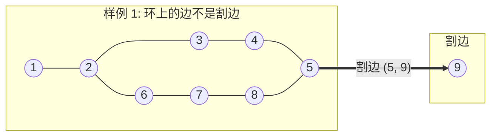

[[TOC]]

## 形式化题目

给定一个包含 $m$ 个顶点、$n$ 条边的无向图 $G = (V, E)$（图可能不连通，可能存在重边）。
定义一条无向边 $e \in E$ 为**主要航道**（即图论中的**割边**或**桥**），当且仅当在图 $G$ 中删去边 $e$ 后，某些点对之间的连通性被破坏（连通分量数量增加）。
输入包含多组测试数据，以节点数与边数均为 $0$ 结束。对于每组数据，求该无向图中割边的总数量。

如上图所示，节点 1 到 8 构成包含两个圈的结构，内部任意删除一条边均不破坏连通性；而边 $(5, 9)$ 删除后节点 9 变成孤立点，因此边 $(5, 9)$ 是割边。

## 正解

### 思路

#### 1. 朴素判定及其瓶颈
若采用暴力枚举：每次删掉一条边，然后利用广度优先搜索（BFS）或深度优先搜索（DFS）检验全图的连通块数量是否增加。单次遍历复杂度为 $O(m + n)$，总复杂度高达 $O(n(m + n))$。在 $m, n \leqslant 30000$ 的数据规模下，运算量约在 $10^9$ 级别，显然无法承受。

#### 2. 无向图 DFS 树与返祖边
在线性时间内判定割边，核心在于利用无向图深度优先搜索生成的 **DFS 生成树（DFS Tree）**：
- 在无向图的 DFS 过程中，图中的边被分为两类：**树边**（首次访问某节点时走过的边）和**非树边**。
- 无向图 DFS 生成树中**不存在横叉边**，所有的非树边都连接着子孙节点与祖先节点，称为**返祖边（后向边）**。

设在 DFS 树上，节点 $u$ 是节点 $v$ 的父节点，树边为 $(u, v)$：
1. 若以 $v$ 为根的整棵 DFS 子树内，存在某个节点引出一条返祖边连回到 $u$ 或 $u$ 的祖先节点，则即使删去树边 $(u, v)$，$v$ 子树仍可通过该返祖边与树的其余部分保持连通。
2. 若 $v$ 的子树内**没有任何**一条非树边能够连回到 $u$ 或其祖先，说明子树 $v$ 通往外界的唯一通道就是树边 $(u, v)$。一旦删除该边，$v$ 子树必定与外部脱节。

因此，**树边 $(u, v)$ 是割边的充要条件是：$v$ 的子树节点无法通过返祖边到达 $u$ 或 $u$ 以前被访问的祖先。**

#### 3. Tarjan 算法维护时间戳
为了量化这一判断条件，维护两个核心数组：
- $dfn[u]$：节点 $u$ 在 DFS 过程中的访问次序（时间戳）。
- $low[u]$：以 $u$ 为根的 DFS 子树中任意节点，通过至多一条返祖边能回溯到的顶点的最小 $dfn$ 值。

状态转移规则：
- 初始访问节点 $u$ 时：$dfn[u] = low[u] = ++timer$。
- 遍历 $u$ 的邻接边 $(u, v)$：
  - 若 $v$ 尚未访问（树边）：对 $v$ 递归遍历，回溯时更新 $low[u] = \min(low[u], low[v])$。此时若满足：
    $$low[v] > dfn[u]$$
    说明 $v$ 及其子树无法到达 $u$ 或其更早的祖先，边 $(u, v)$ 即为一条割边。
  - 若 $v$ 已经访问过且该边不是回退到父节点的反向边（返祖边）：更新 $low[u] = \min(low[u], dfn[v])$。

#### 4. 重边与栈深度处理
1. **重边处理**：两点之间若存在多条重边，则它们不是割边。为了准确区分“反向边”与“平行重边”，为每条无向边分配唯一的 `edge_id`。遍历时记录当前节点的入边编号 `in_edge`，只有当边的唯一编号等于 `in_edge` 时才跳过，平行重边则作为非树边参与更新 $low$，避免将重边误判为割边。
2. **避免深层递归**：本题点数规模达 $30000$，在极端链状图下递归可能导致栈溢出。实现中采用显式栈模拟 DFS 遍历与回溯，彻底杜绝递归限制并提升执行速度。

### 代码

@include-code(./main.py, python)

### 复杂度

- **时间复杂度**：$\mathcal{O}(m + n)$。每个顶点入栈出栈各一次，每条无向边正反方向各被扫描常数次，整体遍历完全线性，对于 $m, n \leqslant 30000$ 能在 0.1 秒内处理完毕。
- **空间复杂度**：$\mathcal{O}(m + n)$。邻接表存储 $2n$ 条有向边，数组与显式栈空间开销与点数 $m$ 成正比，内存占用约为 30MB 左右，远低于 128MB 的限制。

## 总结

本题是无向图割边（桥）判定的经典应用。求解的核心在于：
1. 利用 DFS 树没有横叉边的性质，将连通性判定转化为子树是否存在连回祖先的返祖边；
2. 借由 $dfn$ 与 $low$ 两个时间戳数组将子树可达性转化为简单的数值比较 $low[v] > dfn[u]$；
3. 通过给边赋予全局唯一标识 `edge_id` 优雅地区分了重边与反向边；
4. 使用迭代显式栈规避了深度递归栈溢出的工程隐患。
