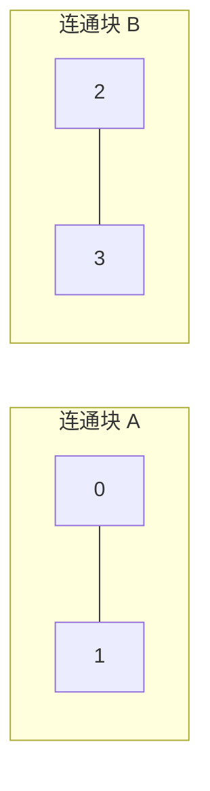

[[TOC]]

## 形式化题目

给定一个无向图（不保证连通、可能有孤立点，无重边）。对每个顶点 $v$，记 $f(v)$ 为删去 $v$ 及其关联边后，剩余图的连通块个数；要求 $\max_v f(v)$——删掉一个点之后，连通块最多有多少。

样例第一组是三角形（三点两两相连）：任删一点，剩下两点之间仍有边，仍是一个连通块，输出 1。

样例第二组是四点两条边，$0-1$ 与 $2-3$ 各成一块，互不相通：

删去 $0$，块 $A$ 塌缩成孤立点 $\{1\}$，块 $B$ 不受影响，剩 $\{1\},\{2,3\}$ 两块；删去 $2$ 同理也是两块。无论删谁都恰好 2 块，输出 2。

样例第三组只有边 $1-0$，外加一个孤立点 $2$：删 $0$（或 $1$）后剩 $\{1\},\{2\}$ 两块，删 $2$ 后剩 $\{0,1\}$ 一块，取最大值，输出 2。

## 正解

### 思路

**朴素做法与瓶颈。** 对每个顶点 $v$ 删掉它、再从剩余点 BFS/DFS 数一次连通块，取最大值——正确但要重扫整张图 $P$ 遍，复杂度 $O(P(P+C))$；$P=10000$ 时上亿次操作，Python 必然超时。而删一个点只破坏与它直接相邻的局部，其余部分的连通信息被整遍丢掉重算。

**第一步：把「删谁」的枚举分解成计数。** 删 $v$ 不影响 $v$ 之外的连通块，所以

$$f(v) = (comps - 1) + pieces(v), \qquad answer = comps - 1 + \max_v pieces(v)$$

其中 $comps$ 是原图连通块数，$pieces(v)$ 是 $v$ 原来所在连通块被删掉 $v$ 后裂成的块数（孤立点算 0）。对照样例：第一组 $comps=1$、每点 $pieces=1$，得 1；第二组 $comps=2$、$pieces$ 全为 1，得 2；第三组 $comps=2$、$\max pieces=1$，得 2。于是问题变成求 $\max_v pieces(v)$——注意**非割点的 $pieces$ 恰为 1，割点的 $pieces \geqslant 2$**，我们要的正是把割点判定变成计数。

**第二步：把 $pieces(v)$ 翻译成 DFS 树上的比较。** 对图做**一次** DFS，记进入序号 $dfn$ 与子树经回边能到达的最小序号 $low$（树边入栈展开，孩子弹栈时把 $low$ 回传父点，回边用祖先的 $dfn$ 压低）。孩子 $c$ 满足 $low(c) \geqslant dfn(v)$，等价于 $c$ 的子树最远只能回到 $v$ 自己、绕不开 $v$ 到达祖先——删掉 $v$ 它必然自成一块，称为 $v$ 的**分离孩子**；反之 $low(c) < dfn(v)$ 说明 $c$ 的子树有回边通向 $v$ 的祖先，删掉 $v$ 也能绕回父方向那一侧。于是：

- **非根 $v$**：各分离孩子自成一块，父方向与所有非分离孩子的子树仍连成一块，故 $pieces(v) = 1 + \text{分离孩子数}$；
- **DFS 树的根**：没有父方向那一块，$pieces(root) =$ 子树数；根的孩子恒满足 $low \geqslant dfn(root)$（根是本连通块里最小的 $dfn$），所以同一套「分离孩子数」统计对根恰好就是子树数，只是不加 1；
- **孤立点**：是「根且零孩子」，$pieces = 0$，公式自然退化，无需特判。

一个最小的割点例子：顶点 $0-1-2$ 构成一条链（边 $0-1$、$1-2$），按邻点编号从小到大访问：

| 点 $u$ | $dfn$ | $low$ | DFS 树中的孩子 | $split(u)$ | $pieces(u)$ |
| --- | --- | --- | --- | --- | --- |
| 0（根） | 0 | 0 | 1 | 1 | 根不加 1：1 |
| 1 | 1 | 1 | 2 | 1 | $1+1 = 2$ |
| 2 | 2 | 2 | — | 0 | $0+1 = 1$ |

表中 $split(u)$ 是已结算孩子里 $low \geqslant dfn(u)$ 的个数。中间点 1 是唯一的割点，$pieces=2$ 正是删它之后的 $\{0\}$ 与 $\{2\}$；根 0 只有 1 棵子树，$pieces=1$（删它剩 $\{1,2\}$ 一块）；叶子 2 是非根非割点，$pieces=1$。回边的作用看三角形样例：环上每点都能绕回更早的点，$low$ 被压到根的 $dfn$，分离孩子数为 0，$\max pieces$ 停在 1，所以输出 1——**回边正是「删点也分不开」的证据**。真实数据开头的 `3 2`（边 $0-1$、$0-2$ 的星形）则把中心搜成了根：两棵子树给 $split=2$，根不加 1，$comps - 1 + best = 1 - 1 + 2 = 2$。

**第三步：一次 DFS 收齐所有答案。** 弹栈时把子点的 $low$ 回传给父点、给父点累加 $split$，并用当前点已定型的 $split[u] + (par \geqslant 0)$ 更新全局最大值——「非根 +1、根不加」一行统一。最后输出 $comps - 1 + best$。整套用显式栈迭代实现，避免 $P=10000$ 的链状图打穿 Python 默认递归深度。

### 代码

@include-code(./main.py, python)

### 复杂度

- **时间复杂度**：每组数据 $O(P+C)$。每个顶点入栈、出栈各一次，每条边被两端各扫描一次；外层逐点开搜只是兜底，未访问点才启动新 DFS，总代价线性。多组数据合计与输入规模同阶，把朴素的 $P$ 遍重扫压成 1 遍。
- **空间复杂度**：$O(P+C)$，邻接表 $2C$ 条记录，`dfn/low/split` 各 $P$ 个槽位，栈最深 $P$；读入逐行惰性切分，不驻留整份输入。
- 实测（真实数据 `e1.in`，OJ 限时 1000 ms / 128 MB）：0.47 s、峰值 19.2 MB，无 TLE/MLE 风险。

## 总结

- 答案 = 原连通块数 $- 1$ + 删点最大裂块数：把「删谁」的枚举转化为「每个点会被裂成几块」的计数，删点的局部性让其余连通块可以整体搬运。
- 一次 Tarjan DFS 同时维护 $dfn/low$：非根 $pieces = 1 + \#\{low \geqslant dfn\}$，根 = 子树数，孤立点 = 0；三条规则在代码里统一为 `split[u] + (par >= 0)`。
- 朴素逐点删点 $O(P(P+C))$ 的瓶颈是每遍重扫全图；「分解 + $low$ 判据」把它压成一遍 $O(P+C)$。
- 实现上两点：读入逐行流式切分（7+ MB 输入峰值仅约 19 MB），深图用显式栈迭代而非递归。
