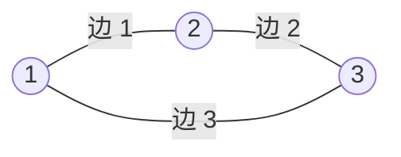

[[TOC]]

## 形式化题目

给定一个可能包含重边和自环的图 $G = (V, E)$，其中 $|V| = n$，$|E| = m$。
包含两个子任务：
1. $t = 1$：$G$ 为无向图。
2. $t = 2$：$G$ 为有向图。

判断图中是否存在欧拉回路（即一条经过图中每条边恰好一次且回到起点的闭路径）：
- 若不存在，输出 `NO`。
- 若存在，输出 `YES`，并输出回路中依次经过的边编号序列 $p_1, p_2, \dots, p_m$。对于无向图，若逆着输入方向走第 $e$ 条边，输出 $-e$；对于有向图，输出边的原始编号。

## 正解

### 思路

欧拉回路的存在性判定包含两个条件：
1. **度数条件**：
   - 无向图：每个顶点的度数必须为偶数（$\text{deg}(v) \equiv 0 \pmod 2$）。
   - 有向图：每个顶点的入度必须等于出度（$\text{in\_deg}(v) = \text{out\_deg}(v)$）。
2. **连通性条件**：所有度数大于 $0$ 的边必须属于同一个连通分量。

若度数条件满足，我们采用 **Hierholzer 算法** 构造欧拉回路。

#### 朴素做法及其性能瓶颈
若直接使用深度优先搜索（DFS）遍历出边，在存在大量重边或星状密集边的图上，每次访问某顶点都从其邻接表头从头扫描已走过的边，会导致大量无效的跳过检查，时间复杂度退化至 $O(m^2)$。同时，当回路长度达到 $2 \times 10^5$ 时，过深的递归会引发栈溢出。

#### 当前弧优化与显式栈
1. **当前弧优化（Current Arc Optimization）**：
   为每个节点维护一个指针 `cur[u]`，记录当前节点尚未尝试访问的下一条出边。每次遍历过一条边后，直接将 `cur[u]` 移至下一条出边 `nxt[e]`。由于每条边只会被“尝试走”常数次，邻接表遍历的总开销被严格限制在 $O(n + m)$。
2. **非递归显式栈**：
   使用顶点栈 `stk_u` 与边栈 `stk_e` 模拟递归回溯过程。
   - 当栈顶顶点还有未访问边时，沿该边前进，并将新顶点与边压入栈；
   - 当栈顶顶点的所有出边均已探索完毕时，弹出栈顶顶点，同时将进入该顶点的边记录至答案序列（后序记录）；
   - 最终将边序列翻转，即得到正序的欧拉回路。
3. **连通性校验**：
   最终遍历得到的回路边数若小于 $m$，说明存在未被访问到的孤立子环（即图中包含多个有边的连通块），判定为无解并输出 `NO`。

### 代码

@include-code(./main.py, python)

### 复杂度

- **时间复杂度**：$\mathcal{O}(n + m)$。读取输入、度数校验需要 $\mathcal{O}(n + m)$；由于当前弧优化的存在，每条边仅被压栈与退栈常数次，Hierholzer 算法耗时 $\mathcal{O}(n + m)$；输出边序列耗时 $\mathcal{O}(m)$。
- **空间复杂度**：$\mathcal{O}(n + m)$。前向星存图、当前弧数组、栈以及结果边列表的空间开销均与 $n, m$ 成线性关系。

## 图示解析

以样例 1（无向图三角形回路）为例，展示 Hierholzer 算法通过退栈后序记录、再反转得到欧拉回路的过程：

- 从顶点 $1$ 出发，依次走边 $1 \to 2$、边 $2 \to 3$、反向边 $-3 \to 1$。
- 此时顶点 $1$ 的出边均已访问完毕，开始回溯退栈：
  - 退栈 $1$，记录进入边 $-3$；
  - 退栈 $3$，记录进入边 $2$；
  - 退栈 $2$，记录进入边 $1$；
- 退栈收集的边序列为 `[-3, 2, 1]`，将其翻转即得合法回路 `[1, 2, -3]`。

## 总结

欧拉回路问题的关键在于：
1. 快速判定度数偶性与出入度平衡；
2. Hierholzer 算法中的**当前弧优化**，防止在稠密重边下邻接表反复回溯退化；
3. 使用**显式栈**避免深层图结构下的调用栈溢出。
