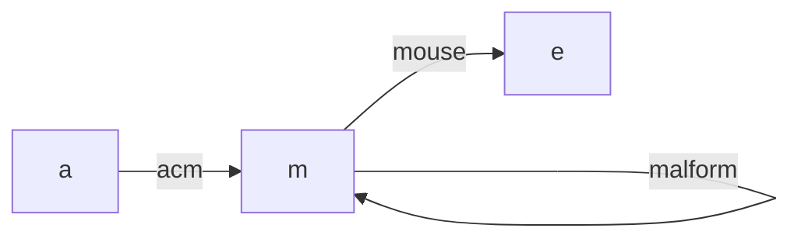

[[TOC]]

## 形式化题目

给定 $N$ 个仅含小写字母的单词，判断能否把它们排成一列 $w_1, w_2, \dots, w_N$，使得对每个 $1 \leqslant i < N$，$w_i$ 的末字母等于 $w_{i+1}$ 的首字母。多组数据，每组只需回答"能"或"不能"。

题面给出三组样例。下表把每个单词写成"首字母 $\to$ 末字母"的边，并算出每个字母的出度减入度差（这就是后文判定条件里用到的量）：

| 样例组 | 单词对应的边 | 各字母 $out-in$ | 结论 |
| --- | --- | --- | --- |
| 1 | `acm`: a→m，`ibm`: i→m | a=+1，i=+1，m=−2 | 出现两个起点且 m 差值超出范围，不能（The door cannot be opened.） |
| 2 | `acm`: a→m，`malform`: m→m，`mouse`: m→e | a=+1，m=0，e=−1 | 恰好一个起点 a、一个终点 e，能（Ordering is possible.） |
| 3 | `ok`: o→k，`ok`: o→k | o=+2，k=−2 | 两条边都从 o 出发，第二条没有入边可接，不能（The door cannot be opened.） |

三组输出与题面样例逐一对应：样例 1、3 分别踩中"起点不止一个"和"度数差绝对值超过 1"这两个反例，样例 2 则两条件全满足。

## 正解

### 思路

**朴素做法：回溯枚举排列。** 依次挑一个还没用过的单词接到序列末尾并检查衔接，回溯尝试所有排列，复杂度 $O(N!)$——而 $N$ 最大 $10^5$，连很小的 $N$ 都撑不住，必须换思路。

**降维：单词就是一条有向边。** 衔接条件只看每个单词的首字母和末字母，单词内部是什么完全不影响判断。于是把单词 $s$ 看成有向边 $s[0] \to s[-1]$，整个词表变成一张 **26 个顶点、$N$ 条边的有向多重图**（重复出现的单词就是重复边，必须逐条保留）。"排成一列"要求相邻单词首尾相接，等价于"每条边恰好用一次、边与边首尾相接地走完"——这正是**欧拉路径**的定义。下面这张图是样例 2 建成的模型：

图中 a 只出不入、e 只入不出、m 出入次数相同，恰好存在一条从 a 走到 e、经过每条边一次的路径 a → m → m → e，对应单词顺序 `acm → malform → mouse`。样例 1 里 a、i 同时只出不入（两个起点），样例 3 里两条平行边都从 o 出发，都无法接成一条通路。

**为什么不必搜索：欧拉路径有充要条件。** 把"是否存在这样的排列"翻译成两个纯统计条件：

1. **度数条件**：序列起点的首字母只被用作出点、终点的末字母只被用作入点，中间每个字母出一次必入一次。所以每个字母的 $out-in$ 只能是 $0$ 或 $\pm 1$，且 $+1$ 至多一个、$-1$ 至多一个（所有边的出度总和等于入度总和，$\pm 1$ 必然成对出现或全为 $0$）。
2. **连通条件**：所有非零度字母必须在无向意义下属于同一个连通分量，否则序列永远无法从一个分量跨进另一个。

这两条也是充分的：从终点向起点补一条虚拟边，全图每个点 $in=out$；平衡有向图中每条边都属于某个圈（沿未用边一直走，每个点剩余的出度始终等于剩余的入度，不会中途卡死，必能绕回起点），而弱连通把所有圈串在一起，因此图强连通，存在欧拉回路（Hierholzer），删去虚拟边即得欧拉路径。于是"判定"取代了"搜索"：扫一遍词表统计度数、用并查集并连通性，最后查两个条件即可。

### 代码

`main.py` 把整个判定压进一个扫描：每个单词只取首末字母（字节串下标减 97 得字母下标），同一个循环里完成出度 +1、入度 +1、并查集合并；扫完后 `used` 收集非零度字母，先用 `{find(root, i) for i in used}` 的大小验连通，再用 `gap = outd - ind` 的三个判据（绝对值不超过 1、$+1$ 不超过一个、$-1$ 不超过一个）验度数条件。

@include-code(./main.py, python)

### 复杂度

- 时间复杂度：$O(L)$，$L$ 为该组输入的总字符数。读入与切分 $O(L)$，每个单词 $O(1)$ 取首末字母并做一次并查集合并 $O(\alpha(26))$，最后在 26 个字母上判定 $O(26)$，与逐字符读入的下界同阶，也与 C++ 正解同阶。
- 空间复杂度：$O(L + N)$：`read().split()` 保存全部 token 占 $O(L)$，边列表与两张度数表占 $O(N + 26)$。
- 实测真实数据（500 组、4.8MB）：0.156s、峰值 61.6MB，在 1000ms / 128MB 限制内。

## 总结

- 建模是本题的关键：衔接只看首末字母，单词降维成有向边后，"合法排列"就是有向图的欧拉路径。
- 存在性不必搜索：非零度点弱连通 + 每个字母 $out-in \in \{0, \pm 1\}$ 且 $\pm 1$ 至多各一个，构成充要条件；充分性靠"补一条虚拟边 $\to$ 平衡 $\to$ 弱连通 $\Rightarrow$ 强连通 $\Rightarrow$ 欧拉回路"。
- 实现上 26 个顶点是常数，度数用两张长度 26 的表、连通用并查集，一次 $O(N)$ 扫描完成；Python 用 `sys.stdin.buffer.read().split()` 一次读入，单词以字节串首末下标直接取字母。
