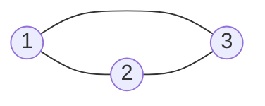

[[TOC]]

## 形式化题目

给定若干个无向图，第 $i$ 个图有 $N$ 个顶点（$1 < N < 1000$，顶点编号 $1 \sim N$）与 $M$ 条边，**允许重边与自环**。对每个图回答：

> 是否存在一条经过图中每条边**恰好一次**、并且回到出发点的闭合通路（欧拉回路）？

存在输出 `1`，否则输出 `0`。输入含多组数据，以单独一行的 $N = 0$ 结束。

题面没有禁止自环与重边，实际测试数据里两者都出现过（例如某组数据的三条边是 `1 1`、`2 2`、`3 3`，另一组里 `1 2` 出现了两次）。它们是合法的普通边，判定时必须一并处理。

## 正解

### 思路

本题只问「存在性」，不要求输出回路，所以不必真的走一遍（Hierholzer 构造回路反而更慢、更容易写错），只要**验证欧拉回路存在的两个必要条件是否也是充分的**。

**无向图欧拉回路判定定理**：图 $G$ 存在欧拉回路，当且仅当

1. **度数条件**：$G$ 中每个顶点的度数都是偶数；
2. **连通条件**：所有**含边的顶点**属于同一个连通块。

**为什么度数必须全偶。** 欧拉回路经过某个顶点 $v$ 时，总是「从一条边进来、从另一条边出去」成对消耗 $v$ 的边；起点/终点同一个点，它额外消耗的边也是成对的。所以回路把 $v$ 的边两两配对用完，$\deg(v)$ 必为偶数。

**为什么有边的点必须连通。** 一笔画不能抬笔，若边分散在两个互不相通的连通块里，走完一块后无法到达另一块。

**为什么这两条已经够。** 若度数全偶，从任一含边的顶点出发，贪心地沿未用边行走：假设走到 $v$ 时无路可走，则 $v$ 的边都已用过，而已用边中与 $v$ 关联的条数是奇数（每次「进入」配一次「离开」，唯独最后停在 $v$ 的那次没有配对），与 $\deg(v)$ 为偶数矛盾。因此行走一定不会中途卡死，必然回到起点，形成一条回路。若这条回路没覆盖全部边，由连通性知回路外必有一条边与回路共用一个顶点，从该顶点出发又能走出新回路，把两条回路在该顶点拼接即可；重复拼接直到覆盖所有边。故两条条件也是充分的。

**怎么检查这两条条件。**

- 度数：读入每条边 $(u, v)$ 时 `deg[u]++`、`deg[v]++`。自环 $(v, v)$ 会执行两次自增，正好给 $v$ 记 $2$ 度，无需特判；重边各加一次，也无需特判。
- 连通性：用并查集把每条边的两个端点合并，最后统计**度数大于 $0$ 的顶点**里有多少个不同的并查集根。根超过一个说明边被分到了多个连通块，答案为 `0`。
- **孤立点不能参与连通性统计**：度数为 $0$ 的点压根不碰边，把它算进去会把本来合法的图误判为不连通。例如样例中 $N = 4$ 而只有三角形 $1\text{-}2\text{-}3$ 的三条边时，点 $4$ 是孤立点，答案仍是 `1`。

以题面样例为例。第一组的三条边是 $1\text{-}2$、$1\text{-}3$、$2\text{-}3$，构成一个三角形：

三个点的度数都是 $2$，且它们连成一片，两个条件都满足，输出 `1`。

第二组的两条边是 $1\text{-}2$、$2\text{-}3$，是一条链：

点 $1$ 与点 $3$ 的度数都是 $1$（奇数），度数条件不满足，输出 `0`。

### 代码

Python 版：

@include-code(./main.py, python)

C++ 版（同一算法）：

@include-code(./main.cpp, cpp)

### 复杂度

- **时间复杂度**：单个测试样例读入 $M$ 条边、合并 $M$ 次并查集，再做 $O(N)$ 次度数检查与找根，总计 $O(M\,\alpha(N) + N)$，其中 $\alpha$ 是并查集的反阿克曼函数，实际接近常数；所有样例相加即为总复杂度。
- **空间复杂度**：度数数组与并查集数组各 $O(N)$，且无需存储任何边，空间为 $O(N)$（C++ 侧固定开 $1005$ 大小的全局数组，Python 侧按 $N$ 现开）。

## 总结

欧拉回路存在性判定是「度数条件 + 连通条件」两个独立检查的组合，缺一不可：只查度数会把「两个各自成环的三角形」判成有解，只查连通会把链判成有解。实现上要记住三点：

1. 自环与重边都是普通边，自环给端点贡献 $2$ 度，不需要特判；
2. 连通性只统计**有边的点**，孤立点必须跳过；
3. 本题只要回答「有没有」，不要为了「输出回路」去做 Hierholzer，白白增加实现量和常数。
