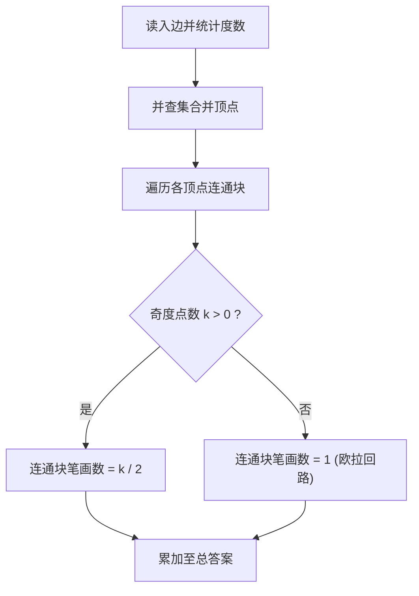

[[TOC]]

## 形式化题目

给定一个包含 $N$ 个顶点和 $M$ 条边的无向图（无重边、无自环）。

要求使用最少数量的不相交路径（允许在顶点处相交，但在边上不可重复遍历）覆盖图中的所有边（即“一笔画”覆盖所有边）。孤立点无需遍历。求该最少笔画数。

## 正解

### 思路

一笔画问题本质上是在无向图中寻找若干条欧拉路径或回路覆盖所有边。

根据图论与欧拉迹的性质：
1. **连通块独立性**：一笔画不能跨越两个不连通的部分。因此，每个包含至少一条边的连通块必须独立画出，总笔画数为各含边连通块所需笔画数之和。
2. **单连通块的笔画数**：
   - 对于一条连续走完的路径，中间每次经过一个顶点时，顶点的度数都会减少 $2$（一进一出），只有该路径的起点和终点（若不同）各产生 $1$ 的奇数度数。
   - 设某个含边连通块内的奇度顶点数量为 $k$。根据握手定理，$k$ 必然为偶数。
   - 若 $k = 0$：该连通块存在欧拉回路，仅需 $1$ 笔即可画出全部边。
   - 若 $k > 0$：每条路径至多只能消耗 $2$ 个奇度点，因此至少需要 $\frac{k}{2}$ 条路径。同时，只要在 $k$ 个奇度点之间两两配对加入 $\frac{k}{2}$ 条虚边即可构成欧拉回路，删去虚边后恰好裂为 $\frac{k}{2}$ 条路径，说明 $\frac{k}{2}$ 笔一定可行。
   - 综上，一个含边连通块所需的最少笔画数为：
     $$
     \operatorname{strokes}(C) = \begin{cases}
     1, & k = 0 \\
     \frac{k}{2}, & k > 0
     \end{cases}
     $$

因此算法流程如下：
1. 使用并查集维护各顶点之间的连通性，并统计每个顶点的度数。
2. 忽略度数为 $0$ 的孤立点，按连通块聚合各顶点的度数奇偶性。
3. 对每个含边连通块，若奇度点数大于 $0$ 则累加 $\frac{k}{2}$，否则累加 $1$。

#### 流程与连通块分类图示

### 代码

@include-code(./main.py, python)

### 复杂度

- 时间复杂度：$\mathcal{O}((N + M)\alpha(N))$，其中 $\alpha$ 为反阿克曼函数。处理每条边时仅需常数次并查集操作，统计答案只需遍历所有顶点，效率极高。
- 空间复杂度：$\mathcal{O}(N)$，主要用于存储并查集父节点数组与各顶点度数。

## 总结

无向图的一笔画覆盖问题是欧拉路径性质的经典应用：将原图分解为互不相交的连通分量，每个连通分量根据奇度顶点的个数即可直接计算出最少需要的欧拉路径数（$k=0$ 时为 $1$ 笔，$k>0$ 时为 $\frac{k}{2}$ 笔），配合并查集可以在近乎线性的时间内完成求解。
