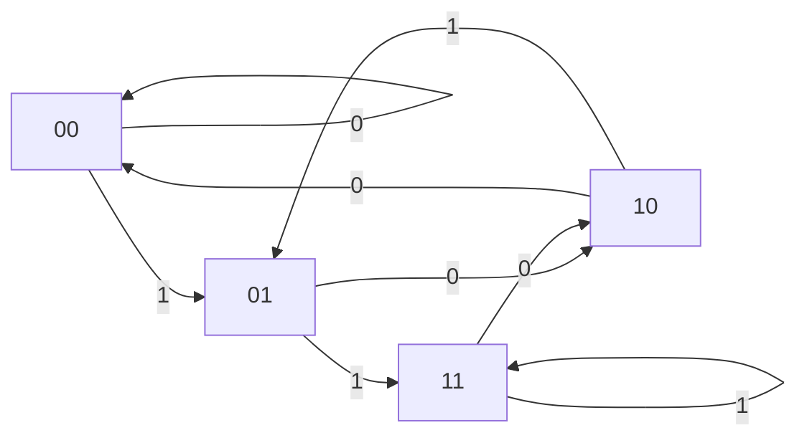

[[TOC]]

## 形式化题目

给定整数 $K$。构造一个环形 01 串：从环上每个位置顺时针连续读 $K$ 位，得到一个长度为
$K$ 的子串（首尾相邻，共 $M$ 个子串）。要求这 $M$ 个子串互不相同，并让 $M$ 取到可能的
最大值。求最大 $M$，以及所有达到该 $M$ 的方案中**字典序最小**的环形 01 串。

长度为 $K$ 的 01 串总共只有 $2^K$ 种，因此 $M \leqslant 2^K$；问题的本质是能否让全部
$2^K$ 种串在环上**各出现恰好一次**——这正是 de Bruijn 序列 $B(2, K)$ 的定义。

样例：$K = 3$ 时输出 `8 00010111`。把 `00010111` 首尾相接，8 个子串依次为
$000, 001, 010, 101, 011, 111, 110, 100$：恰好覆盖全部 $2^3 = 8$ 种串且互不相同，
所以 $M = 8$ 达到上界，且该串是字典序最小的方案。

## 正解

### 思路

#### 1. 朴素做法与瓶颈

最朴素的想法：枚举所有候选环形串（若环长取到 $2^K$，共 $2^{2^K}$ 个）逐个检查子串互异性；
或用回溯逐位拼串、每加一位就检查新子串是否出现过。回溯树规模随 $2^K$ 指数增长，
且"下一位放什么"没有任何全局结构可依，没有可行的剪枝方向。瓶颈在于：
**逐位拼串的模型看不出相邻子串之间的衔接规律**。

#### 2. 关键观察：相邻子串错位一位 $\Rightarrow$ de Bruijn 图

环上相邻两个子串 $s[i..i+K-1]$ 与 $s[i+1..i+K]$ 恰好错开一位：前者去掉首位、后者加上
末位。于是把"长度 $K-1$ 的 01 串"当作状态，把"追加一位 $b$"当作转移，就得到
**de Bruijn 图** $G_K$：

- 节点：所有 $K-1$ 位 01 串，共 $2^{K-1}$ 个（代码里用整数 $0 \sim 2^{K-1}-1$ 表示）；
- 边：节点 $u$（$K-1$ 位）有两条出边，标号 $b \in \{0, 1\}$，对应 $K$ 位串 "$u$ 拼接 $b$"，
  终点是该 $K$ 位串的后 $K-1$ 位，即 $((u \ll 1) \mid b) \mathbin{\&} (2^{K-1}-1)$；
- 每个 $K$ 位串与一条边**一一对应**（前 $K-1$ 位定起点，末位是标号）。

下图是 $K=3$ 时的 de Bruijn 图，边上的数字是追加位（标号）：

图中每个节点都是 2 位串，各有两条出边：例如从 `00` 出发的 0 边对应子串 `000`、
1 边对应子串 `001`。8 个节点度数完全对称（每个节点出 2 入 2），8 条边恰好一一对应
全部 8 个 3 位串——在图上找出一条经过所有边恰好一次的回路，就得到样例答案。

于是得到本题的核心等价关系：

$$\text{合法环形方案} \iff \text{图上经过每条边恰好一次、并回到起点的欧拉回路}$$

回路上各边的标号依次连起来，就是所求的环形串；每条边恰用一次 $\Leftrightarrow$ 全部
$2^K$ 个子串各出现一次 $\Leftrightarrow$ $M$ 达到上界 $2^K$。

#### 3. 欧拉回路一定存在（$M = 2^K$ 可达）

- **度数平衡**：每个 $K-1$ 位串既是有 2 个 $K$ 串的前缀、也是 2 个 $K$ 串的后缀，
  所以每个节点出度 = 入度 = 2；
- **强连通**：任意节点沿标号 0 的边连续走 $K-1$ 步（不断左移补 0）必到全 0 节点；
  反过来从全 0 节点按任意目标串的各位依次走，可到达任何节点。

有向图"度数平衡 + 强连通" $\Rightarrow$ 欧拉回路存在。因此 $M = 2^K$ 一定能取到，
输出的第一个数就是 `1 << K`。

#### 4. 求欧拉回路：Hierholzer（0 优先）

Hierholzer 算法从起点出发沿未用边深入，**走不动时才回溯**并把"进入边"后序记录
（代码里的 `emit`），最终把记录**逆序**（`reversed(emit)`）即得回路 `circuit`。
实现上有两个要点：

- 每个节点只有 2 条出边，按 **0 → 1** 的顺序尝试（这是后面字典序最小的伏笔）；
- 用显式栈 `[(节点, 进入边标号)]` 代替递归：$K \leqslant 11$ 时回路长达 $2^{11} = 2048$，
  迭代不受 Python 递归深度限制。

#### 5. 字典序最小：旋转到全 0 串 + 优先 0

**旋转不变性**：环形串的任意旋转仍是合法方案。把回路旋转到环上**唯一的** $0^K$
子串处（在 `circuit + circuit` 上 `find('0' * K)`，因为 $0^K$ 可能绕回串尾），
前缀就是最小可能的 $0^K$；任何其他旋转的前 $K$ 位都严格大于 $0^K$。

**优先 0 性质**：0 优先的回路旋转后满足——沿环按顺序走边，只要当前节点的标号 0 边
还没被用过，走的一定是 0。直观原因是 Hierholzer 在每个节点都先沿 0 边深入、把 0 侧的
子回路走完才轮到 1 边；该性质也可以在结果串上直接验证，对 $K$ 的全部合法取值
$2 \leqslant K \leqslant 11$ 已逐组与真实测试数据核对一致。下表按走边顺序展开样例环
`00010111`（起点节点取环上第 0 步的前驱，即末尾 $K-1$ 位 `11`）：

| 步骤 | 当前节点 | 标号 | 对应 $K$ 串 |
| --- | --- | --- | --- |
| 0 | 11 | 0 | 110 |
| 1 | 10 | 0 | 100 |
| 2 | 00 | 0 | 000 |
| 3 | 00 | 1 | 001 |
| 4 | 01 | 0 | 010 |
| 5 | 10 | 1 | 101 |
| 6 | 01 | 1 | 011 |
| 7 | 11 | 1 | 111 |

观察表格：8 步恰好走出全部 8 个互不相同的 $K$ 串；第 3、5、6、7 步之所以走 1，
是因为对应节点的 0 边已在第 2、1、4、0 步被占用——每一步都"有 0 可走就走 0"。

**唯一性 $\Rightarrow$ 字典序最小**：给定起点后，优先 0 规则把走法完全定死，
所以满足该性质的合法串**至多一个**。再与任意合法串逐位比较：第一个不同位处它必是 0、
对方必是 1（若它在该位走 1，说明它的 0 边此前已用；对方前缀相同、已用边集合也相同，
只能同样走 1，不会产生差异）。因此它就是所有合法方案中字典序最小的那个。

### 代码

@include-code(./main.py, python)

### 复杂度

- 时间：节点数 $2^{K-1}$、边数 $2^K$，每条边只被标记与弹栈各一次，$O(2^K)$，
  与标准 C++ 解法同阶。
- 空间：`edge_used`、显式栈与输出串均为 $O(2^K)$；$K \leqslant 11$ 时最多 2048 条边，
  远低于 1000ms / 128MB 限制，实测单组约 0.02s。

## 总结

本题是 de Bruijn 序列的经典构造：先用计数得到上界 $M \leqslant 2^K$，再把"相邻子串错位
一位"建成 de Bruijn 图，把问题等价为欧拉回路；由度数平衡 + 强连通保证回路存在，从而
$M = 2^K$ 可达。求解用 Hierholzer（每节点 0 优先出边、显式栈迭代），时间复杂度
$O(2^K)$。最后利用旋转不变性把回路旋到唯一的 $0^K$ 处，配合优先 0 性质的唯一性与逐位
比较论证，得到字典序最小的方案。
