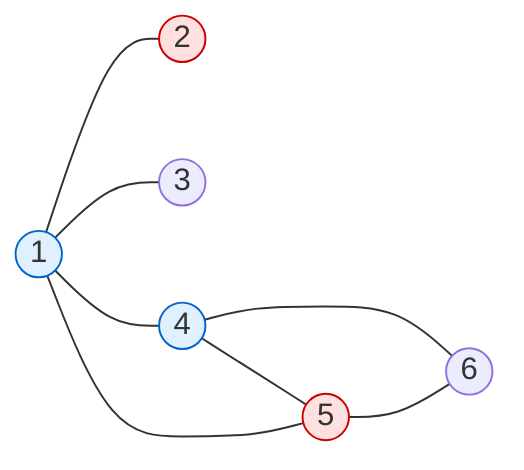

[[TOC]]

## 形式化题目

给定一张无向图：$n$ 个焊点（标号 $1 \sim n$）与 $m$ 根导线，每根导线连接两个焊点；若某一端为 $0$，表示该端是**自由端**，没有接到任何焊点上。

允许两种操作，每次操作计 $1$ 步：

1. **烧熔一个焊点**：把接在该焊点上的所有导线端重新分成若干组，同一组内的端仍然相连，不同组之间分离；
2. **焊接两个自由端**：把两根导线的自由端接在一起。

要求用上**全部**导线，把它们首尾相接成闭环（相框）。图可能不连通，每个连通块各自收成一个环即可。求最少操作步数。

限制条件：如果某个焊点只接了一根导线（度数为 $1$），那么在该导线的这一端被连到别的导线之前，不允许烧熔这个焊点；没有接任何导线的焊点可以直接忽略。数据范围 $0 \leqslant n \leqslant 1000$，$2 \leqslant m \leqslant 50000$。

## 正解

### 思路

一个连通块能被一笔画完并回到起点，等价于块内**每个顶点的度数都是偶数**（欧拉回路）。所以"改造成相框"这件事，只和每个块的度数奇偶、以及度数太高的点有关。下面分三笔账算。

**第一笔：奇端配对，需要 $o/2$ 次焊接。**

对每个连通块，设

$$o = \text{(块内奇度焊点数)} + \text{(块内自由端数)}.$$

一次焊接只能同时消掉两个奇端，所以至少需要 $o/2$ 步；而自由端本来就是裸露的线头，两两焊上正好消掉，所以 $o/2$ 步可以做到。由握手定理，$o$ 一定是偶数。

**第二笔：度数大于 $2$ 的焊点必须烧熔。**

设块内度数 $> 2$ 的焊点个数为 $high$。这样一个焊点上挂着 $3,4,5,\dots$ 个线头，如果不烧熔，它的度数就保持不变，在"一笔画"里无法把多余的分支拆开，环就走不通。烧熔一次就可以把它的线头任意分组，因此每个这样的焊点贡献 $1$ 步，共 $high$ 步。反过来，度数 $\leqslant 2$ 的焊点本身不挡路，不需要处理。

**第三笔：已经闭合的块要"烧开再焊回"。**

如果某个块满足 $o = 0$，说明它内部度数已经全偶、也没有自由端，**它自己就已经是一个闭环**了。但相框要求所有导线串在同一个环上，这个块必须被打开一次再合上：至少 $1$ 次烧熔加 $1$ 次焊接，也就是 $2$ 步。如果块里本来就有 $high$ 个高次点，那么烧熔这些点的同时就已经把它打开了，只需额外多 $1$ 步，于是代价是 $high + 1$。

综合三笔账，每个连通块的代价为

$$
\text{cost} =
\begin{cases}
high + \dfrac{o}{2}, & o > 0,\\[2mm]
\max\left(2,\ high + 1\right), & o = 0.
\end{cases}
$$

答案就是所有块的 $\text{cost}$ 之和。

下面用输入样例说明这些量怎么算。样例是**一个**连通块：

```
6 8
1 2      各点度数： deg[1]=4  deg[2]=1  deg[3]=2
1 3                 deg[4]=4  deg[5]=3  deg[6]=2
3 4
1 4
4 6
5 6
4 5
1 5
```

| 量 | 取值 | 说明 |
| --- | --- | --- |
| 奇度焊点 | $2$ 个（点 $2$、点 $5$） | 度数为 $1$ 和 $3$ |
| 自由端 | $0$ 个 | 没有端点为 $0$ 的导线 |
| $o$ | $2 + 0 = 2$ | 需要 $o/2 = 1$ 次焊接 |
| $high$ | $3$ 个（点 $1$、点 $4$、点 $5$） | 度数为 $4,4,3$，都 $>2$ |
| cost | $3 + 2/2 = 4$ | 与样例输出一致 |

图中这块由 $1$ 和 $4$ 两个"十字路口"（度数 $4$）把导线织在一起，必须把它们分别烧熔拆成偶度，再补一次焊接把剩下的两个奇端接上：



红色是奇度点（点 $2$、点 $5$，$o$ 的来源），蓝色是度数 $>2$ 的点（点 $1$、点 $4$，$high$ 的来源）。烧熔点 $1$、点 $4$、点 $5$ 花 $3$ 步，再把拆出来的两个奇端焊到一起花 $1$ 步，总共 $4$ 步。

注意几个边界情形：

- 单根两端都是自由端的导线 $0\text{-}0$：$o = 2$，代价 $1$（把两个线头焊成一个自环）；
- 自环导线 $v\text{-}v$：$o = 0$、$high = 0$，代价 $\max(2, 0+1) = 2$；
- 两点之间的平行边（$1\text{-}2$ 与 $2\text{-}1$）：同样 $o = 0$，代价 $2$；
- 一条路径：只有两个端点度为 $1$，$o = 2$，代价 $1$；
- $n = 0$：没有焊点，每根导线都是 $0\text{-}0$，每根贡献 $1$。

实现上只需要并查集把共享焊点的导线并成连通块（两端都为 $0$ 的导线各自单独成块），再按块累计三个计数器 $odd, free, high$ 即可。

### 代码

Python 版：

@include-code(./main.py, python)

C++ 版（同一算法）：

@include-code(./main.cpp, cpp)

### 复杂度

并查集带路径压缩，时间 $O(m\,\alpha(n))$，空间 $O(n + m)$。对 $m \leqslant 50000$ 的数据，Python 实现实测单组最慢 $0.02$ s、峰值内存约 $15$ MB。

## 总结

把导线当边、焊点当点，按连通块统计奇端数 $o$ 与度数大于 $2$ 的焊点数 $high$：$o > 0$ 的块代价是 $high + o/2$，$o = 0$ 的块已被封闭，代价是 $\max(2, high+1)$；全部相加即为答案。
