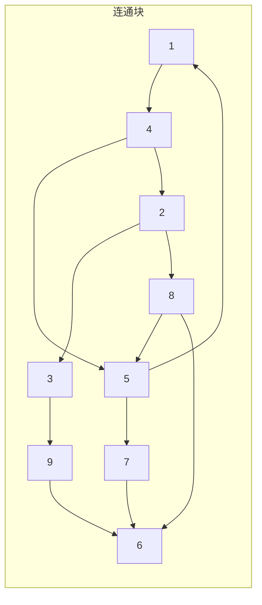

[[TOC]]

## 形式化题目

给定 $m$ 个互不相同的有序数对 $(l_i, r_i)$。
要求构造一个长度最短的整数序列 $A = (a_1, a_2, \dots, a_L)$，使得对所有 $1 \leqslant i \leqslant m$，都存在某个下标 $k$ 满足 $a_k = l_i$ 且 $a_{k+1} = r_i$。
输出序列的最短长度 $L$。

## 正解

### 思路

将每个特征数对 $(l, r)$ 视作有向图中的一条有向边 $l \to r$，整个输入构成一张包含 $m$ 条有向边的图。

序列中相邻的元素 $a_k \to a_{k+1}$ 对应沿着图中的一条有向边移动。一段连续的序列对应图中的一条有向路径。假设我们将整张图的 $m$ 条边划分为 $P$ 条互不相交的有向路径，每条路径包含 $e_i$ 条边（满足 $\sum_{i=1}^P e_i = m$），则第 $i$ 条路径需要 $e_i + 1$ 个元素。拼接这 $P$ 条路径构成的序列总长度为：

$$ L = \sum_{i=1}^P (e_i + 1) = \sum_{i=1}^P e_i + P = m + P $$

因此，要使序列总长度最小，等价于**用最少条数的有向路径覆盖图中的所有边**。

图由若干个互不相连的弱连通分量组成，每个连通分量内部必须独立覆盖。对于某一个弱连通分量 $C$：
1. 统计每个顶点的出度 $out[u]$ 和入度 $in[u]$。
2. 在任意一条有向路径中，只有起点满足出度比入度多 1，终点满足入度比出度多 1，中间点出入度相等。因此，若一个节点满足 $out[u] > in[u]$，它必须至少作为 $out[u] - in[u]$ 条路径的起点。
3. 记连通分量 $C$ 中所有顶点的正度数差之和为：
   $$ \Delta_C = \sum_{u \in C,\, out[u] > in[u]} (out[u] - in[u]) $$
   - 若 $\Delta_C > 0$，说明分量内无法形成欧拉回路，最少需要 $\Delta_C$ 条路径覆盖所有边。
   - 若 $\Delta_C = 0$，说明分量内所有节点出度均等于入度，图存在欧拉回路，此时可以用 $1$ 条闭合路径覆盖所有边。
   因此，该分量所需的最少路径数为：
   $$ P_C = \max(1, \Delta_C) $$

整张图所需的最少路径数为各个弱连通分量所需路径数之和：
$$ P = \sum_{C} P_C = \sum_{C} \max(1, \Delta_C) $$

最终答案即为：
$$ \text{Ans} = m + \sum_{C} \max\left(1, \sum_{u \in C,\, out[u] > in[u]} (out[u] - in[u])\right) $$

使用并查集维护顶点的弱连通性，遍历边统计出入度后，按连通块求和即可。

### 代码

@include-code(./main.py, python)

### 复杂度

- 时间复杂度：$O(m \alpha(V) + V)$，其中 $m$ 为特征数对数量，$V$ 为出现的不同节点数量（$V \leqslant 1000$）。并查集合并与度数统计均在毫秒级内完成。
- 空间复杂度：$O(V)$，存储节点出入度与并查集结构。

## 图示解析

以样例数据为例：
样例输入包含 12 条边，构成的图分为若干局部路径，通过计算各点的出入度差值可确定欧拉路径划分方案。

观察各节点的入度与出度：
- 节点 $8$：出度 2，入度 1，差值 $+1$
- 节点 $4$：出度 2，入度 1，差值 $+1$
- 节点 $2$：出度 2，入度 1，差值 $+1$
- 节点 $6$：出度 0，入度 3，差值 $-3$
- 其余节点出度与入度均相等。

全图为单个连通分量，正度数差之和为 $(2-1) + (2-1) + (2-1) = 3$。最少需要 $3$ 条路径覆盖所有边，最终答案长度为 $12 + 3 = 15$。

## 总结

本题的关键在于通过模型转换，将“求最短重叠序列”转化为经典的“有向图最少有向路径覆盖所有边”问题。结合欧拉图性质，单个弱连通块的最少路径数取决于度数不平衡顶点的差值，再通过并查集对弱连通分量分别处理，最终得到简单且高效的线性阶解法。
