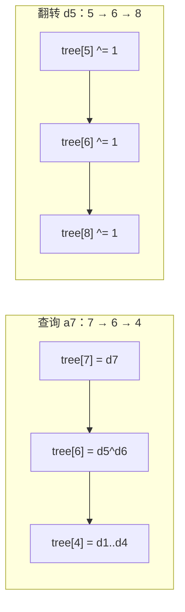

[[TOC]]

## 形式化题目

有一个长度为 $n$ 的 0/1 数组 $a$，初始全为 $0$。按顺序处理 $m$ 条指令：

- **区间翻转** `1 L R`：对所有 $L \leqslant j \leqslant R$，令 $a_j \leftarrow a_j \oplus 1$；
- **单点询问** `2 i`：输出 $a_i$ 的当前值。

指令**在线交错**给出，每次询问必须看到它之前所有翻转的累积效果。求按顺序输出每个询问的答案。

这是"区间修改 + 单点查询"，方向与常见的"单点修改 + 区间查询"正好相反。

以样例（$n = 20$）的前四条指令说明"翻转只动差分数组的两端"：

| 指令 | 执行后数组 $a_1 \dots a_{20}$ | 差分数组 $d$ 的变化 | 输出 |
| --- | --- | --- | --- |
| `1 1 10` | `11111111110000000000` | $d_1 \oplus 1$、$d_{11} \oplus 1$ | |
| `2 6` | 不变 | 无 | 1 |
| `2 12` | 不变 | 无 | 0 |
| `1 5 12` | `11110000001100000000` | $d_5 \oplus 1$、$d_{13} \oplus 1$ | |

观察重点：`1 1 10` 翻转了 10 个位置，但 $d$ 只有 $d_1$ 与 $d_{11}$ 变了；区间**内部**
的 $d_j$（$1 < j \leqslant 10$）因为相邻两数同时取反而保持不变。这就是把 $O(n)$ 的区间
操作压成 $O(1)$ 个单点操作的来源；代价是查询 $a_i$ 要异或 $d_1 \dots d_i$。

## 正解

### 思路

**朴素做法。** 直接用数组存 $a$：`1 L R` 就逐位取反 $O(R - L + 1) \leqslant O(n)$，
`2 i` 直接输出 $O(1)$。$n, m$ 最大为 $10^5, 5 \times 10^5$，最坏
$O(nm) = 5 \times 10^{10}$，不可行。瓶颈在于每次翻转都碰了整个区间，
而被碰的绝大多数位置在后续翻转中又会被反复抹掉。

**关键观察：差分把区间翻转降成两次单点翻转。** 定义异或差分

$$d_i = a_i \oplus a_{i-1} \quad (1 \leqslant i \leqslant n), \qquad a_0 = 0.$$

当 $[L, R]$ 全体取反时：

- 若 $L < j \leqslant R$，则 $a_j$ 与 $a_{j-1}$ **同时**取反，
  $d_j = a_j \oplus a_{j-1}$ 不变；
- $j = L$ 时只有 $a_L$ 变了，故 $d_L$ 取反；
- $j = R + 1$ 时只有 $a_R$ 变了（$a_{R+1}$ 不在翻转区间内），故 $d_{R+1}$ 取反。

于是 `1 L R` 只需对 $d_L$ 和 $d_{R+1}$ 各取反一次。这里用的是异或而不是减法，
"差分—前缀和"的互逆关系在 $\mathrm{GF}(2)$ 下照样成立：把 $d_1 \dots d_i$ 依次
异或，中间的 $a_1 \dots a_{i-1}$ 都出现两次而抵消，恰好剩

$$a_i = d_1 \oplus d_2 \oplus \dots \oplus d_i.$$

所以问题被改写成：维护 0/1 数组 $d$，支持**单点取反**与**异或前缀和查询**。
瓶颈从修改侧转移到了查询侧——每次查询要合并 $i$ 项。

**在线结构：异或树状数组。** 如果所有翻转都能先收集完再处理，扫一遍差分即可
$O(n + m)$；但指令在线交错，查询的时刻是本质的，不能重排。树状数组正好提供
"单点修改 + 前缀查询"的在线支持：它把前缀 $[1, i]$ 拆成
$O(\log i)$ 个互不相交的区间，每个区间对应一个结点。普通树状数组靠加法的
结合律工作；异或同样满足结合律与交换律，所以**把加法换成异或，全部推导原样成立**：

- 单点取反 $d_i$：沿 $i \to i + \mathrm{lowbit}(i)$ 向上，把覆盖到 $i$ 的结点全部取反；
- 前缀异或：沿 $i \to i - \mathrm{lowbit}(i)$ 向下，把拆出的结点异或起来。

两个方向各走 $O(\log n)$ 步，总计 $O((n + m) \log n)$，正是本题的标准正解。

**实现要点。** 唯一的边界是右端点：$R = n$ 时 $d_{n+1}$ 落在数组外，而前缀异或的
最大下标只到 $n$，这个位置永远不会被读到，直接跳过即可（代码里的 `if right < n`）。

### 代码

@include-code(./main.py, python)

`lowbit`、`flip`、`prefix_xor` 三个函数分别对应上面推导里的三个概念：结点管辖长度、
单点取反、前缀异或；`solve()` 只负责读 token、按 $t$ 分派到这两个操作并收集输出。
差分模型的说明写在 `tree` 初始化处的注释里，避免读者把 `tree` 误当成原数组。

### 复杂度

- 时间复杂度：$O((n + m) \log n)$。每次翻转至多两次单点取反，每次询问一次前缀异或，
  均为 $O(\log n)$。
- 空间复杂度：$O(n + m)$。树状数组 $n + 1$ 个整数，另需 $O(m)$ 的输入与输出缓冲。
- 实测：$n = 10^5, m = 5 \times 10^5$ 的最强数据 0.45 s / 78 MB，在 1000 ms、128 MB 内。

## 总结

- "区间修改 + 单点查询"优先考虑**差分**：异或差分让区间翻转退化成两个单点取反，
  单点值则成为差分的异或前缀和。
- 前缀操作要在线完成，就用**异或树状数组**：异或满足结合律、交换律，
  把树状数组的加法直接换成异或即可，复杂度 $O((n+m)\log n)$，与正解同阶。
- 右端点 $R = n$ 时 $d_{n+1}$ 越界且永不被查询读到，跳过它不破坏正确性。

## 图示解析

下面以 $n = 8$ 为例，展示异或树状数组如何用两个 $O(\log n)$ 链完成两种操作。
表中 $\mathrm{tree}[i]$ 维护的是差分区间 $(i - \mathrm{lowbit}(i),\ i]$ 的异或和。

| $i$ | 1 | 2 | 3 | 4 | 5 | 6 | 7 | 8 |
| --- | --- | --- | --- | --- | --- | --- | --- | --- |
| 管辖的 $d$ | $d_1$ | $d_{1..2}$ | $d_3$ | $d_{1..4}$ | $d_5$ | $d_{5..6}$ | $d_7$ | $d_{1..8}$ |

- 查询 $a_7$（`prefix_xor(7)`）：按 $7 \to 6 \to 4$ 拆分，$a_7 = \mathrm{tree}[7] \oplus \mathrm{tree}[6] \oplus \mathrm{tree}[4]$，三段区间 $(6,7] \cup (4,6] \cup (0,4] = (0,7]$ 恰好拼成 $d_1 \dots d_7$，不重不漏；
- 翻转 $d_5$（`flip(5)`）：按 $5 \to 6 \to 8$ 向上，恰好是所有管辖到 $d_5$ 的结点，取反这三个结点即完成单点修改。

注意两条链在 `tree[6]` 处相交：它既参与 $a_7$ 的查询，也覆盖 $d_5$ 的更新。
这正说明树状数组为什么能把两种操作都压到 $O(\log n)$——每个结点同时服务多个前缀。
