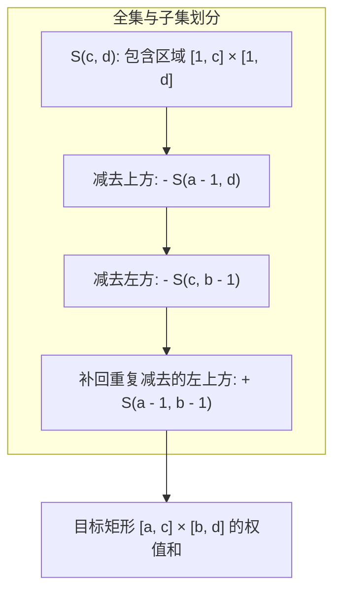

[[TOC]]

## 形式化题目

维护一个大小为 $n \times m$ 的矩阵 $A$（下标从 $1$ 开始），初始全为 $0$。支持如下两类在线操作：

1. 单点增加：给定 $x, y, k$，执行 $A_{x,y} \leftarrow A_{x,y} + k$。
2. 子矩形求和：给定 $a, b, c, d$（保证 $1 \le a \le c \le n$ 且 $1 \le b \le d \le m$），计算并返回 $\sum_{i=a}^{c} \sum_{j=b}^{d} A_{i,j}$。

## 正解：二维树状数组

### 思路

#### 1. 朴素做法及其局限

若直接用二维数组维护原矩阵，单点增加操作时间复杂度为 $O(1)$。但对于每次矩形求和操作，需要遍历所有属于行范围 $[a, c]$ 与列范围 $[b, d]$ 的元素，单次查询时间复杂度为 $O((c - a + 1)(d - b + 1)) = O(nm)$。在 $n, m \le 4096$ 且操作数达到 $3 \times 10^5$ 的规模下，总体时间复杂度将达到 $O(q \cdot nm)$，显然会超时。

若采用静态二维前缀和，单次查询为 $O(1)$，但每次单点修改需要更新后续所有前缀和，单次修改耗时 $O(nm)$，同样无法承受。

#### 2. 二维前缀和与容斥原理

定义二维前缀和 $S(x, y) = \sum_{i=1}^{x} \sum_{j=1}^{y} A_{i,j}$。对于任意查询矩形 $[a, c] \times [b, d]$，根据容斥原理，该区域内的元素和可以表示为 4 个前缀矩形和的线性组合：

$$
\sum_{i=a}^{c} \sum_{j=b}^{d} A_{i,j} = S(c, d) - S(a - 1, d) - S(c, b - 1) + S(a - 1, b - 1)
$$

因此，只要我们能高效地支持：
1. 单点修改 $A_{x,y}$；
2. 动态查询任意前缀和 $S(x, y)$。

就可以在相同的时间复杂度内完成子矩形查询。

#### 3. 二维树状数组（2D Fenwick Tree）

一维树状数组通过管辖区间 $[i - \text{lowbit}(i) + 1, i]$ 实现动态前缀和与单点加，单次操作复杂度为 $O(\log n)$。

将一维树状数组推广到二维：外层树状数组维护行坐标，每个行节点内部嵌套一个一维树状数组维护列坐标。节点 $(i, j)$ 管辖的原矩阵区域为：
$$
[i - \text{lowbit}(i) + 1, i] \times [j - \text{lowbit}(j) + 1, j]
$$

- **单点更新 `add(x, y, k)`**：从外层 $i = x$ 开始，每次 $i \leftarrow i + \text{lowbit}(i)$；对于每个合法的行下标 $i$，内层从 $j = y$ 开始，每次 $j \leftarrow j + \text{lowbit}(j)$，将树状数组节点对应的值加上 $k$。
- **前缀查询 `query(x, y)`**：从外层 $i = x$ 开始，每次 $i \leftarrow i - \text{lowbit}(i)$；内层从 $j = y$ 开始，每次 $j \leftarrow j - \text{lowbit}(j)$，累加所有管辖区间的和。

对于 Python 实现，若直接开辟 $(n + 1) \times (m + 1)$ 的定长二维数组，当 $n, m = 4096$ 时需要分配约 $1.6 \times 10^7$ 个元素，空间占用大且分配慢；使用 `list[dict[int, int]]` 稀疏存储只对被修改的位置分配内存，既省内存又利于快速初始化。

### 代码

@include-code(./main.py, python)

### 复杂度

- **时间复杂度**：
  - 单点增加：外层循环执行 $O(\log n)$ 次，内层循环执行 $O(\log m)$ 次，单次修改耗时 $O(\log n \log m)$。
  - 矩形查询：执行 4 次二维前缀查询，每次前缀查询耗时 $O(\log n \log m)$，单次查询耗时 $O(\log n \log m)$。
  - 总时间复杂度为 $O(q \log n \log m)$。在 $q = 3 \times 10^5$、$n, m \le 4096$ 下，$\log_2 n, \log_2 m \le 12$，总操作量约 $3 \times 10^5 \times 144 \approx 4.3 \times 10^7$ 次基本运算，完全满足时限要求。
- **空间复杂度**：
  - 二维树状数组每个修改操作最多增加 $O(\log n \log m)$ 个字典键值对。
  - 最多 $q$ 次修改，字典总大小不超过 $O(q \log n \log m)$；外层列表大小为 $O(n)$。总空间复杂度为 $O(n + q \log n \log m)$，满足内存限制。

## 图示解析

二维子矩阵和通过二维前缀和容斥计算的示意图如下：

矩阵网格划分示意图：

| 区域标识 | 行范围 | 列范围 | 容斥系数 |
| :--- | :--- | :--- | :--- |
| **左上角** | $[1, a - 1]$ | $[1, b - 1]$ | $+1 - 1 - 1 + 1 = 0$ |
| **正上方** | $[1, a - 1]$ | $[b, d]$ | $+1 - 1 = 0$ |
| **正左方** | $[a, c]$ | $[1, b - 1]$ | $+1 - 1 = 0$ |
| **目标子矩阵** | $[a, c]$ | $[b, d]$ | **$+1$** |

每个树状数组节点维护一个二维矩形区间的和，沿 lowbit 链式向上更新与向下累加，实现了二维维度上的动态树形维护。

## 总结

1. 本题是经典的二维单点修改、二维子矩阵和查询模板题。
2. 核心数学思想是将二维矩形求和通过**容斥原理**转化为 4 次二维前缀矩形求和。
3. 动态维护二维前缀和利用**二维树状数组**，将两个维度独立做树状数组分解，每次修改和查询只需 $O(\log n \log m)$ 时间。
4. 在 Python 实现中，结合稀疏字典表示每行的内层树状数组，可以避免开辟大规格全量数组的内存和初始化开销。
