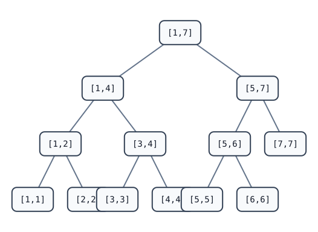

[[TOC]]

## 形式化题目

给定长度为 $n$ 的非负整数序列 $a[1..n]$ 与模数 $P$，支持 $m$ 次操作（$1 \leqslant t \leqslant g \leqslant n$，$0 \leqslant c \leqslant 10^9$）：

1. `1 t g c`：对每个 $i \in [t, g]$，令 $a_i \gets a_i \times c \bmod P$；
2. `2 t g c`：对每个 $i \in [t, g]$，令 $a_i \gets a_i + c$；
3. `3 t g`：输出 $\sum_{i=t}^{g} a_i \bmod P$。

以题面样例（$P = 43$，$a = [1, 2, 3, 4, 5, 6, 7]$）逐操作推演，表格中"处理后序列"是该操作执行完后的状态：

| 序号 | 操作 | 处理后序列 $a$ | 本步输出 |
| :---: | :---: | :---: | :---: |
| 1 | `1 2 5 5` | $[1,\ 10,\ 15,\ 20,\ 25,\ 6,\ 7]$ | — |
| 2 | `3 2 4` | 同上 | $10 + 15 + 20 = 45$，$45 \bmod 43 = 2$ |
| 3 | `2 3 7 9` | $[1,\ 10,\ 24,\ 29,\ 34,\ 15,\ 16]$ | — |
| 4 | `3 1 3` | 同上 | $1 + 10 + 24 = 35$ |
| 5 | `3 4 7` | 同上 | $29 + 34 + 15 + 16 = 94$，$94 \bmod 43 = 8$ |

三次询问依次输出 $2$、$35$、$8$。注意题面【提示】把第 2 次询问写成 22，但 $45 \bmod 43 = 2$，与【输出样例】一致，以样例输出为准（题面笔误）。

## 正解

### 思路

#### 1. 朴素做法与其瓶颈

每次修改、询问都逐点扫完整个 $[t, g]$：单次 $O(n)$，总计 $O(nm) = 10^{10}$，超时。

把查询侧直接换成经典的"区间和 + 懒标记"线段树只救一半：那种线段树只有**加法标记**。遇到区间乘时，段内每个数从 $x + a$ 变成 $b(x + a) = bx + ba$，不再是"加一个常数"——加法标记家族对乘法不封闭；反过来乘法标记也接不住加法（$bx + c$ 不是"乘一个常数"）。两种标记各存各的，下推时还得分谁先谁后。瓶颈是：**要找一个对乘、加都封闭的标记结构**。

#### 2. 关键观察：修改都是仿射变换，且复合封闭

把每个修改看成对段内每个数施加的变换 $x \mapsto b \cdot x + c \pmod P$：

| 操作 | 变换 $(b, c)$ |
| :---: | :---: |
| 区间乘 $v$ | $(v \bmod P,\ 0)$ |
| 区间加 $v$ | $(1,\ v \bmod P)$ |

仿射变换按"先做已有标记 $(m, a)$（即孩子还欠着的变换），再做新操作 $(b, c)$"复合：

$$ x \xrightarrow{\ (m, a)\ } mx + a \xrightarrow{\ (b, c)\ } b(mx + a) + c = (bm)\,x + (ba + c) $$

复合结果 $(bm,\ ba + c)$ 仍是仿射变换，恒等变换 $(1, 0)$ 是单位元——**封闭性**正是第 1 节里加法标记缺失的性质，于是乘和加共用同一个标记，不再需要区分先后。

区间和在变换下的像也有闭式：长度 $L$、当前和 $S$ 的整段套用 $(b, c)$ 后变成

$$ S \mapsto bS + cL \pmod P $$

所以整段结算不需要知道段内每个数是什么。

#### 3. 线段树设计

线段树每个节点存区间和 $t$ 与懒标记 $(m, a)$，三个核心动作：

- **apply(node, L, b, c)**：整段结算 $t \gets bt + cL$，并把标记复合为 $(bm,\ ba + c)$；
- **push(node)**：把本节点标记对两个孩子 `apply`（孩子的真实和被一并修正），本节点复位为 $(1, 0)$；
- **update / query**：查询区间整段覆盖直接返回 $t$，修改整段覆盖直接 `apply`；否则先 `push` 兑现欠账，只递归真正相交的一侧，回溯时用两个孩子的和刷新 $t$。

区间分解的 $O(\log n)$ 来源如下图（规模 7 的线段树，节点标注其代表的区间）：

任意操作区间都被拆成 $O(\log n)$ 个"整段节点"：例如修改 $[2, 5]$ 命中 `[2,2]`、`[3,4]`、`[5,5]` 三个整段，各花 $O(1)$ 结算，不必访问区间内的每个点。

正确性依赖一条不变式：**节点的 $t$ 恒等于其真实区间和模 $P$（因而恒小于 $P$），标记恒等于孩子欠做的变换**。整段修改只更新自己、把欠账复合进标记；任何要读孩子的地方都先 `push` 兑现欠账——沿递归深度归纳，每次读到的 $t$ 都是真实值。

### 代码

@include-code(./main.py, python)

### 复杂度

- **时间复杂度**：建树 $O(n)$；每次操作把区间拆成 $O(\log n)$ 个整段节点，递归路径也是 $O(\log n)$，每个节点的 `apply`/读取为 $O(1)$。合计 $O((n + m) \log n)$，与 C++ 双标记正解同阶。
- **空间复杂度**：线段树 $4n$ 个节点各存一个和与一个二元标记，输出列表 $O(m)$，合计 $O(n + m)$；本实现峰值约 92MB。

## 总结

区间乘、区间加单独看都是简单懒标记，难在两者混合：标记结构必须对两种操作都封闭，而加法标记扛不住乘法（$(x + a)b = bx + ba$ 不再是加法）。把两类操作统一成仿射变换 $x \mapsto bx + c$ 后，封闭性由复合律

$$ (m, a) \circ (b, c) = (bm,\ ba + c) $$

直接给出：乘、加共用一个 $(m, a)$ 双分量标记，`apply` 负责"整段结算 $bS + cL$ + 标记复合"，`push` 负责下推兑现，$O((n + m) \log n)$ 完成全部操作。实现上最容易写反的是复合次序——新操作最后作用在数上，标记应取 $(bm,\ ba + c)$；若写成 $(bm,\ mc + a)$ 就把先后顺序颠倒了：以样例为例，节点 `[3,4]` 先被乘 5、再被加 9，正确标记是 $(5, 9)$，颠倒后是 $(5, 5)$，随后的询问 `3 1 3` 会把 $a_3$ 算成 20 而不是 24，立刻暴露。
