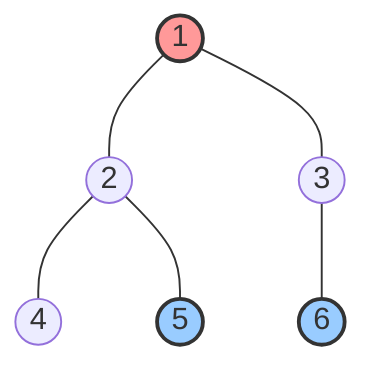

[[TOC]]

## 形式化题目

给定一棵包含 $n$ 个节点的无权无向连通树 $T=(V, E)$，边权均为 $1$。
给出 $Q$ 次查询，每次查询给定节点对 $(u, v)$，求 $u$ 与 $v$ 在树上的简单路径长度（即两点之间的最短边数 $\text{dist}(u, v)$）。

## 正解

### 思路

在一棵以节点 $1$ 为根的有根树中，任意两节点 $u$ 与 $v$ 之间的简单路径必定唯一通过它们的最近公共祖先 $\text{LCA}(u, v)$。

设 $\text{depth}[u]$ 为节点 $u$ 的深度（定义根节点的深度 $\text{depth}[1] = 1$），则节点 $u$ 到根节点的边数恰为 $\text{depth}[u] - 1$。
从 $u$ 到 $v$ 的路径可以拆分为先由 $u$ 向上走到 $\text{LCA}(u, v)$，再从 $\text{LCA}(u, v)$ 向下走到 $v$ 两段：
- $u$ 到 $\text{LCA}(u, v)$ 的边数为 $\text{depth}[u] - \text{depth}[\text{lca}]$；
- $v$ 到 $\text{LCA}(u, v)$ 的边数为 $\text{depth}[v] - \text{depth}[\text{lca}]$。

因此，两点在树上的距离公式为：
$$ \text{dist}(u, v) = \text{depth}[u] + \text{depth}[v] - 2 \cdot \text{depth}[\text{LCA}(u, v)] $$

计算距离的核心即转化为高效求解 $\text{LCA}(u, v)$。对于 $Q \leqslant 10^5$ 的在线询问，单次 $O(n)$ 暴力爬树会超时（$O(Q \cdot n)$），采用**二进制倍增法（Binary Lifting）**：

1. **倍增状态与转移**：
   定义 $\text{up}[k][u]$ 表示节点 $u$ 沿父节点方向向上跳 $2^k$ 步所到达的祖先节点。
   - 基础状态：$\text{up}[0][u] = \text{father}[u]$；
   - 状态转移：$\text{up}[k][u] = \text{up}[k-1][\text{up}[k-1][u]]$。
   由于 $n \leqslant 10^5 < 2^{18}$，取步长上限 $k < 18$ 即可覆盖全树高度。
2. **建树与预处理**：
   使用广度优先搜索（BFS）自根节点 $1$ 层次遍历整棵树，确定每个节点的深度 `depth` 和直接父节点 $\text{up}[0][u]$。采用迭代 BFS 可避免在极限链状数据下递归调用爆栈。随后按 $k = 1, 2, \dots, 17$ 双重循环递推填充倍增表。
3. **倍增查询 LCA**：
   - 设 $u$ 的深度不小于 $v$（若 $\text{depth}[u] < \text{depth}[v]$ 则交换）；
   - 计算深度差 $\Delta = \text{depth}[u] - \text{depth}[v]$，将其按二进制拆分，把 $u$ 提升到与 $v$ 相同的深度；
   - 若此时 $u == v$，说明原先的 $v$ 即为 $u$ 的祖先，直接返回 $u$；
   - 否则，$k$ 从 $17$ 逆序递减到 $0$：若 $\text{up}[k][u] \neq \text{up}[k][v]$，则两点同步向上跳跃至对应祖先。循环结束后，两点恰好停留在 LCA 的直接子节点处，最终答案即为 $\text{up}[0][u]$。

### 代码

@include-code(./main.py, python)

### 复杂度

- **时间复杂度**：
  - BFS 建树与遍历：每条边与节点访问常数次，耗时 $O(n)$。
  - 倍增数组预处理：遍历 $18 \times n$ 个状态，耗时 $O(n \log n)$。
  - 单次 LCA 询问：对齐深度与同步上跳均至多执行 $18$ 步，耗时 $O(\log n)$。
  - 回答 $Q$ 次询问总耗时 $O(Q \log n)$。
  - 总时间复杂度为 $O((n + Q) \log n)$。
- **空间复杂度**：
  - 邻接表与深度表占用 $O(n)$ 空间。
  - 倍增表占用 $O(n \log n)$ 空间。
  - 总空间复杂度为 $O(n \log n)$。

## 总结

1. **树上距离与 LCA 的转化**：无权树上两点距离直接由深度表与最近公共祖先深度确定：$\text{dist}(u, v) = \text{depth}[u] + \text{depth}[v] - 2 \cdot \text{depth}[\text{lca}]$，将路径长度问题转化为树上祖先定位。
2. **二进制倍增的稳定性**：倍增法将单次搜索从 $O(n)$ 降为 $O(\log n)$，预处理与查询开销均衡，且逻辑均为数组随机访问，十分适合应对多组在线询问。

## 图示解析

下图以样例树结构说明询问 $(2, 6)$ 与 $(5, 6)$ 的最近公共祖先及路径：

- 根节点为 $1$（$\text{depth}[1]=1$）。
- 询问 $(2, 6)$：$\text{depth}[2]=2, \text{depth}[6]=3$。最近公共祖先为节点 $1$（$\text{depth}[1]=1$），路径为 $2 \to 1 \to 3 \to 6$，边数为 $2 + 3 - 2 \times 1 = 3$。
- 询问 $(5, 6)$：$\text{depth}[5]=3, \text{depth}[6]=3$。最近公共祖先为节点 $1$（$\text{depth}[1]=1$），路径为 $5 \to 2 \to 1 \to 3 \to 6$，边数为 $3 + 3 - 2 \times 1 = 4$。
