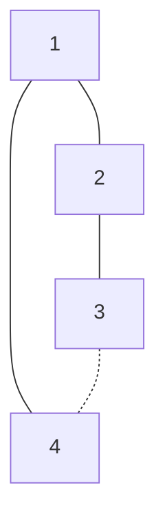

[[TOC]]

## 形式化题目

给定一个 $N$ 个节点的无向图，由两类边组成：

- $N-1$ 条**主要边**构成一棵树（任意两点间恰有一条只走主要边的路径）；
- $M$ 条**附加边**。

按规则切两条边：先切一条主要边，之后主要边无敌、只能再切一条附加边（即使第一步已把图切断，也必须切）。问有多少种"（第一条主要边，第二条附加边）"的有序方案，使最终图不连通。

以样例 $N=4,\ M=1$ 为例，主要边 $(1,2),(2,3),(1,4)$、附加边 $(3,4)$，样例的树与虚线附加边如下：

切主要边 $(1,2)$ 后 $\{1,4\}$ 与 $\{2,3\}$ 两半只靠附加边 $(3,4)$ 相连，切掉它即断开；同理切 $(2,3)$、$(1,4)$ 后也都只剩附加边 $(3,4)$ 这一条连接，各对应 1 种方案，共 $1+1+1=3$，与样例输出一致。

## 正解

### 思路

**朴素做法先暴露瓶颈。** 枚举每条主要边 $e$：切断它，树断成两半 $A,B$；再枚举 $M$ 条附加边数出跨 $A,B$ 的条数 $c_e$。关键是第二步切完后图不连通的条件：

- 切完第一条后两半内部各是一棵树（树边都在各自半边内），所以**内部永远连通**，第二步切内部边不影响断开；
- 整图连通当且仅当还剩至少一条跨 $A,B$ 的附加边。

于是对每条主要边 $e$ 按 $c_e$ 三分类：

| $c_e$（跨边数） | 第二步可切的附加边 | 贡献 |
| --- | --- | --- |
| $0$ | 图已断开，题面仍要求切一条，$M$ 条任选都保持断开 | $M$ |
| $1$ | 只有切掉那条唯一的跨边才能断开 | $1$ |
| $\geqslant 2$ | 切一条至少还剩一条，两半始终相连 | $0$ |

答案就是 $\sum_{e} \big(c_e = 0 ?\ M :\ c_e = 1 ?\ 1 :\ 0\big)$。

**瓶颈与翻转。** 朴素做法对每条树边重新数一遍跨边，总 $O(N(N+M))$；而所有 $c_e$ 其实由 $M$ 条附加边决定——每条附加边 $(u,v)$ 会给路径 $u \to v$ 上的每条树边 $+1$。把问题翻转成"枚举附加边、路径加，最后统一收集"，就是经典的**树上差分**：

- 设 $w = \mathrm{lca}(u,v)$，对差分数组（代码中的 `diff`）做 $\mathrm{diff}[u] {+}{+},\ \mathrm{diff}[v] {+}{+},\ \mathrm{diff}[w] {-}{-} 2$（两个端点的流在 LCA 处抵消）；
- 对树按**后序**累加（代码中倒序遍历先根列表 `reversed(order)`），孩子 $x$ 上累加完的 `diff[x]` 恰好等于边 $(\mathrm{fa}[x], x)$ 被跨越的次数，即这条边的 $c_e$；累加时顺手做三分类求和。

每条附加边只花一次 LCA 的 $O(\log N)$（倍增求法：先抬深度，再从高到低同步上跳），全部差分 $O(M\log N)$；一次倒序回溯同时完成累加和三分类求和，$O(N)$。整体 $O((N+M)\log N)$，与 C++ 正解同阶。

以样例走一遍：附加边 $(3,4)$ 的路径是 $3 \to 2 \to 1 \to 4$，三条主要边各被跨越一次，$c_e$ 全为 1，按表格每条贡献 1，得 $1+1+1=3$。

### 代码

@include-code(./main.py, python)

### 复杂度

- 时间复杂度：$O((N+M)\log N)$。建图与两次遍历 $O(N)$，倍增表 $O(N\log N)$，$M$ 次 LCA 差分 $O(M\log N)$。
- 空间复杂度：$O(N\log N)$，倍增表 $17(N+1)$ 加邻接表与差分数组；实测峰值约 83.7 MB，在 128 MB 限制内。

## 总结

- 三分类是本题的核心观察：$c_e = 0$ 贡献 $M$（图已断但必须再切一条，切哪条都行）、$c_e = 1$ 贡献 $1$、$c_e \geqslant 2$ 贡献 $0$；正确性依赖"两半内部是树、永远连通"这一性质。
- "按边枚举、查跨边"要翻转成"按附加边枚举、路径加"：树上差分 $d[u] {+}{+}, d[v] {+}{+}, d[w] {-}{-} 2$ 配一次后序累加，$O(1)$ 完成一条附加边的全部贡献。
- LCA 用倍增、遍历用迭代栈，规避 Python 递归深度限制；实测 10 组真实数据全部一致，最大一组 0.512 s、峰值 83.7 MB，本地相对 20 s 放宽限时毫无压力（OJ 限时 1000 ms 下 Python 有 TLE 风险，按约定允许）。
