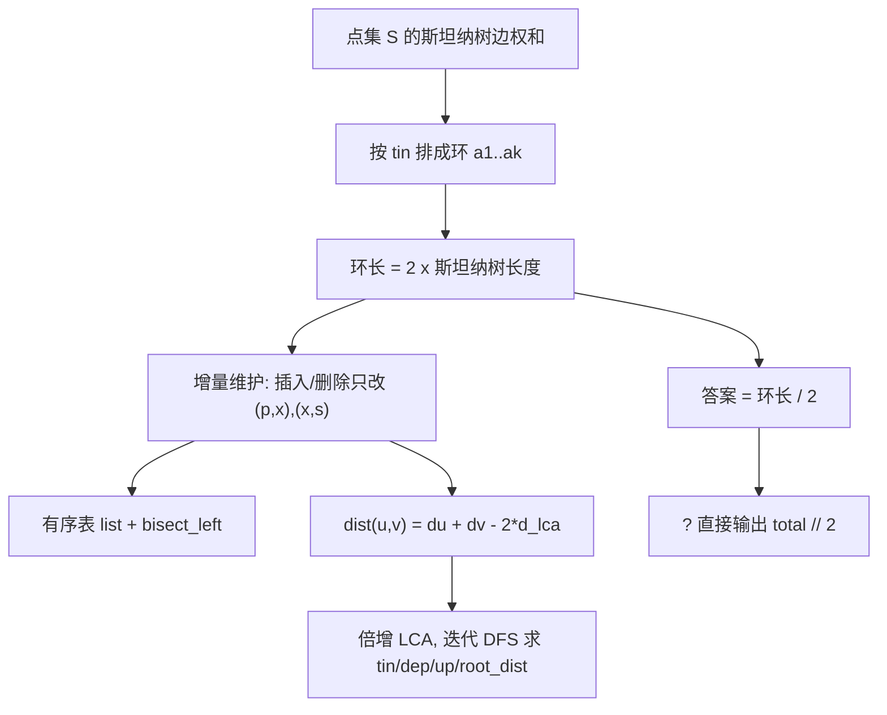

[[TOC]]

## 形式化题目

给定一棵 $N$ 个点的带权无向树，动态度量点集。要求支持：

- 向点集中加入一个当前不在集合中的点；
- 从点集中删除一个当前在集合中的点；
- 询问当前点集在树上的斯坦纳树（包含这些点及其两两路径并集的最小子树）的边权之和；点集大小不超过 1 时答案为 $0$。

## 正解

### 思路

#### 第一步：把"连通所有异象石"翻译成斯坦纳树

"使点集 $S$ 中所有点连通的最小边集"只有一种取法：$S$ 中任意两点之间的路径都必须出现在边集中，所以最小边集正是这些路径的并集，也就是 $S$ 在树上的**斯坦纳树**，答案就是它的边权和。$|S| \le 1$ 时没有边需要选，答案为 $0$。

#### 第二步：朴素做法及其瓶颈

斯坦纳树长度可以用 DFS 序算出来。把 $S$ 中的点按**进入时刻 $\mathrm{tin}$** 从小到大排成环 $a_1, a_2, \dots, a_k$（约定 $a_{k+1} = a_1$），则

$$\text{答案} \;=\; \frac{1}{2}\sum_{i=1}^{k} \operatorname{dist}(a_i,\; a_{i+1}).$$

于是朴素做法是：每次询问重新枚举整个 $S$、排序、逐对求 LCA 距离，单次 $O(|S| \log N)$。$M$ 次询问最坏 $O(NM \log N)$，显然会超时。

**瓶颈很清楚：每次询问都在重算整个环，而一次操作其实只改变一个点。** 只要想到"环上只有 $O(1)$ 条相邻边会变"，复杂度立刻降下来。

#### 第三步：为什么 DFS 序能给出斯坦纳树

先说明上面那个恒等式为什么成立，否则后面的增量维护没有依据。

考虑斯坦纳树上的任意一条边 $e$。删掉 $e$ 后树被切成两侧，其中一侧（记作子树 $T_e$）里含有一部分异象石。记 $T_e$ 中异象石的 $\mathrm{tin}$ 集合为 $P_e$。

关键字是：**$P_e$ 恰好是一段连续的区间**。因为子树 $T_e$ 中的点在 DFS 序里是连续访问的。于是把环上的点依次走一遍，进入区间 $P_e$ 一次、离开它一次，**恰好跨越割 $(T_e, \bar T_e)$ 两次**。

每一次跨越都对应环上某条相邻边 $a_i \to a_{i+1}$，而 $\operatorname{dist}(a_i, a_{i+1})$ 这条路径必然经过 $e$。所以 $e$ 一共被环上相邻距离之和累加了 $2 w_e$。对斯坦纳树的每条边求和，就得到

$$\sum_{i=1}^{k} \operatorname{dist}(a_i, a_{i+1}) \;=\; 2 \cdot (\text{斯坦纳树边权和}).$$

这正是第二步的公式。这个证明同时也解释了**为什么必须用 DFS 序**：只有 DFS 序才能保证"子树的点连续成段"，换任何一种遍历序都会让某条边被跨越超过两次，从而算出偏大的结果。

以样例树为例（以 1 为根，括号内是 $\mathrm{tin}$）：

```text
              1 (tin=1)
            / | \
   (tin=6) 2  3 (tin=5)  4 (tin=2)
                         / \
                (tin=4) 5   6 (tin=3)
```

DFS 序为 $1,4,6,5,3,2$。当 $S=\{1,3,6\}$ 时，按 $\mathrm{tin}$ 排成的环是 $1 \to 6 \to 3 \to 1$，相邻距离依次为

| 相邻对 | 路径 | 距离 |
| --- | --- | --- |
| $1 \to 6$ | $1\!-\!4\!-\!6$ | $7+2=9$ |
| $6 \to 3$ | $6\!-\!4\!-\!1\!-\!3$ | $2+7+5=14$ |
| $3 \to 1$（首尾闭合） | $3\!-\!1$ | $5$ |

环和 $=9+14+5=28$，折半得 $14$，与样例第三组输出一致。

#### 第四步：增量维护

设 $x$ 在有序序列中的位置为 $i$，前驱为 $p$、后继为 $s$（都按环取模）。

- **插入 $x$**：环上原来直接相连的是 $(p, s)$，现在被 $x$ 断成 $(p,x)$ 与 $(x,s)$。环和的变化量是

  $$\Delta = \operatorname{dist}(p,x) + \operatorname{dist}(x,s) - \operatorname{dist}(p,s).$$

- **删除 $x$**：正是上式的逆操作，环和减去同一个 $\Delta$。

两处公式**完全一样**，只有加减号不同，实现时可以共用同一段表达式。这样每个操作只需 3 次 LCA 距离计算，$O(\log N)$。

#### 第五步：维护有序序列与 LCA

- 有序序列用 Python 的 `list` 维护 $\mathrm{tin}$，`bisect_left` 定位后用 `insert` / `pop` 搬移。搬移是 C 层的 `memmove`，常数极小，实测 $10^5$ 规模完全够用。
- 用 `(i - 1)`（Python 负数下标自动绕到环尾）和 `(i + 1) % len(order)`（绕回环首）统一处理首尾相邻，不需要特判。
- LCA 用倍增表：`jump[k][v]` 表示 $v$ 的第 $2^k$ 级祖先，预处理 $O(N\log N)$，单次查询 $O(\log N)$。距离用 $d_u + d_v - 2 d_{\mathrm{lca}}$，其中 $d$ 是根到点的距离。
- DFS 必须**迭代**实现：树可能退化成链，深度 $10^5$ 会让 Python 递归直接爆栈。根到点距离在 DFS 访问子节点时**立即**赋值，不能等 DFS 结束后再遍历边表补算（父边可能排在子边之后）。

### 代码

@include-code(./main.py, python)

### 复杂度

预处理 $O(N \log N)$；一次插入或删除（含有序表搬移）为 $O(\log N + k)$，$k$ 是当前异象石数量；一次询问 $O(1)$。

总时间 $O\big(N \log N + M(\log N + k)\big)$，空间 $O(N \log N)$（邻接表加倍增表）。

## 总结

- 核心恒等式：**按 DFS 序排成环后，环长等于斯坦纳树的两倍**（每条斯坦纳树边被跨越恰好两次）。
- 正因为环长是"两倍"，输出时别忘了折半；这是最容易漏掉、且会让所有答案翻倍的一步。
- 增量维护的立足点是局部性：一次操作只改环上 $O(1)$ 条相邻边，由此从"每次询问重算"降到"每次操作 $O(\log N)$"。

## 图示解析

下图把本题的推导路线、实现分工和验证要点压缩到一处，适合读完正文后复盘。



方案分工：

- **环与有序表**负责"答案是多少"，把一次操作压缩成常数次距离计算；
- **倍增 LCA 与迭代 DFS** 是底层支撑，提供 $O(\log N)$ 的两点距离；
- **`?` 事件**不做任何计算，只把已经维护好的 `total` 折半输出。

需要注意的三处边界：$S = \varnothing$ 时输出 $0$；插入第一个点时 $\Delta = 0$；同一元素先 `+` 后 `-` 能回到空集状态。
