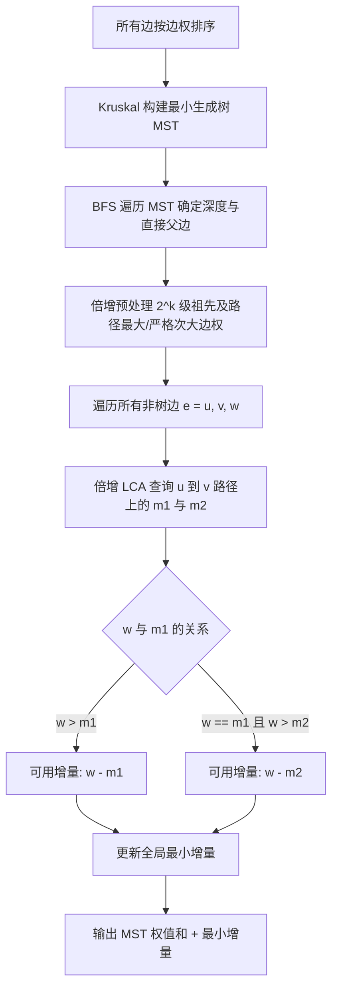

[[TOC]]

## 形式化题目

给定一个包含 $N$ 个顶点和 $M$ 条无向边的连通图 $G = (V, E)$，边权非负。
设 $G$ 的最小生成树权值和为 $sum$。
求所有权值和严格大于 $sum$ 的生成树中，权值和最小的一棵生成树的权值和。
保证图连通、无自环，且必定存在严格次小生成树。

## 正解

### 思路

根据生成树与环的基本性质，严格次小生成树一定可以由某棵最小生成树（MST）通过**替换恰好一条边**得到：
将一条不在 MST 中的非树边 $e = (u, v)$ 加入 MST 会形成唯一的简单环，若删去该环上（即原树中 $u$ 到 $v$ 的简单路径上）的一条树边 $e'$，即可得到一棵新的生成树。

新生成树的权值和为：
$$sum' = sum + w(e) - w(e')$$

为了使新生成树是**严格次小生成树**，必须满足：
1. **严格大于**：$w(e) > w(e')$，从而使得增量 $w(e) - w(e') > 0$；
2. **最小增量**：对于给定的非树边 $e$，希望减去的树边权值 $w(e')$ 尽量大，从而让增量尽量小。

因此，设树上 $u \to v$ 路径上的**最大边权**为 $m_1$，**严格次大边权**为 $m_2$（若不存在则为 $-1$）：
- 若 $w(e) > m_1$：此时替换最大边 $m_1$，增量为 $w(e) - m_1$；
- 若 $w(e) = m_1$：此时替换 $m_1$ 增量为 $0$（仍是最小生成树），不能产生严格更大的树；必须替换严格次大边 $m_2$（要求 $m_2 \neq -1$ 且 $w(e) > m_2$），增量为 $w(e) - m_2$。

**算法步骤**：
1. 使用 Kruskal 算法求出任意一棵最小生成树，并记录所有非树边。
2. 以 1 号节点为根，通过 BFS 建立树上倍增表：
   - 设 $LOGN = 18$；
   - `up[k][u]` 表示节点 $u$ 的 $2^k$ 级祖先；
   - `f1[k][u]` 表示 $u$ 到其 $2^k$ 级祖先路径上的最大边权；
   - `f2[k][u]` 表示该路径上的严格次大边权。
   - 在倍增向上合并两段路径时，将两段的最大值与次大值共 4 个候选值合并，去重并选出全局最大与严格次大。
3. 遍历每条非树边 $(u, v, w)$，在倍增 LCA 的过程中同时合并并查询树上 $u \to v$ 路径的最大值 $m_1$ 与严格次大值 $m_2$。
4. 按上述规则计算替换增量，取所有非树边中的最小增量 $\Delta_{min}$。
5. 最终答案即为 $sum + \Delta_{min}$。

### 代码

@include-code(./main.py, python)

### 复杂度

- **时间复杂度**：$O(M \log M + M \log N)$
  - 边权排序耗时 $O(M \log M)$，并查集构建 MST 耗时 $O(M \alpha(N))$；
  - 树上倍增表预处理耗时 $O(N \log N)$；
  - 查询 $M - N + 1$ 条非树边对应的路径最值，单次倍增 LCA 耗时 $O(\log N)$，总计 $O(M \log N)$。
  整个算法在 $N \le 10^5, M \le 3 \times 10^5$ 下运行平稳高效。
- **空间复杂度**：$O(N \log N + M)$
  - 存储图结构与非树边需要 $O(N + M)$ 空间；
  - 倍增数组 `up`, `f1`, `f2` 各需 $18 \times N$ 的空间，约几万至几十万元素，完全满足 128MB 限制。

## 总结

严格次小生成树是最小生成树的经典扩展，关键在于认清生成树加边成环后的单边替换原理。对于“严格”的要求，本质是规避边权相等带来的非正增量，通过在树上倍增时**同时维护最大值与严格次大值**，可以在 $O(\log N)$ 内精准得到合法替换边，将问题高效解决。
