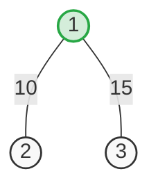
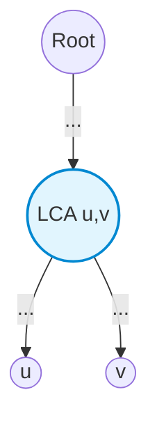

[[TOC]]

## 形式化题目

给定一棵包含 $n$ 个节点和 $n-1$ 条带权无向边的树。给定 $m$ 次询问，每次询问给出两个节点 $u, v$，要求计算树上两点 $u$ 和 $v$ 之间的唯一简单路径上的边权和（即两点间最短距离）。

以样例 2 为例，树上节点 1 连接节点 2（边权 10）和节点 3（边权 15）。询问节点 3 到 2 的距离，其简单路径为 $3 \to 1 \to 2$，距离为 $15 + 10 = 25$。

## 正解

### 思路

树上任意两点 $u$ 和 $v$ 之间有且仅有一条简单路径。若任意钦定一个根节点（例如节点 1），这条简单路径一定由两段构成：从 $u$ 向上走到它们的最深公共分叉点——即最近公共祖先 $\operatorname{LCA}(u, v)$，再向下走到 $v$。

记 $\operatorname{dist}(x)$ 为节点 $x$ 到根节点的路径权值和。根据树上路径的可减性，从根节点到 $u$ 的路径与到 $v$ 的路径重叠部分恰好是根节点到 $\operatorname{LCA}(u, v)$ 的路径。因此，两点间的距离公式为：
$$\operatorname{dist}(u, v) = \operatorname{dist}(u) + \operatorname{dist}(v) - 2 \cdot \operatorname{dist}(\operatorname{LCA}(u, v))$$

借助该性质，问题拆解为两步：
1. **预处理深度与距离**：从根节点出发进行一次广度优先搜索（BFS），计算出每个节点的深度 $\operatorname{depth}[u]$ 以及到根节点的累积权值 $\operatorname{dist}[u]$。同时构建倍增祖先数组 $up[u][k]$，表示节点 $u$ 的第 $2^k$ 级祖先。
   - 转移方程：$up[u][k] = up[up[u][k-1]][k-1]$。
2. **快速回答询问**：对于每次询问 $(u, v)$：
   - 首先利用倍增把较深的节点跳升到与较浅节点相同的深度；
   - 若两点重合，则该节点即为 LCA；
   - 否则两者同步按 $2^k$ 从大到小向上跳，直到两点的父节点相同，此时父节点即为 LCA；
   - 代入上述距离公式即可在 $O(1)$ 计算出答案。

### 代码

@include-code(./main.py, python)

### 复杂度

- **时间复杂度**：
  - 建图与 BFS 预处理遍历所有边和点，并填充倍增数组，时间复杂度为 $O(n \log n)$；
  - 共有 $m$ 次询问，单次倍增查询 LCA 时间复杂度为 $O(\log n)$，总查询时间复杂度为 $O(m \log n)$；
  - 整体时间复杂度为 $O((n + m) \log n)$。在本题 $n \leqslant 10^4, m \leqslant 2 \times 10^4$ 的数据规模下，运算量在数十万次级别，执行耗时不足 0.1 秒，轻松通过。
- **空间复杂度**：
  - 邻接表占用 $O(n)$ 空间；
  - 深度数组、距离数组与倍增数组 $up[n][16]$ 占用 $O(n \log n)$ 空间；
  - 整体空间复杂度为 $O(n \log n)$，内存开销约为数十兆字节，远低于 128MB 限制。

## 总结

本题是树上两点距离与最近公共祖先（LCA）的经典结合。利用树上路径的可减性，将求两点距离转化为求点到根距离与 LCA 的差分运算。通过一次遍历预处理加上树上倍增，将单次查询复杂度从朴素遍历的 $O(n)$ 优化至 $O(\log n)$，是在线求解树上多点路径相关问题的基础范式。
