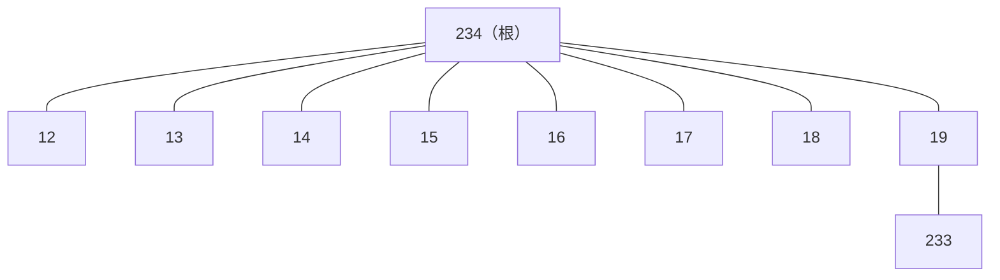

[[TOC]]

## 形式化题目

给定一棵 $n$ 个节点、根为 $r$ 的有根树（输入中 $b=-1$ 的那条记录标记根），以及 $m$ 个询问。每个询问给出节点 $x$ 与 $y$，要求判定两者的祖孙关系并逐行输出：

- $x$ 是 $y$ 的祖先，输出 $1$；
- $y$ 是 $x$ 的祖先，输出 $2$；
- 互不为祖先，输出 $0$。

以样例的树为例：根是 $234$，它挂着 $12 \sim 19$ 八个孩子，$233$ 单独挂在 $19$ 下面。

五个询问依次是 $(234,233)$、$(233,12)$、$(233,13)$、$(233,15)$、$(233,19)$：$234$ 在根到 $233$ 的唯一路径 $234 \to 19 \to 233$ 上，输出 $1$；$233$ 与 $12,13,15$ 互不在对方到根的路径上，输出 $0$；$19$ 在 $233$ 到根的路径上，即 $y$ 是 $x$ 的祖先，输出 $2$。与题面样例输出 $1,0,0,0,2$ 一致。

## 正解

### 思路

**朴素做法先暴露瓶颈。** 建树求出每个点的父亲后，对每个询问分别从 $x$、$y$ 出发沿父链走向根，看对方是否出现在链上：遇到 $x$ 到 $y$ 的链 → 输出 $1$，遇到反方向 → 输出 $2$，都走完没遇到 → 输出 $0$。链状树深度可达 $n$，每个询问最坏 $O(n)$，总 $O(nm)$，上限下约 $1.6\times10^9$ 次比较，必然超时。注意瓶颈在哪：树只建一次、询问全程只读，却每个询问都重走一遍同样的根链——"$u$ 的祖先集合"在建树完成时就固定了，朴素做法在反复重算它。直接把每个点的祖先集合存下来是 $O(n^2)$（链状树），需要一个 $O(n)$ 的压缩表示。

**DFS 括号序把祖先集合压成一个区间。** 对树做一次 DFS，进入节点 $u$ 时给全局时刻 $timer$ 加一并记 $tin[u]=timer$，离开 $u$ 时记 $tout[u]=timer$（时刻只在进入时递增）。DFS 进入 $u$ 之后、离开 $u$ 之前只会访问 $u$ 的子树，所以：

$$v \text{ 在 } u \text{ 的子树中} \iff tin[u] \leqslant tin[v] \leqslant tout[u].$$

反方向也成立：不在 $u$ 子树里的点只可能在进入 $u$ 之前（$tin$ 更小）或离开 $u$ 之后（$tin$ 更大）才被访问。而 "$u$ 是 $v$ 的祖先" 与 "$v$ 在 $u$ 的子树中" 是同一件事，于是**祖先判定 = 区间包含**，一次整数比较完成。

**每个询问问两遍方向。** $tin$ 两两互异，$x$ 盖住 $y$ 与 $y$ 盖住 $x$ 同时成立只能是 $tin[x]=tin[y]$ 即 $x=y$，所以 $x\neq y$ 时两个方向互斥：先判 $x$ 是否盖住 $y$（输出 $1$），再判反方向（输出 $2$），都不中输出 $0$。预处理一次 $O(n)$，每询问 $O(1)$，总 $O(n+m)$。$x=y$ 是唯一让两个条件同时成立的情形，按“节点是自己的祖先”输出 $1$；样例与测试数据均不含 $x=y$ 的询问，该分支只是实现约定。

**样例走一遍。** 按代码的栈序（孩子后压先走，$19$ 号先访问）得到下面这一种合法括号序，五个询问的判定直接从区间读出：

| 询问 $(x,y)$ | $x$ 的区间 $[tin,tout]$ | $y$ 的区间 $[tin,tout]$ | 包含关系 | 输出 |
| --- | --- | --- | --- | --- |
| $(234,233)$ | $[1,10]$ | $[3,3]$ | $tin_{233}=3 \in [1,10]$，$x$ 盖住 $y$ | $1$ |
| $(233,12)$ | $[3,3]$ | $[10,10]$ | 互不包含 | $0$ |
| $(233,13)$ | $[3,3]$ | $[9,9]$ | 互不包含 | $0$ |
| $(233,15)$ | $[3,3]$ | $[7,7]$ | 互不包含 | $0$ |
| $(233,19)$ | $[3,3]$ | $[2,3]$ | $tin_{233}=3 \in [2,3]$，$y$ 盖住 $x$ | $2$ |

根的区间完整盖住整棵树 $[1,10]$；每个叶子是单点区间（如 $[3,3]$、$[7,7]$），只能盖住自己。要特别看第 5 行：$tin$ 落在**对方**区间里说明对方是祖先，对应输出 $2$——这正是区分 $1$ 与 $2$ 的关键。DFS 用显式栈实现（进入/离开两阶段），链状树深度 $4\times10^4$ 也不会触发 Python 的递归深度限制。

### 代码

Python 版：

@include-code(./main.py, python)

C++ 版（同一算法）：

@include-code(./main.cpp, cpp)

### 复杂度

- 时间复杂度：$O(n+m)$。建邻接表 $O(n)$，两阶段迭代 DFS 标号每条边检查两次、$O(n)$，$m$ 个询问每个两次整数比较。
- 空间复杂度：$O(n+m)$。邻接表、`tin/tout` 两张时刻表与显式栈各 $O(n)$，输出列表 $O(m)$；实测峰值约 41.1 MB，在 128 MB 限制内。

## 总结

- 核心观察：DFS 的进入/离开时刻把每个子树压成连续区间，"$u$ 是 $v$ 的祖先" 等价于 "$tin[u] \leqslant tin[v] \leqslant tout[u]$"，一次比较替代一次走链。
- 朴素解法 $O(nm)$ 的瓶颈是"每个询问重算固定的祖先集合"，正解用 $O(n)$ 预处理把它压成区间，每询问降到 $O(1)$，整体 $O(n+m)$ 与 C++ 正解同阶。
- 实现要点：DFS 用显式栈的进入/离开两阶段（压回自身的离开阶段后再压孩子，保证配对顺序），`tin/tout` 用 dict 按原编号存取，兼容编号稀疏；真实数据 10 组全部一致，最大一组 0.059 s、峰值 41.1 MB。
