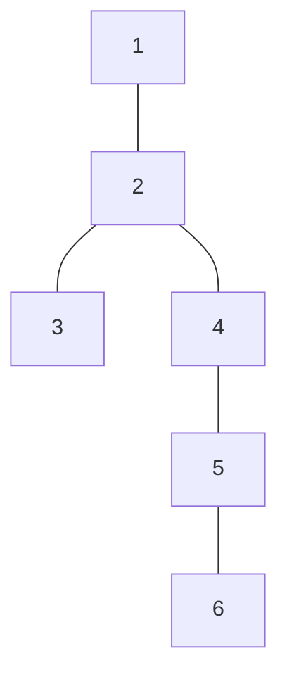

[[TOC]]

## 形式化题目

给定一棵 $N$ 个结点、$N-1$ 条边的树，每条边的权为 1，$d(u,v)$ 表示树上 $u$ 到 $v$ 的唯一路径的边数。每次询问给出三个结点 $a, b, c$，要求选出一个结点 $P$，使

$$f(P) = d(P, a) + d(P, b) + d(P, c)$$

最小，并输出这个 $P$ 与 $f(P)$ 的最小值。由于 $P$ 是三条两两路径的唯一公共点（见下文推导），输出没有歧义。

### 样例树

下图展示题面样例的 6 个城市与 5 条道路：



以第一次询问 $(4,5,6)$ 为例：三人分别站在 $4,5,6$，$5$ 到三人的距离是 $1+0+1=2$，任何其他点的距离和都更大，所以输出 `5 2`；题面四次询问的答案依次是 `5 2`、`2 5`、`4 1`、`6 0`。

## 正解

### 思路

**朴素做法。** 每次询问枚举全部 $N$ 个候选城市，对每个候选求它到 $a,b,c$ 的距离和取最小：单次要跑 BFS/DFS（或沿父链爬）$O(N)$，$M$ 次询问合计 $O(NM)$。在 $N = M = 5 \times 10^5$ 时约 $2.5 \times 10^{11}$ 次运算，显然超时。朴素做法暴露的瓶颈是：**距离和最优点都是"路径"上的量，却每次现算**——而树上两点路径唯一，完全可以预先结构化。

**第一步：把目标函数拆成两两距离。** 对任意结点 $v$，把三组"到两点距离和"相加：

$$2f(v) = [d(v,a)+d(v,b)] + [d(v,b)+d(v,c)] + [d(v,c)+d(v,a)] \geqslant d(a,b)+d(b,c)+d(c,a)$$

每组用到路径上的三角不等式：设 $d(v,\mathrm{path}(u,w))$ 表示 $v$ 到这条路径的最短距离，则 $d(v,u)+d(v,w) = d(u,w) + 2\,d(v,\mathrm{path}(u,w)) \geqslant d(u,w)$，取等当且仅当 $v$ 就在 $\mathrm{path}(u,w)$ 上。于是得到下界

$$f(v) \geqslant \tfrac12\big(d(a,b)+d(b,c)+d(c,a)\big)$$

且 $v$ 取到下界 $\iff v$ 同时位于 $\mathrm{path}(a,b)$、$\mathrm{path}(b,c)$、$\mathrm{path}(c,a)$ 三条路径上。

**第二步：三条路径的公共点存在且唯一，它就是三对 LCA 中最深的那个。**

- **存在**：记 $x = \mathrm{lca}(a,b)$、$y = \mathrm{lca}(b,c)$、$z = \mathrm{lca}(c,a)$，三者两两可比（例如 $x,z$ 都是 $a$ 的祖先）。不妨设 $x$ 最深，则 $\mathrm{dep}(x) \geqslant \mathrm{dep}(z)$ 说明 $x$ 在 $a \to z$ 的祖先链上，故 $x \in \mathrm{path}(a,c)$；同理 $x \in \mathrm{path}(b,c)$；而 $x \in \mathrm{path}(a,b)$ 由定义显然。三条路径交集非空，下界可达。
- **唯一**：在 $\mathrm{path}(a,b)$ 上 $d(v,a)+d(v,b) = d(a,b)$ 恒成立，故 $f(v) = d(a,b) + d(v,c)$。记 $w$ 为从 $c$ 通向 $a$、通向 $b$ 两条路径的分岔点：它们先重合（$c \to w$）再分开、分别走向 $a$ 与 $b$，所以 $w$ 落在 $\mathrm{path}(a,b)$ 上，且 $c$ 到链上任何一点都要经过 $w$——于是对链上任意 $v$ 有 $d(v,c) = d(v,w) + d(w,c)$，而 $d(v,w)$ 沿链就是位置差，严格 V 形。因此 $\mathrm{path}(a,b)$ 上 $f$ 的最小点唯一（恰为 $w$）。三路交集含于 $\mathrm{path}(a,b)$ 且其中每点都取到全局下界，故交集只有这一个点；前一条已证最深 LCA 在交集里，所以它就是 $w$。

同深度的两个 LCA 必为同一点（两两可比，可比且同深度即相等），所以"取最深"不会出现并列歧义。

**第三步：费用也只用三个 LCA。** 树上距离公式 $d(u,v) = \mathrm{dep}(u)+\mathrm{dep}(v)-2\,\mathrm{dep}(\mathrm{lca}(u,v))$ 代入第一步的下界，相同项抵消：

$$C = \mathrm{dep}(a)+\mathrm{dep}(b)+\mathrm{dep}(c) - \mathrm{dep}(x) - \mathrm{dep}(y) - \mathrm{dep}(z)$$

于是每次询问只需 3 次 LCA：**聚会点 $P$ 取三对 LCA 中最深的，费用 $C$ 用上面的深度和公式**。

**第四步：LCA 用重链剖分。** 倍增要 $O(N \log N)$ 的祖先表，在 Python 里 $5 \times 10^5$ 规模下内存偏重；重链剖分只用几个 $O(N)$ 数组：把"重儿子连成的链"压在一起，查询时若两点链顶不同，就把链顶更深的整条链整体上移到父链——每跨一条轻边，所在子树大小至少减半，因此最多跳 $O(\log N)$ 次；两点同链时浅者即 LCA。实现里根的父点记为 0（城市编号从 1 开始），下标 0 不参与任何查询。

下表把样例 4 次聚会逐对拆开，验证"最深 LCA 即聚会点"与费用公式（根取 $1$）：

| # | $(a,b,c)$ | $\mathrm{lca}(a,b)$ | $\mathrm{lca}(b,c)$ | $\mathrm{lca}(c,a)$ | 最深 LCA $=P$ | 深度和公式算出 $C$ |
| --- | --- | --- | --- | --- | --- | --- |
| 1 | 4 5 6 | 4 (深 2) | 5 (深 3) | 4 (深 2) | **5** | **2** |
| 2 | 6 3 1 | 2 (深 1) | 1 (深 0) | 1 (深 0) | **2** | **5** |
| 3 | 2 4 4 | 2 (深 1) | 4 (深 2) | 2 (深 1) | **4** | **1** |
| 4 | 6 6 6 | 6 (深 4) | 6 (深 4) | 6 (深 4) | **6** | **0** |

表中每次的最深 LCA 与标准输出的 $P$ 完全一致，费用列也逐行对上样例输出。第 1 行三条路径交在 $5$、第 2 行交在 $2$，都可对着上面的树逐条描一遍。第 3 行两个 $4$ 重合，三对 LCA 中 $\mathrm{lca}(b,c)=4$ 最深，聚会点取在人数多的那一侧；第 4 行三点相同，三对 LCA 全相等，费用为 $0$——这正是"同深度必为同点、取最深没有歧义"的直观例子。

### 代码

@include-code(./main.py, python)

### 复杂度

- 时间复杂度：预处理三次线性扫描 $O(N)$；每次询问 3 次重链跳跃 LCA，每次 $O(\log N)$，合计 $O(N + M \log N)$，与倍增 LCA 的标准正解同阶（更小常数）。
- 空间复杂度：$O(N)$，邻接表与 `parent / depth / size / heavy / head` 各占一线性数组，没有倍增表。
- 实测（本地 20s/测例、不做内存判定）：$N = M = 5 \times 10^5$ 的两组各约 2.7s、峰值约 145MB，10 组真实数据全部输出一致。

## 总结

- 三人聚会问题 = 树上三元中位数：三角不等式给出下界 $\tfrac12\sum d$，取等条件把最优点锁定到三条两两路径的公共点。
- 公共点存在且唯一，恰好是三对 LCA 中最深的那个；费用等于三点深度和减去三对 LCA 深度和，一次询问 3 次 LCA 全部解决。
- LCA 用重链剖分落地：$O(N)$ 预处理、$O(\log N)$ 查询、$O(N)$ 空间，正是 Python 在 $5 \times 10^5$ 规模下的可行选择。

## 图示解析

这张图串起本题从建模到得到答案的主线：

```text
三个结点 a, b, c
|- 朴素：枚举每个点求距离和 → O(NM)，超时
`- 树上路径唯一，可以 LCA 化
   |- 下界：2f(v) ≥ d(a,b)+d(b,c)+d(c,a)，取等 ⇔ v 在三条两两路径上
   |- 三路公共点存在且唯一 = 三对 LCA 中最深者 → 聚会点 P
   `- 费用 = 三点深度和 − 三对 LCA 深度和
      `- 重链跳跃 O(log N) 求 LCA → 每次询问 O(log N)
```

先看每个节点代表的推理结论：下界解释"为什么只需看三条路径的交点"，唯一性解释"为什么输出确定"，最后两行说明交点与费用如何被 3 次 LCA 表出。
图中只保留正文已证明的关键关系，样例的具体数字见上文推导表。
