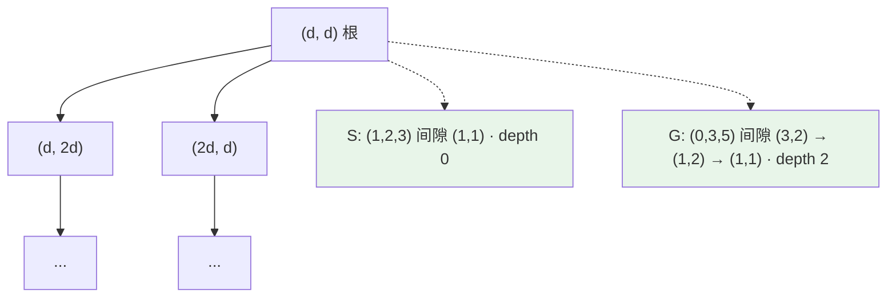

[[TOC]]

## 形式化题目

在数轴上，三颗棋子分别位于整数位置 $a < b < c$。每次操作选择**外侧**的一颗棋子，使其跳过相邻的**中轴**棋子，落在对称位置（跳后两段间隙中的一段翻转到另一侧，两段间隙长度不变的性质被打破，但两棋子间距等于被跳过的间隙长度）。

给定初始位置 $(a, b, c)$ 与目标位置 $(x, y, z)$（棋子无区别），求是否能通过若干次跳动使棋子位置变为目标位置；若能，求最少跳动次数。

## 正解

### 思路

#### 1. 跳动的逆操作构成树结构

一次跳动的**逆操作**是唯一的：若外侧棋子跳过中轴棋子，则逆操作就是把它跳回来。将每个状态看作节点，逆操作看作父边，则所有状态构成一棵**二叉树**：

- 当两段间隙相等（$b - a = c - b$）时，该状态是**叶子**（根），无法再向"根"方向收缩；
- 否则，间隙较大的一侧的外侧棋子可以跳过中轴棋子，向内收缩一步。

两个状态互相可达 $\iff$ 它们在这棵树上的**根相同**。以间隙 $(d_1, d_2)$ 标注状态，树的形状如下（每个父节点恰好长出两个孩子）：

样例的收缩过程（$G$ 沿父边两步走到根，与 $S$ 同根，故 $\mathrm{LCA}$ 即根，答案 $0 + 2 - 0 = 2$）：

| 步骤 | 状态（升序） | 间隙 $(d_1, d_2)$ | 动作 |
| --- | --- | --- | --- |
| 0 | $(0, 3, 5)$ | $(3, 2)$ | 左间隙大：右外侧棋子 $5$ 跳过中轴 $3$ |
| 1 | $(0, 1, 3)$ | $(1, 2)$ | 右间隙大：左外侧棋子 $0$ 跳过中轴 $1$ |
| 2 | $(1, 2, 3)$ | $(1, 1)$ | 间隙相等，抵达根 |

#### 2. 收缩到根与深度计算

`climb(state, limit)` 沿父边向根收缩，同时记录步数（深度）。**关键优化**：当一侧间隙远大于另一侧时（如 $(1, 10^9)$），逐单步收缩效率极低。观察到同方向连续收缩可**批量执行**：若左间隙 $d_1$ 小于右间隙 $d_2$，则连续 $\lfloor (d_2-1)/d_1 \rfloor$ 步都在"右间隙减左间隙"，一步整除算清批长，将复杂度从 $O(\text{步数})$ 降至 $O(\log(\text{间隙比}))$。

#### 3. LCA 求最少跳动次数

两状态 $S$、$G$ 在同一棵树上的距离：
$$\text{dist}(S, G) = \text{depth}(S) + \text{depth}(G) - 2 \cdot \text{depth}(\mathrm{LCA}(S, G))$$

求 LCA 的方法：
1. 先将较深的一方收缩到与另一方**同一深度**；
2. 在同深度下**二分搜索**最小的 $k$，使得双方各收缩 $k$ 步后相遇（$k$ 对"是否相遇"单调）；
3. 最近公共祖先深度 $= \text{depth} - k$，代入公式得最少跳动次数。

### 代码

@include-code(./main.py, python)

### 复杂度

- **时间复杂度**：每次 `climb` 的批量收缩在 $O(\log(\text{间隙比}))$ 时间内完成；求 LCA 需二分 $O(\log(\text{depth}))$ 次 `climb`，故总时间复杂度为 $O(\log(\text{间隙比}) \cdot \log(\text{depth}))$，对于 $10^9$ 范围的坐标非常高效。
- **空间复杂度**：$O(1)$，仅使用常数个变量。

## 总结

- 本题的关键洞见：跳动的逆操作唯一，所有状态构成二叉树，两状态可达 $\iff$ 根相同。
- 最少跳动次数转化为树上 LCA 距离问题，用"同深度二分相遇点"求最近公共祖先。
- 批量倍增加速收缩是避免 $O(\text{步数})$ 退化的关键，使算法能处理间隙比达 $10^9$ 的极端数据。
