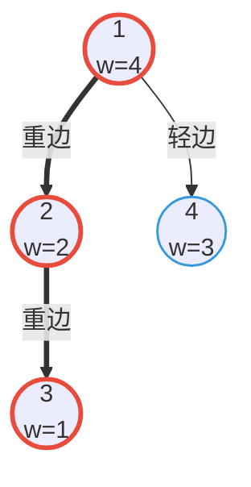

[[TOC]]

## 形式化题目

给定一棵包含 $n$ 个节点的带点权无向树。要求支持以下三种在线操作：

1. **单点修改**：将节点 $u$ 的权值更新为 $t$；
2. **路径最大值查询**：求节点 $u$ 到节点 $v$ 的简单路径上所有节点权值的最大值；
3. **路径和查询**：求节点 $u$ 到节点 $v$ 的简单路径上所有节点权值的总和。

## 正解

### 思路

对于树上路径的动态修改与统计问题，若直接进行暴力搜索或 DFS/BFS 遍历，单次查询最坏需要遍历整棵树，时间复杂度为 $\mathcal{O}(n)$，在 $q = 2\times 10^5$ 的操作规模下必然超时。

为了高效支持树上路径修改与查询，我们采用**重链剖分（树链剖分）**将树上节点重新编号，把树上路径拆解为 $\mathcal{O}(\log n)$ 段连续的区间，随后使用底层的**线段树**进行维护：

1. **两遍遍历（树链剖分）**：
   - 第一次遍历：确定每个节点的深度 `depth`、父节点 `parent`、子树大小 `size` 以及重儿子 `heavy`（即子树规模最大的子节点）。
   - 第二次遍历：优先访问重儿子，建立每个节点的 DFS 序（`dfn`）和所属重链的链顶（`top`）。由于重儿子被连续遍历，同一条重链上的所有节点在 DFS 序中对应一段连续的整数区间。

2. **路径查询与拆分**：
   - 设当前查询路径两端点为 $u$ 和 $v$。若 $u$ 和 $v$ 不在同一条重链上（`top[u] != top[v]`），不妨设深度较深的链顶为 $u$，则节点 $u$ 到其链顶 `top[u]` 是一段连续的 DFS 区间 $[\mathrm{dfn}[\mathrm{top}[u]], \mathrm{dfn}[u]]$，在线段树中查询这一区间的统计信息，然后将 $u$ 跃迁至其链顶的父节点 $u \leftarrow \mathrm{parent}[\mathrm{top}[u]]$。
   - 重复上述过程，直到 $u$ 与 $v$ 跃迁至同一条重链上。此时两点之间的路径同样对应一段连续区间 $[\min(\mathrm{dfn}[u], \mathrm{dfn}[v]), \max(\mathrm{dfn}[u], \mathrm{dfn}[v])]$，在线段树中再做一次区间查询即可。
   - 由于任意节点到根节点的路径至多经过 $\mathcal{O}(\log n)$ 条轻边（即被拆分成 $\mathcal{O}(\log n)$ 段重链区间），单次路径查询的复杂度为 $\mathcal{O}(\log^2 n)$。

3. **底层线段树维护**：
   - 线段树每个节点维护对应区间的权值和 `sum` 与最大值 `max`。
   - 单点修改只需更新叶子节点 $\mathrm{dfn}[u]$，自底向上合并信息，复杂度为 $\mathcal{O}(\log n)$。

### 代码

@include-code(./main.py, python)

### 复杂度

- **时间复杂度**：
  - 树链剖分预处理需要两次树遍历，耗时 $\mathcal{O}(n)$；
  - 建树耗时 $\mathcal{O}(n)$；
  - 每次单点修改操作在线段树上单点更新，耗时 $\mathcal{O}(\log n)$；
  - 每次路径查询（`QMAX` / `QSUM`）将路径拆解为至多 $\mathcal{O}(\log n)$ 段区间，每段区间在线段树上耗时 $\mathcal{O}(\log n)$，总耗时为 $\mathcal{O}(\log^2 n)$；
  - 处理 $q$ 次操作的总时间复杂度为 $\mathcal{O}(n + q \log^2 n)$。
- **空间复杂度**：
  - 邻接表及树链剖分数组需 $\mathcal{O}(n)$ 空间；
  - 存储树上点权的线段树需 $\mathcal{O}(n)$ 空间；
  - 总体额外空间复杂度为 $\mathcal{O}(n)$。

## 总结

- 树链剖分（轻重链剖分）的核心思想在于：通过优先遍历重儿子，使得任意一条重链上的节点在 DFS 序上均排布在一段连续区间内。
- 借助这一性质，复杂的树上路径查询被转化为若干个序列区间查询，从而能够无缝结合线段树等序列数据结构高效求解。

## 图示解析

下图展示了样例中 4 个节点的树结构及重链划分情况。图中双线箭头表示重边组成的重链，单线箭头表示轻边。

以节点 1 为根时，子节点 2 的子树包含节点 $\{2, 3\}$（大小为 2），节点 4 的子树仅包含自身（大小为 1），因此 $1 \to 2 \to 3$ 构成同一条连续的重链。当查询节点 3 到节点 4 的路径时：
1. 节点 3 所在重链链顶为 1，节点 4 所在重链链顶为 4；
2. 由于 $\mathrm{depth}[\mathrm{top}[4]] = 2 > \mathrm{depth}[\mathrm{top}[3]] = 1$，先处理轻链端点 4（区间 $[4, 4]$），随后节点 4 跳至其父节点 1；
3. 此时节点 1 与节点 3 均在同一条重链上，直接查询区间 $[1, 3]$，两部分统计结果合并即可得到整条路径的答案。
