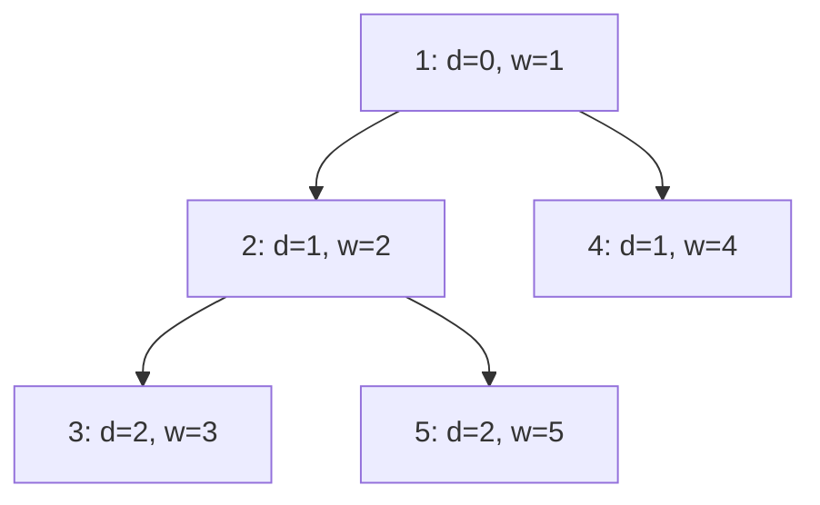

[[TOC]]

## 形式化题目

给定一棵以点 $1$ 为根、点数为 $n$ 的树，每个点 $u$ 有权值 $w[u]$。维护以下三类操作：

- **单点加**：$w[x] \mathrel{+}= a$；
- **子树加**：对以 $x$ 为根的子树中每个点 $u$，$w[u] \mathrel{+}= a$；
- **路径询问**：求根到 $x$ 的路径（即 $x$ 的全部祖先，含自身）上所有点权之和
  $$A[x] = \sum_{u \text{ 是 } x \text{ 的祖先}} w[u].$$

题面给出的输入样例缺了首行 `N M`（样例按 $n=5,\ m=5$ 补全后与官方输出一致）；
代码以真实测试数据的格式（首行 `N M`）读入。下图为样例的树（括号内为深度 $depth$ 与初始权值）：

图中每条有向边都由父亲指向孩子，深度沿边递增 1；$depth$ 之后会作为拆项公式
$a(depth[y]-depth[x]+1)$ 中的系数出现，而每个节点的子树就是它下方的整块——
样例执行过程（只列变化部分）：

| 步骤 | 操作 | 说明 | 输出 |
| --- | --- | --- | --- |
| 初始 | — | 权值 1 2 3 4 5 | |
| 1 | `3 3` | 路径 $1 \to 2 \to 3$：$1+2+3$ | 6 |
| 2 | `1 2 1` | $w[2] \mathrel{+}= 1$，变为 3 | |
| 3 | `3 5` | 路径 $1 \to 2 \to 5$：$1+3+5$ | 9 |
| 4 | `2 1 2` | 整棵树加 2，权值变 3 5 5 6 7 | |
| 5 | `3 3` | 路径 $1 \to 2 \to 3$：$3+5+5$ | 13 |

三次询问的答案依次为 6、9、13：第 4 步整棵树加 2 后，路径上的点数（3 个）就是增量 6 的来源，
正好对应下文公式中的 $depth[y]+1$。

## 正解

### 思路

**朴素做法与瓶颈。** 单点加直接改 $w[x]$ 只要 $O(1)$；但子树加要 DFS 整棵子树、
路径询问要沿父链上溯，都是 $O(N)$，$n, m \leqslant 10^5$ 时最坏 $10^{10}$ 次操作，必然超时。
问题的张力在于：**修改的自然单位是子树，询问的自然单位是祖先链**，两者在树上不重合——
祖先链在 DFS 序中是散落的点，子树在祖先视角下是逐点枚举，硬套任何一边都会退化。

**第一步：DFS 序把子树变成连续区间。** 按进入时刻给节点编号 $tin$，则子树 $x$ 恰好对应
连续区间 $[tin[x], tout[x]]$。样例树按"根 → 左孩子优先"进入的编号为
$1 \mapsto 1,\ 4 \mapsto 2,\ 2 \mapsto 3,\ 5 \mapsto 4,\ 3 \mapsto 5$，
子树 $2 = [3, 5]$、子树 $3 = [5, 5]$，确实都是连续段。

**第二步：换维护对象——直接维护询问答案 $A[y]$。** 写出询问的定义式
$A[y] = \sum_{u \text{ 是 } y \text{ 的祖先}} w[u]$，换个读法：**点 $u$ 的权值 $w[u]$，
恰好被所有 $y \in subtree(u)$ 的询问各统计一次**。于是：

- **单点加**（$w[x] \mathrel{+}= a$）：受影响的 $y$ 恰是 $subtree(x)$，每个 $y$ 的答案
  统一 $+a$ —— 区间 $[tin[x], tout[x]]$ 加 $a$。修改从"点"升维到"区间"，反而变规整了。

**第三步：子树加拆成 depth 的一次函数。** 给 $subtree(x)$ 每点加 $a$ 后，$y$ 的答案增量是
$a \times$（$y$ 的祖先中落在 $subtree(x)$ 内的个数）。祖先落在子树内 $\Rightarrow$
该祖先的后代 $y$ 也在子树内，所以 $y \notin subtree(x)$ 时增量为 $0$；
$y \in subtree(x)$ 时，这样的祖先恰是 $x \to y$ 路径上的 $depth[y] - depth[x] + 1$ 个点：

$$\Delta A[y] = a\,(depth[y] - depth[x] + 1) = a \cdot depth[y] + a(1 - depth[x]).$$

增量是 $depth[y]$ 的一次函数：$depth[y]$ 与位置有关、无法统一，但**常数系数可以拆开**——
"乘 $depth[y]$ 的那部分"和"纯常数部分"各自都是区间统一加。用两棵树状数组分工：
$A[y] = depth[y] \cdot q_1[y] + q_2[y]$，其中 $q_1$ 记一次项系数、$q_2$ 记常数项
（初始权值和单点加都只贡献常数，也进 $q_2$）。

**第四步：询问退化为点查。** 三种操作落到数据结构上的动作汇总如下（区间均为 $[tin[x], tout[x]]$）：

| 操作 | 对 $A[y]$ 的贡献 | 树状数组上的动作 |
| --- | --- | --- |
| 初始权值 $w[u]$ | $y \in subtree(u)$ 时 $+w[u]$ | $q_2$ 区间加 $w[u]$ |
| 1 单点加 $a$ | $y \in subtree(x)$ 时 $+a$ | $q_2$ 区间加 $a$ |
| 2 子树加 $a$ | $y \in subtree(x)$ 时 $+a(depth[y]-depth[x]+1)$ | $q_1$ 区间加 $a$；$q_2$ 区间加 $a(1-depth[x])$ |
| 3 询问 $x$ | 输出 $A[x]$ | $depth[x] \cdot q_1$ 点查 $+\ q_2$ 点查 |

三类操作全部统一为"区间加、点查"：树状数组按差分实现（左端 $+v$、右端后一位 $-v$，
点查即前缀和），单次 $O(\log n)$，朴素做法的 $O(N)$ 瓶颈被彻底消除。
查询端的乘法只发生一次——深度 $depth[x]$ 是只读的固定值，不影响更新复杂度。
实现上用显式栈做迭代 DFS 求欧拉序，规避 Python 默认递归深度在链状树上的限制。

### 代码

@include-code(./main.py, python)

### 复杂度

- **时间**：一次迭代 DFS 求欧拉序 $O(n)$；每个操作 $O(\log n)$ 次树状数组更新/查询，
  总计 $O((n + m) \log n)$，与 C++ 正解（DFS 序 + 树状数组、或树链剖分 + 线段树）同阶。
- **空间**：$O(n)$，邻接表、欧拉序数组与两棵树状数组各 $O(n)$。

## 总结

- 祖先链与子树是树上一对对偶结构：DFS 序让子树变连续，而"祖先链"通过**贡献视角**
  （点 $u$ 影响整棵子树）被翻译成同一种坐标下的区间操作。
- 子树加的贡献 $a(depth[y]-depth[x]+1)$ 含有与位置有关的 $depth[y]$，
  用"一次项 + 常数项"拆成两棵树状数组，是把**非统一增量**化归为统一区间加的常用手法。
- 最终三类操作全部是"区间加、点查"，差分树状数组 $O(\log n)$ 完成，
  总复杂度 $O((n+m)\log n)$；Python 实现全部 10 组真实数据 0.4s 内通过。
