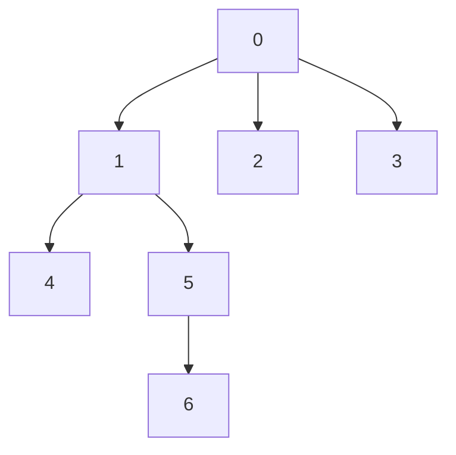

[[TOC]]

## 形式化题目

给定一棵以 $0$ 为根、共 $n$ 个节点的树：除根外每个节点恰有一个父亲，依赖关系无环。每个节点维护一个布尔状态「是否已安装」，初始全部未安装。支持两类操作，每次操作先输出被改变状态的节点数，再应用操作：

- 安装 $x$：把根到 $x$ 的整条路径上未安装的节点全部置为已安装；
- 卸载 $x$：把 $x$ 的整棵子树中已安装的节点全部置为未安装。

若 $x$ 已安装时执行安装、或 $x$ 未安装时执行卸载，则状态不会改变，输出 $0$。

两类操作始终维护同一条性质：**已安装集合对祖先封闭**——某个节点已安装，则它的全部祖先必然已安装（安装会带上整条祖先链，卸载只删子树、不会波及祖先）。因此「$x$ 已安装」与「根到 $x$ 的路径全部已安装」是等价说法，卸载一个未安装的节点时它的子树里也必然没有已安装的节点。

样例的依赖树如下（边表示「父依赖子方向」的父子关系，例如 $1$ 依赖 $0$）：



按样例依次操作：安装 $5$ 需要装上 $0,1,5$（输出 $3$）；再装 $6$ 只差它自己（输出 $1$）；卸载 $1$ 会连带卸掉子树里的 $1,5,6$（输出 $3$）；装 $4$ 只需补上 $1,4$（输出 $2$）；最后卸载 $0$ 卸掉全部已安装的 $0,1,4$（输出 $3$）。

## 正解

### 思路

**朴素做法**：直接模拟。安装 $x$ 沿父指针一路向上逐个检查、逐个置 $1$；卸载 $x$ 遍历整棵子树逐个检查、逐个置 $0$。每次操作的代价与「被改变状态的节点数」同阶，看起来是均摊的。

**瓶颈**：真实数据里有深度上万的链，反复「安装深节点 → 卸载根」时，总改动量达到 $1.5 \times 10^8$，逐点修改在 Python 下撑不住。这说明瓶颈不在复杂度阶数，而在于**逐个节点改状态这件事本身**——必须让「把一整段区间置 $0$ / 置 $1$」成为一次带懒标记的批量操作，答案也从区间里一次求和得到。

**关键观察**：两类操作恰好都能翻译成一维区间上的「区间赋值 + 区间求和」，只差一个把树映射成一维下标的方案：

1. **子树是连续区间**：对树做先序编号（DFS 序），$x$ 的子树恰好占据 $[\mathrm{pos}(x),\ \mathrm{pos}(x) + \mathrm{size}(x) - 1]$。于是卸载 = 该区间求和（即被卸载个数）后整体赋 $0$。
2. **根到 $x$ 的路径拆成 $O(\log n)$ 段连续区间**：先做树链剖分——每个节点选子树最大的儿子作重儿子，重儿子串成重链。再按「重儿子优先」的顺序编号，每条重链在编号上连续、子树也仍然连续。安装时从 $x$ 沿链头跳向根，每跳一次处理 $[\mathrm{pos}(\mathrm{head}),\ \mathrm{pos}(x)]$ 一整段，段数等于路径上的轻边数，不超过 $O(\log n)$。每段 = 段长 $-$ 区间和（未安装个数）后整体赋 $1$。
3. **线段树带懒标记**同时支持区间求和与区间赋值，把每段的代价压到 $O(\log n)$。

样例树按上述规则编号后的结果（重链为 $0 \to 1 \to 5 \to 6$）：

| 节点 | pos | 链头 | 子树区间 |
| :---: | :---: | :---: | :---: |
| 0 | 0 | 0 | $[0, 6]$ |
| 1 | 1 | 0 | $[1, 4]$ |
| 5 | 2 | 0 | $[2, 3]$ |
| 6 | 3 | 0 | $[3, 3]$ |
| 4 | 4 | 4 | $[4, 4]$ |
| 2 | 5 | 2 | $[5, 5]$ |
| 3 | 6 | 3 | $[6, 6]$ |

表格展示了 pos、链头与子树区间三种下标视角：重链 $0\text{-}1\text{-}5\text{-}6$ 连续占据 $[0,3]$，其余节点各自成链；同时每个子树仍是连续区间，例如 $1$ 的子树 $[1,4]$ 正好含 $1,5,6,4$。以样例的 `install 4` 为例：先跳到链头 $4$ 处理 $[4,4]$（补装 $4$），再令 $x = 1$ 跳到链头 $0$ 处理 $[0,1]$（其中 $0$ 已装、只补 $1$），两段合计输出 $2$。

### 代码

@include-code(./main.py, python)

### 复杂度

预处理（求子树大小、重儿子、重链编号）为 $O(n)$。每次安装拆成 $O(\log n)$ 段区间赋值，每段在线段树上 $O(\log n)$，合计 $O(\log^2 n)$；每次卸载只操作一个子树区间，为 $O(\log n)$。总复杂度 $O((n + q) \log^2 n)$，空间 $O(n)$。本仓库 20 组真实数据全部输出一致，最慢一组约 $2\,\mathrm{s}$（本地 20s 限时）。

## 总结

把「逐点改状态」换成「区间批量改」是本题的核心：先序编号让子树变成连续区间，树链剖分让根到 $x$ 的路径变成 $O(\log n)$ 段连续区间，最后由带懒标记的线段树统一完成区间求和与区间赋值——安装用「段长 $-$ 和」数出未安装个数，卸载用区间和数出已安装个数。

## 图示解析

这张图串起本题从朴素模拟到最终做法的推导主线：

```text
逐点模拟（安装走上链、卸载遍历子树）
|- 改动量 = 总状态变化，深链数据下爆炸
`- 换成区间批量操作
   |- 先序编号：子树 = 连续区间 [pos, pos+size-1]
   `- 重链剖分：根到 x 路径 = O(log n) 段连续区间
      `- 线段树懒标记：区间赋值 + 求和
         `- install：段长-和 后置 1；uninstall：求和后置 0
```

先看第一行暴露的瓶颈，再顺着分支检查两种编号如何把树上操作翻译成一维区间，最后确认线段树如何同时给出答案并完成赋值。
