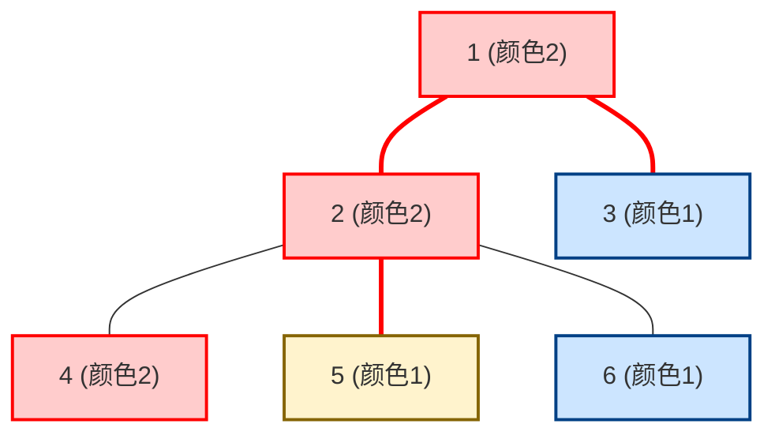

[[TOC]]

## 形式化题目

给定一棵包含 $n$ 个节点的树，节点从 $1$ 到 $n$ 编号，每个节点 $i$ 初始具有颜色 $c_i$。需要维护以下两类共 $m$ 个在线操作：

1. `C a b c`：将树上节点 $a$ 到 $b$ 简单路径上的所有点染成颜色 $c$；
2. `Q a b`：计算树上节点 $a$ 到 $b$ 简单路径上的颜色段数量，即路径上相邻相同颜色的连续极长节点集合构成的块数。

上图为样例初始状态：从节点 $3$ 到 $5$ 的路径依次经过节点 $3 \to 1 \to 2 \to 5$。节点颜色分别为 $1, 2, 2, 1$，连续相同颜色合并为一段，颜色段为 $[1], [2, 2], [1]$，共 $3$ 段。

## 正解

### 思路

#### 1. 朴素方法与瓶颈
若每次操作直接在树上寻找路径并遍历：
- 染色操作：单次时间复杂度 $O(n)$；
- 询问操作：单次遍历路径统计相邻变色点，时间复杂度 $O(n)$。

当 $m, n \le 10^5$ 时，总复杂度为 $O(m \cdot n)$，显然会超时。需要一种支持高效处理树上路径修改与查询的数据结构。

#### 2. 区间子问题：线段树维护连续颜色段
如果问题退化为序列（链）上的区间覆盖与连续段查询，可以用线段树维护每个区间 $[L, R]$ 的三个关键信息：
- `cnt`：区间内的颜色段数；
- `lc`：区间左端点（$L$）的颜色；
- `rc`：区间右端点（$R$）的颜色。

在合并左子区间 $ls$ 与右子区间 $rs$ 时：
$$cnt = cnt_{ls} + cnt_{rs} - [rc_{ls} == lc_{rs}]$$
即如果左子区间的右边界颜色与右子区间的左边界颜色相同，则两段在分界点处属于同一连续段，总段数减 $1$。区间覆盖通过标准 Lazy 标记维护。

#### 3. 树上转化：树链剖分（HLD）
通过轻重链剖分，将树上每条重链映射为 DFS 序中一段连续的整数区间：
1. **路径修改**：如同常规树剖，将两点向上提升到相同重链的过程中，每次对重链对应的 DFS 序区间进行线段树区间覆盖；
2. **路径查询与跨链合并**：
   - 从深度较大的链顶向上跳，查询当前重链区间 $[dfn[top[u]], dfn[u]]$ 的段数；
   - **注意方向与端点**：$u$ 对应区间的右端点（$rc$），$top[u]$ 对应区间的左端点（$lc$）。因此自底向上跳链时，当前链的底部应当与上一段链的顶部衔接：若上一次记录的端点颜色等于当前区间的 $rc$，则段数减 $1$；
   - 当两点移动到同一条重链上后，做最后一次区间查询，并将两侧分别记录的链端点颜色与最后区间的左右端点比对消重。

### 代码

@include-code(./main.py, python)

### 复杂度

- **时间复杂度**：
  - 树链剖分预处理需要遍历整棵树，复杂度为 $O(n)$；
  - 路径修改和查询过程中，两点之间最多经过 $O(\log n)$ 条重链，每条重链在线段树上进行区间操作的时间复杂度为 $O(\log n)$，因此单次操作的时间复杂度为 $O(\log^2 n)$；
  - 处理全部 $m$ 次操作的总时间复杂度为 $O(m \log^2 n)$。
- **空间复杂度**：
  - 树的邻接表、重链剖分数组（深度、父节点、重儿子、链顶、DFS 序）占用 $O(n)$ 空间；
  - 维护颜色段的线段树大小为 $4n$ 节点，空间复杂度为 $O(n)$；
  - 总空间复杂度为 $O(n)$。

## 总结

本题是树链剖分与线段树结合的典型范式。核心在于将树上路径抽象为若干条连续链的拼接，并在合并线段树节点以及跨越重链时，通过记录端点颜色正确消除边界处相同颜色的重复计数。
