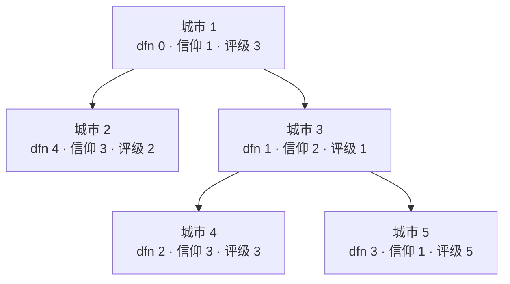

[[TOC]]

## 形式化题目

给定一棵 $n$ 个点的树，点 $i$ 有两个属性：评级 $w_i$（正整数）与信仰 $c_i$（$1 \sim C$ 的正整数）。
按顺序处理 $q$ 个操作，并对每个查询输出答案：

1. $CC\ x\ c$：把 $c_x$ 改为 $c$；
2. $CW\ x\ w$：把 $w_x$ 改为 $w$；
3. $QS\ x\ y$：记路径 $x \rightsquigarrow y$（唯一最短路，含两端）上满足 $c_u = c_x$ 的点集为 $S$，
   输出 $\sum_{u \in S} w_u$；
4. $QM\ x\ y$：同上，输出 $\max_{u \in S} w_u$。

保证每次查询时 $c_x = c_y$，且单次旅行期间所有属性不变。

样例输入：

```text
5 6
3 1
2 3
1 2
3 3
5 1
1 2
1 3
3 4
3 5
QS 1 5
CC 3 1
QS 1 5
CW 3 3
QS 1 5
QM 2 4
```

样例输出：

```text
8
9
11
3
```

下图为样例初始状态，每个节点标注 dfn 编号、信仰与评级（dfn 是后文树链剖分的编号，此处先给结果）：



样例逐条对答案：`QS 1 5` 的路径是 $1 \to 3 \to 5$，信仰 1 的城市只有 1 和 5，
和为 $3 + 5 = 8$；`CC 3 1` 后城市 3 也命中，和变 $3 + 1 + 5 = 9$；
`CW 3 3` 把城市 3 的评级改成 3，和为 $3 + 3 + 5 = 11$；
`QM 2 4` 的路径是 $2 \to 1 \to 3 \to 4$，其中信仰 3 的城市是 2 和 4，最大值为 $\max(2, 3) = 3$。

## 正解

### 思路

#### 1. 朴素做法与两个瓶颈

每次查询先求 LCA，再沿路径逐点走：信仰与 $c_x$ 相同就累加 / 比较。
单次 $O(n)$，$q$ 次最坏 $O(nq) = 10^{10}$，显然超时。逐点扫暴露两个瓶颈：

- **瓶颈一：路径本身太长。** 一条链可能有 $n$ 个点，逐点走无法避免；
- **瓶颈二：段内混着各种信仰。** 即便把路径切短，每段里仍只有少数点属于 $c_x$，
  普通线段树统计的是区间内所有点，回答不了「只算一种信仰」。

两个瓶颈分别用两步优化消除。

#### 2. 瓶颈一：树链剖分把路径拆成 O(log n) 段 dfn

重儿子定义为子树最大的儿子，其余为轻儿子；重链是重儿子首尾相接的链。
按「先访问重儿子」的顺序给每个点编一个 dfn（走完一条重链才折返去轻儿子），则**每条重链得到一段连续的 dfn 区间**。
路径 $x \rightsquigarrow y$ 的拆法：只要 $\mathrm{head}[x] \neq \mathrm{head}[y]$，
就把链顶较深的一侧整段 $[\mathrm{dfn}(\mathrm{head}[x]), \mathrm{dfn}(x)]$ 摘下来
（此时 $x$ 一侧从链顶到 $x$ 整段都在路径上），再把 $x$ 跳到链顶的父亲；两侧同链时，浅者就是 LCA，
收尾一段 $[\mathrm{dfn}(\mathrm{LCA}), \mathrm{dfn}(\text{深者})]$。
每次摘段至少爬一条轻边，而从根到任何点的轻边不超过 $\log_2 n$ 条
（每爬一条轻边子树大小至少翻倍），所以路径被拆成 $O(\log n)$ 段**连续 dfn 闭区间**（代码里的 `path_spans`，全程迭代，链形树也不会爆递归）。

#### 3. 瓶颈二：按信仰把状态切开

关键观察：**一次查询只问 $c_x$ 这一种信仰**——其他信仰无论怎么变都与本次无关。
于是可以把点权状态按信仰切开：每种信仰各维护一份独立结构，查询时只碰 $c_x$ 那一份，
彼此零耦合。按信仰分堆的难点是「信仰成员随时因 `CC` 变动」，两个观察化解它：

- **成员全集静态可预算**：城市只有初始信仰和 `CC` 指定的新信仰两种可能，
  预扫一遍全部 `CC` 事件就得到每种信仰「出现过」的成员集合，总量不超过 $n + q$；
- **成员的 dfn 固定**：树不会变，把每种信仰的成员按 dfn 升序存成位置表 `pos`，
  这张表一旦建好永不改变，随时间变化的只有「该城市此刻记多少值」。

有了 dfn 升序的位置表，查询段 $[l, r]$ 内信仰 $c$ 的城市就是 `pos` 中的
$[\mathrm{bisect\_left}(l),\ \mathrm{bisect\_right}(r))$ 一段**连续秩区间**——
两次二分就把 dfn 区间翻译成了秩区间。每种信仰剩下的需求只有
「单点改值 + 秩区间求和 + 秩区间最大值」，正好是树状数组与完全二叉树线段树的活，
$k_c$ 个成员的结构只占 $O(k_c)$ 空间，不需要 C++ 正解里为省空间常用的动态开点线段树。

**取值约定**：城市 $x$ 在信仰 $c$ 结构里的值 = $w_x$（若 $c_x = c$）否则 $0$。
三类维护动作由此落地：

- `CW x w`：改 `weight` 后，把自己信仰那一份的单点值刷成 $w$；
- `CC x c`：旧信仰置 $0$、新信仰置 $w_x$，两次单点改值；
- 初始：每座城市写进初始信仰那一份。

**0 是安全的中性元**：评级恒为正，记 0 的城市不会贡献求和，也抢不走最大值；
且查询端点自身必然命中、评级 $> 0$，所以空段的 0 永远不影响答案。

#### 4. 样例推演

以初始状态的 `QS 1 5` 为例：路径拆成第 1 段 $[3, 3]$（城市 5）与第 2 段 $[0, 1]$（城市 1、3）；
信仰 1 的位置表是 $[0, 3]$，逐段二分出秩区间再查值。下表每列是一段拆分，
四行依次是该段的 dfn 区间、段内信仰相同的城市、翻译出的秩范围与它的评级贡献：

| 项目 | 第 1 段 | 第 2 段 |
| --- | --- | --- |
| dfn 区间 | $[3, 3]$ | $[0, 1]$ |
| 命中城市（信仰相同） | 5 | 1 |
| 位置表秩范围 | $[1, 2)$ | $[0, 1)$ |
| 评级贡献 | 5 | 3 |

各段贡献相加即路径总和：$5 + 3 = 8$，与样例第一行一致。
`CC 3 1` 后城市 3 的 dfn 1 插入位置表变成 $[0, 1, 3]$，同一路径命中 $5 + (3 + 1) = 9$。

#### 5. 正确性要点

- 拆段不重不漏：每段都是路径上的一段连续弧，段间首尾相接，覆盖整条路径；
- 秩区间与 dfn 区间等价：位置表 dfn 升序，`bisect` 的左右边界恰好圈出段内成员；
- 单点维护归纳正确：初始、`CW`、`CC` 三种写入都遵守取值约定，
  因而任意时刻结构里的值都等于约定值，前缀和与区间最大值自然正确；
- 与常见 C++ 正解（树剖 + 每信仰动态开点线段树）复杂度同阶，
  本解用「预扫事件预算成员」换掉动态开点，常数与实现都更小。

上面三步分别对应 `main.py` 的 `path_spans`（拆段）、`paint`（单点改值）与
`query_sum` / `query_max`（段内二分 + 统计）。

### 代码

Python 版：

@include-code(./main.py, python)

C++ 版（同一算法）：

@include-code(./main.cpp, cpp)

### 复杂度

- 预处理：两次迭代 DFS 树剖 $O(n)$，扫事件 $O(q)$，各信仰成员排序
  $\sum_c k_c \log k_c \leqslant (n + q)\log n$，初始 $n$ 次写入 $O(n \log n)$；
- 单点修改（`CC` / `CW`）：二分定秩 + 树状数组更新 + 线段树回溯，$O(\log n)$；
- 单次查询（`QS` / `QM`）：$O(\log n)$ 段，每段两次二分加一次区间查询 $O(\log n)$，
  共 $O(\log^2 n)$；
- 总时间 $O((n + q)\log^2 n)$，与正解同阶；空间 $O(n + q)$：位置表、树状数组
  与线段树持有的整数总数均为 $O(n + q)$ 量级。
- 实测 data 仓 20 组真实数据（$n, q \leqslant 10^5$）输出全部一致，
  单组 $0.5 \sim 1.0$ s、峰值内存约 100 MB；OJ 端 1 s 限时对 Python 偏紧，
  代码用一次 `read().split()` 读入与全迭代实现压常数。

## 总结

本题是「带信仰限制的动态树路径查询」：信仰是点的颜色，查询只问端点那一种颜色。
朴素逐点扫的两个瓶颈——路径太长、区间混色——分别由树链剖分和按信仰分堆解决：
树剖把路径压成 $O(\log n)$ 段连续 dfn 区间；「一次只问一种信仰」让状态可以按信仰
完全切开，再靠「预扫事件知成员全集、成员 dfn 固定」把动态改色降级成单点置值，
dfn 区间两次二分即得连续秩区间，段内求和与求最值交给树状数组和线段树。
两步合起来得到 $O((n + q)\log^2 n)$ 的在线解法。凡是「带颜色限制的路径 / 子树查询」，
都可以考虑这种「按颜色分堆 + 成员预算」的拆法。

## 图示解析

这张图串起本题从建模到得到答案的主线：

```text
带信仰限制的路径查询
 |- 瓶颈一：逐点爬路径 O(n) -> 树链剖分把路径拆成 O(log n) 段 dfn 区间
 |- 瓶颈二：区间混着各种信仰 -> 按信仰切开状态，每信仰一份独立结构
 |   `- 成员 dfn 静态：dfn 区间 --两次二分--> 连续秩区间
 `- 秩区间求和 / 求最值 + 单点改值 -> 树状数组 + 线段树
    `- 逐段累加（0 作中性元）= 路径答案
```

先看每条分支解决的是哪个瓶颈：上半两支把「路径太长」「只统计一种信仰」分别拆掉，
中间一支用「成员 dfn 静态」把动态改色降级成单点置值，最后一支给出段内统计的落地结构。
顺着箭头走一遍样例 `QS 1 5`，就能看到拆段、二分、累加如何合成最终答案。
