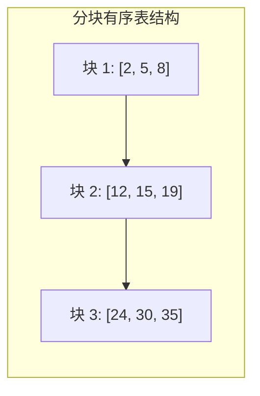

[[TOC]]

## 形式化题目

维护一个动态的多重整数集合 $S$，初始为空。共处理 $n$ 次操作（$1 \leqslant n \leqslant 10^5$，$-10^7 \leqslant x \leqslant 10^7$），操作类型如下：

1. **插入**：向集合 $S$ 中加入数 $x$。
2. **删除**：从集合 $S$ 中移除一个数 $x$（若有多个相同数，仅删除一个）。
3. **查询数 $x$ 的排名**：定义为集合中严格小于 $x$ 的元素个数 $+ 1$。
4. **查询排名为 $x$ 的数**：即查询集合从小到大排序后的第 $x$ 个数（$1$-indexed）。
5. **查询数 $x$ 的前趋**：求集合中严格小于 $x$ 且数值最大的数。
6. **查询数 $x$ 的后继**：求集合中严格大于 $x$ 且数值最小的数。

对于操作 $3, 4, 5, 6$，依次输出每项操作计算得到的答案。

## 正解

### 思路

本题是平衡树的经典模板题。在 Python 环境下，由于面向对象指针结构的递归和内存分配常数较大，手写二叉平衡树（如 Treap、Splay）极易遭遇递归爆栈或运行超时。

我们采用**分块有序表（Block List）**来实现：

1. **结构组织**：
   维护一个由多个列表构成的容器 `blocks`，满足：
   - 每个子列表内部保持非降序；
   - 块与块之间保持全局有序（即前一块的尾元素 $\leqslant$ 后一块的头元素）。

2. **核心操作**：
   - **插入**：顺序检查各块的末尾元素。若目标值 $x \leqslant$ 块尾元素，使用 `bisect.insort` 插入到该块内；若所有块尾都小于 $x$，则插入最后一个块。若单块长度膨胀超过阈值 $2B$，触发全局展平重构。
   - **删除**：定位到包含 $x$ 的块，二分定位并执行 `pop`，单次耗时 $O(B)$。
   - **排名查询**：遍历各块，若全块元素均 $< x$，累加整块长度；否则在首个尾元素 $\geqslant x$ 的块内二分计算严格小于 $x$ 的个数，总排名加 $1$ 即得。
   - **第 $k$ 小查询**：顺序扫描各块长度，用 $k$ 依次扣减块长，直到落在某块内部，直接通过下标取出对应元素。
   - **前趋与后继**：
     - 前趋：维护可能的最大前趋候选，一旦某个块的第一个元素 $\geqslant x$，后面所有块必然更大，即可提前剪枝。
     - 后继：跳过末尾元素 $\leqslant x$ 的块，在第一个包含更大元素的块中使用 `bisect_right` 取得答案。

3. **分块平衡与重构**：
   设定块大小基准 $B \approx 2\sqrt{n}$。当单块长度超过 $2B$ 时，将所有块展平后按大小 $B$ 重新划分为若干块，均摊复杂度仅为 $O(B)$。

### 代码

@include-code(./main.py, python)

### 复杂度

- **时间复杂度**：令块大小 $B = \Theta(\sqrt{n})$，总块数为 $O(n / B)$。单次插入、删除、查询排名、前趋与后继均由 $O(n / B)$ 次块间定位及 $O(B)$ 的块内二分与位移构成；平摊重构复杂度为 $O(B)$。单次操作平摊复杂度为 $O(\sqrt{n})$，总时间复杂度为 $O(n\sqrt{n})$。在 Python 中得益于内置 C 底层操作，性能极优。
- **空间复杂度**：存储集合中所有的元素，总空间复杂度为 $O(n)$。

## 总结

在处理值域较大或动态有序集合问题时，分块有序表兼顾了简单性与高效性，在高级语言中配合标准库二分能发挥出极强的常数优势。
