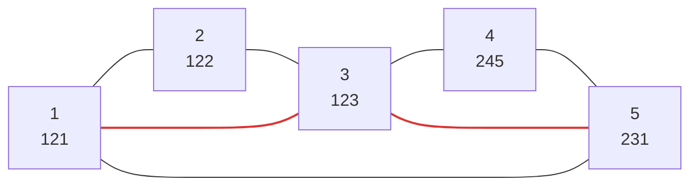

[[TOC]]

## 形式化题目

给定凸 $N$ 边形，顶点按边界顺序编号 $1..N$，顶点 $i$ 的权值 $w_i$ 为正整数。把它划分成 $N-2$ 个互不相交的三角形（即标准三角剖分：每个三角形以三个顶点为顶、边是原多边形的边或对角线，覆盖整个多边形且内部不交），每个三角形取三顶点权值之积 $w_a w_b w_c$，求全部三角形乘积之和的最小值。

样例：$N = 5$，权值依次为 `121 122 123 245 231`，输出 `12214884`。

## 正解

### 思路

**一句话本质**：利用"边界边必属于唯一三角形"，枚举与边界边组成三角形的顶点 $k$，把区间劈成两个独立子多边形，用区间 DP 求最小乘积和。

**朴素做法与瓶颈。** 最直接的想法是枚举所有三角剖分再逐个求和：剖分数是 Catalan 数 $C_{N-2} \approx 1.3 \times 10^{26}$（$N=50$），完全不可行。慢的根源不是求和，而是**重叠子问题**：任意一段"边界上连续顶点构成的子多边形"，它的最优剖分只与这段顶点本身有关，与外层怎么拼接无关；枚举整剖分时，同一个子多边形的最优值被重复计算了指数多次。

**关键观察：劈分结构。** 记 $[i..j]$ 为边界上连续的一段顶点构成的凸多边形：

1. 当 $j > i + 1$ 时，$(i, j)$ 是这段子多边形的边界边，而三角剖分中每条边界边恰属于一个三角形，所以它必属于某个三角形 $(i, k, j)$，$i < k < j$。
2. 三角形 $(i, k, j)$ 的两条弦 $(i, k)$、$(k, j)$ 把 $[i..j]$ 劈成两段更小的、顶点仍连续的凸多边形 $[i..k]$ 与 $[k..j]$（$k$ 与端点相邻时一侧退化成一条边）。两段内部不交、三角形互不共享，且权值全为正，所以两段各自取最优即整体最优。

于是"最后一个决策"就是选哪个 $k$，得到区间 DP（$f[i][j]$ = 子多边形 $[i..j]$ 的最小乘积和）：

$$f[i][j] = \min_{i < k < j} \big( f[i][k] + f[k][j] + w_i \cdot w_k \cdot w_j \big), \qquad f[i][i] = f[i][i+1] = 0$$

答案是 $f[1][N]$（代码 0-based 写作 `f[0][n-1]`）。两段的 $j - i$ 一定比原区间小，所以按 gap 从小到大递推即可保证用到的子状态都已算出。

**样例的 DP 表。** 下表是样例的全部 $f[i][j]$（行 = 左端点 $i$，列 = 右端点 $j$，`-` 表示 $i > j$ 的无效格，对角线与相邻格是边界值 $0$；单元格 = 该段子多边形的最小乘积和）：

| $i \backslash j$ | 1 | 2 | 3 | 4 | 5 |
| --- | --- | --- | --- | --- | --- |
| **1** | 0 | 0 | 1815726 | 5462061 | 12214884 |
| **2** | - | 0 | 0 | 3676470 | 10427571 |
| **3** | - | - | 0 | 0 | 6961185 |
| **4** | - | - | - | 0 | 0 |
| **5** | - | - | - | - | 0 |

观察重点：gap $= 2$ 的格子直接等于三顶点之积（如 $f[1][3] = 121 \times 122 \times 123 = 1815726$）；越靠右上 gap 越大，每格只依赖 gap 更小的格子。右上角 $f[1][5]$ 的三个候选：

$$k = 2:\ 0 + 10427571 + 121 \cdot 122 \cdot 231 = 13837593$$
$$k = 3:\ 1815726 + 6961185 + 121 \cdot 123 \cdot 231 = 12214884 \quad \text{（最优）}$$
$$k = 4:\ 5462061 + 0 + 121 \cdot 245 \cdot 231 = 12310056$$

即先用三角形 $(1, 3, 5)$ 把五边形劈成 $[1..3]$ 与 $[3..5]$ 两段，两段各自取最优（都恰好是三角形），得到 $12214884$，与样例输出一致。

**正确性。** 对 gap $= j - i$ 归纳：gap $\leqslant 1$ 时顶点不足三个、无三角形可划，$f = 0$ 显然。一般情形下，由观察 1 任一剖分都对应唯一的一个 $k$，由观察 2 该剖分的代价恰等于"两段剖分代价 $+$ $w_i w_k w_j$"，不同 $k$ 对应互不相同的剖分集合；枚举全部 $k$ 且两段取各自最优，覆盖所有方案且不重不漏，故 min 即全局最优。

**边界与溢出。** $N = 3$ 时外层只算 gap $= 2$ 一个格子，输出唯一三角形的乘积。权值 $< 10^9$ 时单个乘积达 $10^{27}$、总和最多 $48$ 项约 $4.8 \times 10^{28}$，超过 64 位整数范围——C++ 需要高精度，而 Python 的 `int` 是任意精度的，直接写乘加即可。

### 代码

Python 版：

@include-code(./main.py, python)

C++ 版（同一算法）：

@include-code(./main.cpp, cpp)

### 复杂度

- 时间复杂度：$O(N^3)$，gap、左端点、$k$ 三重循环；$N = 50$ 时转移次数 $\binom{50}{3} \approx 2 \times 10^4$，在 1000 ms 内绰绰有余。
- 空间复杂度：$O(N^2)$，$50 \times 50$ 的 DP 表加 $O(N)$ 的读入。

## 总结

- 凸多边形三角剖分的最优子结构：**边界边必属于唯一三角形**，选劈分顶点 $k$ 后问题拆成两个连续区间的独立子问题，正权值保证两段可以各自取最优。
- 状态 $f[i][j]$ = 连续顶点子多边形的最小乘积和，边界是 gap $\leqslant 1$ 的 $0$，按 gap 递增递推，答案 $f[1][N]$。
- "枚举整个方案"是 Catalan 级暴力；"枚举最后一个决策 + 记忆化子问题"把它降到 $O(N^3)$，这是区间 DP 的通用套路。
- 权值 $10^9$ 下总和可达 $\sim 10^{28}$，这题在 C++ 里要配高精度，Python 大整数天然免掉这一层。

## 图示解析

下图是样例最优剖分的顶点环（红色为剖分引入的对角线）：

三个三角形 $(1,2,3)$、$(1,3,5)$、$(3,4,5)$ 的乘积分别是 $1815726$、$3437973$、$6961185$，和为 $12214884$。观察重点：两条红对角线正是 DP 在 $f[1][5]$ 处选中 $k=3$ 产生的三角形 $(1,3,5)$，以及它劈出的两段 $[1..3]$、$[3..5]$ 各自的唯一三角形——图与上文 DP 表的右上角逐格对应。
