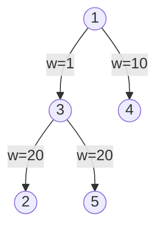

[[TOC]]

## 形式化题目

给定一棵包含 $N$ 个节点的带权有根二叉树，根节点编号为 $1$。树中每个非叶节点恰好有两个子节点。

每条边具有非负整数权值（苹果数量）。需要从该树中选择一个包含根节点 $1$ 的连通子图（子树），该连通子图恰好包含 $Q$ 条边。求所选边权之和的最大值。

## 正解

### 思路

这是一道经典的**树形背包动态规划**问题。

由于所选取的边必须与根节点 $1$ 连通，若要在某个节点的子树内部保留树枝，必须先保留从父节点连接到该子节点的树枝。

题面明确指出这是一棵严格二叉树（非叶节点必定分两叉）。因此，对于任意非叶节点 $u$，设其左子节点为 $l$，对应边权为 $w_l$；右子节点为 $r$，对应边权为 $w_r$。

设状态 $f(u, k)$ 表示在以节点 $u$ 为根的子树中保留 $k$ 条边所能获得的最大苹果数。

边界条件：
- 当 $k = 0$ 时，$f(u, 0) = 0$；
- 当 $u$ 为叶子节点时，$f(u, k) = 0$。

对于非叶节点 $u$，要在以 $u$ 为根的子树中总共保留 $k$ 条边（$k \ge 1$），可以根据左右子树的选择情况分为三种互斥情形：
1. **只在左子树保留**：必须保留边 $(u, l)$，消耗 $1$ 条边，剩余 $k-1$ 条边分配给左子树内部：
   $$
   f(u, k) = f(l, k - 1) + w_l
   $$
2. **只在右子树保留**：必须保留边 $(u, r)$，消耗 $1$ 条边，剩余 $k-1$ 条边分配给右子树内部：
   $$
   f(u, k) = f(r, k - 1) + w_r
   $$
3. **左右子树均有保留**：同时保留边 $(u, l)$ 和 $(u, r)$，基础消耗 $2$ 条边。剩余 $k-2$ 条边分配给两棵子树。枚举分配给左子树内部保留的边数 $i \in [0, k-2]$，则右子树分配 $k-2-i$ 条边：
   $$
   f(u, k) = \max_{0 \le i \le k-2} \{ f(l, i) + w_l + f(r, k - 2 - i) + w_r \}
   $$

综合以上三种情况取最大值，即为 $f(u, k)$ 的最优解。利用 Python 的 `@functools.cache` 配合深度优先搜索（DFS），可自顶向下直接求得答案 $f(1, Q)$。

### 代码

@include-code(./main.py, python)

### 复杂度

- **时间复杂度**：状态总数为 $O(N \cdot Q)$。计算每个状态 $(u, k)$ 时枚举边数分配需遍历 $i \in [0, k-2]$，耗时 $O(k) \le O(Q)$。总时间复杂度为 $O(N \cdot Q^2)$。在数据范围 $N, Q \le 100$ 下计算量不超过 $10^6$，在 Python 3 中耗时约 0.03 秒，远低于 1.0 秒时限。
- **空间复杂度**：树结构与递归状态总数均为 $O(N \cdot Q)$，二叉树最大递归深度不超过 $O(N)$，空间开销约为 15MB，满足 128MB 限制。

## 总结

本题利用二叉树的“仅有两个儿子”这一特殊性质，将树上背包的背包卷积简化为固定左右两叉的边数分配枚举（$i$ 与 $k-2-i$）。通过自顶向下的记忆化搜索，代码结构紧凑且避免了多叉树分组背包的手动展开。

## 图示解析

以样例输入为例：
```text
5 2
1 3 1
1 4 10
2 3 20
3 5 20
```

经过根节点 $1$ 有向建树后的二叉结构如下：



保留 $Q=2$ 条边的决策分析：
- 方案 A（只选右侧）：选边 $(1, 4)$，仅占 1 条边，收益 10；
- 方案 B（只选左侧）：选边 $(1, 3)$ 及 $(3, 2)$ 或 $(3, 5)$，占 2 条边，收益 $1 + 20 = 21$；
- 方案 C（左右各选一条连边）：选边 $(1, 3)$ 和 $(1, 4)$，占 2 条边，收益 $1 + 10 = 11$。

最优方案为方案 B，最大苹果数为 $21$。
