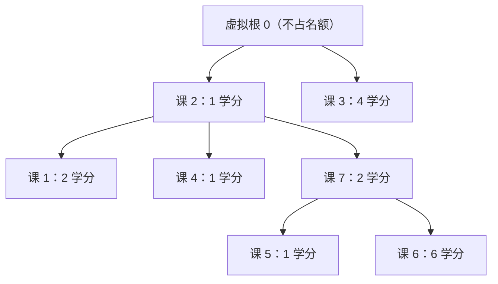

[[TOC]]

## 形式化题目

给定 $M$ 门课程，课号 $1, 2, \dots, M$。每门课 $i$ 至多有一门直接先修课 $p_i$（$p_i = 0$ 表示没有先修课），学分为 $w_i$。若选了课 $i$，则 $p_i$、以及 $p_i$ 的先修课……整条先修链都必须已被选中。

要求选出恰好 $N$ 门课，使得学分总和最大。所有学分均为正数。

样例（$M = 7, N = 4$）的先修关系如下，输出 $13$：

注意两点：课 5、课 6 的先修课是 7，而 7 在输入中排在它们**之后**，所以先修课号可以大于本课课号，建图不能依赖输入顺序；「虚拟根 0」是为解法引入的辅助点，把无先修课的课 2、课 3 变成同一棵树的两棵子树根，它本身不占课程名额。最优方案是选 {3, 2, 7, 6}，学分 $4 + 1 + 2 + 6 = 13$。

## 正解

### 思路

**一句话本质**：先修关系是森林，合法方案是"祖先闭包"（选了子树里的课就必须选它的祖先），于是对树做分组背包 DP——每个孩子是一组，逐孩子把方案表卷积合并。

**朴素做法与瓶颈。** 最直接的想法是从 $M$ 门课中枚举大小为 $N$ 的子集，验证闭包合法性后取学分最大值；方案数 $\binom{100}{50} \approx 10^{29}$，验证本身虽只要沿父链回溯 $O(M)$，方案数量却是指数级的。瓶颈在于：不同的枚举方案大量收敛到同一个子问题——"在某棵子树里选了若干门课，最优学分是多少"只由**子树根**和**所选门数**决定，与子树外怎么选无关（子树之间只通过公共祖先互相依赖，而祖先是否选中是已定的前提）。指数条路径只对应 $O(MN)$ 个状态，逐个枚举纯属重复计算。

**关键观察：闭包约束让状态只依赖两个量。** 每门课至多一门直接先修，先修图是若干棵有根树；给所有"无先修课"的课挂一个学分为 $0$ 的**虚拟根 0**，森林就变成一棵树。在子树 $u$ 内选课时，只要 $u$ 被选中，各孩子的选择互相独立；$u$ 没被选中，整棵子树一门都不能选。于是定义：

$$dp(u, k) = \text{在以 } u \text{ 为根的子树中选 } k \text{ 门课（选课必含 } u\text{）的最大学分}$$

- **初始化**：只选 $u$ 自己，$dp(u,1) = w_u$；$dp(u,0)$ 先记为不可达——只要子树里选了任何一门课就必须选 $u$。
- **转移（逐孩子做分组背包卷积）**：设已合并孩子的方案表为 $best$，下一个孩子 $v$ 的方案表为 $f(v,\cdot)$（其中 $f(v,0)=0$ 表示跳过这棵子树），则

$$best'[a+b] = \max_{a + b \leqslant N} \big( best[a] + f(v, b) \big)$$

- **收尾**：把 $best[0]$ 置为 $0$（一门不选是合法方案，供父节点表示"跳过本子树"）；虚拟根从 $best[0] = 0$ 出发并入森林各树，答案即虚拟根方案表的第 $N$ 项。
- 所有学分都是正数，且任何 $k < N$ 的合法方案都能再加一门"先修已满足"的课扩展到 $k+1$，所以"恰好 $N$ 门"与"至多 $N$ 门"答案相同，直接取 $dp(0, N)$ 即可。

样例中节点 2 的方案表在三次合并中的变化如下（行 = 合并阶段，列 = 在这棵子树里共选几门课，单元格 = 最大学分，$\times$ 表示不可达）：

| 合并阶段（节点 2 子树） | best[0] | best[1] | best[2] | best[3] | best[4] |
| --- | --- | --- | --- | --- | --- |
| 初始化：只选课 2（1 学分） | $\times$ | 1 | $\times$ | $\times$ | $\times$ |
| 并入孩子 1（2 学分） | $\times$ | 1 | 3 | $\times$ | $\times$ |
| 并入孩子 4（1 学分） | $\times$ | 1 | 3 | 4 | $\times$ |
| 并入孩子 7（方案表 0, 2, 8, 9） | $\times$ | 1 | 3 | 9 | 11 |
| 收尾 $best[0] = 0$ | 0 | 1 | 3 | 9 | 11 |

读表要点：并入孩子 7 后 $best[3]$ 从 4 跳到 9（{2, 7, 6}），$best[4]$ 变成 11（{2, 1, 7, 6}），卷积把"父节点已选"前提下两棵子树的选法拼接取最优。最终虚拟根方案表为 `[0, 4, 5, 9, 13]`，$best[4] = 13$ 来自"课 3（4 分）+ 节点 2 子树选 3 门（9 分）"，即样例输出。

实现上用 `functools.cache` 记忆化后序 DFS，每个节点返回一张长度 $N+1$ 的方案表即可。

### 代码

@include-code(./main.py, python)

### 复杂度

- **时间复杂度**：$O(M \cdot N^2)$。每个节点做一次卷积合并，每次合并枚举 $a, b \leqslant N$ 共 $O(N^2)$；共 $M$ 个节点。$M, N \leqslant 100$ 时不超过 $10^6$ 次基本操作，实测 6 组真实数据单测最长 0.033s，远低于 1.0s 时限。
- **空间复杂度**：$O(M \cdot N)$（每棵子树各缓存一张方案表），另有 $O(M)$ 的邻接表与递归栈（深度不超过 $M + 1$）。实测峰值内存 14.9MB，满足 128MB 限制。

## 总结

"每门课至多一门先修"把依赖结构压缩成森林，闭包约束把方案合法性变成树上的"选父才能选子"，于是枚举组合的指数瓶颈被 $O(MN)$ 个子树状态消掉：`dfs` 后序返回子树方案表，`pack` 以 $O(N^2)$ 卷积逐孩子合并，虚拟根把森林的答案对齐到恰好 $N$ 门课。读入时按课号直接连边即可，不必假设先修课先出现。
