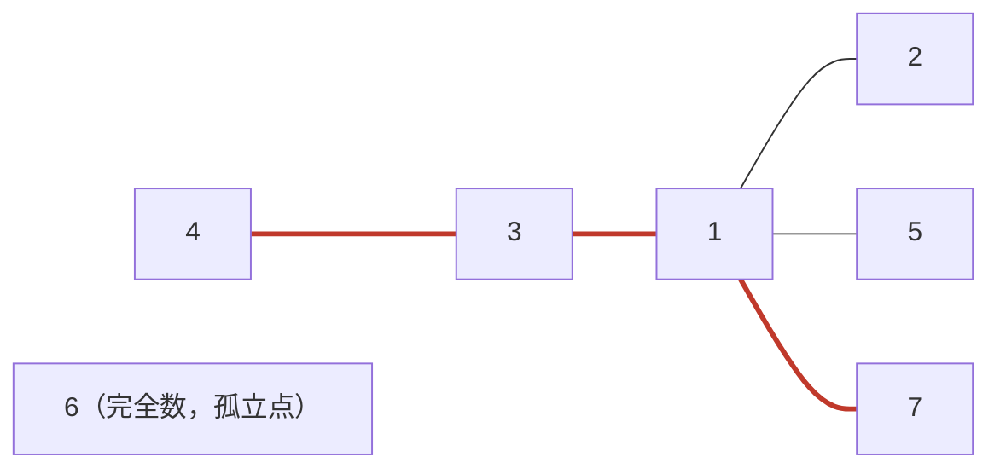

[[TOC]]

## 形式化题目

给定正整数 $n$。对每个数 $x$ 定义它的**真约数和** $s(x)$：$x$ 的全部约数之和，去掉 $x$ 自己。变换规则是：若 $s(x) = y$ 且 $y < x$，那么 $x$ 可以变成 $y$，$y$ 也可以变成 $x$——即 $x$ 与 $y$ 之间存在一条**无向边**，两个方向都能走。变换过程中出现的所有数字都必须落在 $1..n$ 内。

要求：从任意数出发，不断变换且**路径上不出现重复数字**，求最多能走多少步（步数 = 变换次数 = 路径经过的边数）。

样例 $n = 7$。先把每个数的真约数和算出来，再按"$s(x) < x$ 才连边"逐个检查：

| $x$ | $s(x)$ | 是否连边 | 连出的边 |
| --- | --- | --- | --- |
| 1 | 0 | 否（$0$ 不在 $1..7$ 内） | — |
| 2 | 1 | 是（$1 < 2$） | $1\text{-}2$ |
| 3 | 1 | 是（$1 < 3$） | $1\text{-}3$ |
| 4 | 3 | 是（$3 < 4$） | $3\text{-}4$ |
| 5 | 1 | 是（$1 < 5$） | $1\text{-}5$ |
| 6 | 6 | 否（完全数，$6 \not< 6$） | — |
| 7 | 1 | 是（$1 < 7$） | $1\text{-}7$ |

于是得到连通块 $\{1,2,3,4,5,7\}$ 和孤立点 $6$。一条不重复的最长路线是 $4 \to 3 \to 1 \to 7$，共 3 步，输出 3。注意 $1$ 自己的 $s(1) = 0$ 连不出边，但它会被 $2,3,5,7$ 这些数从对侧连进来——题面那句"$1$ 可以变为 $7$"正是靠 $s(7) = 1 < 7$ 这一侧的规则实现双向通行的。

## 正解

### 思路

**朴素做法及其瓶颈。** 把图建出来后，最直接的想法是对每个连通块枚举所有不重复路径、取最长。但"最长简单路径"在一般图上是 NP-hard，枚举是指数级的，$n = 50000$ 完全跑不动。所以关键不在搜索，而在证明这张图**不是一般图**——它有很强的结构。

**第一步：每个点至多一条"向下"的边。** 点 $x$ 只有在 $s(x) < x$ 时才主动连出一条到 $s(x)$ 的边，而 $s(x)$ 是唯一确定的；它向上可以被很多点连（所有满足 $s(u) = x$ 的 $u$），所以度数可以大于 1，不能直接当链做。

**第二步：这张图没有环，是森林。** 反证：假设存在环，取环上编号最大的点 $m$，它在环上有两个不同的邻居 $u, v$，且 $u < m$、$v < m$。边 $m\text{-}u$ 只能由某一侧的规则产生：若由 $u$ 侧产生，需要 $s(u) = m$ 且 $m < u$，与 $u < m$ 矛盾；所以只能是 $m$ 侧产生的，即 $s(m) = u$。同理 $s(m) = v$。但 $s(m)$ 只有一个值，得 $u = v$，与"两个不同邻居"矛盾。因此图无环；无环的连通块就是树，整张图是森林。

**第三步：森林里的最长不重复路径就是树的直径。** 树上任意两点之间的路径唯一，所以"不重复路径"与"树上路径"是同一回事，最长的那条即直径。求直径不需要枚举：任取一点做 BFS 找到最远点 $u$（树的性质：$u$ 一定是某条直径的端点），再从 $u$ 出发做一次 BFS，它的最远距离就是该树的直径。每个连通块走两遍，总计 $O(n)$。

**约数和用筛法预处理。** 逐个分解每个数是 $O(n\sqrt{n})$；换成"d 枚举倍数"：对每个 $d$，把它加进所有倍数 $2d, 3d, \dots$ 的约数和里，总次数是调和级数 $\sum_{d=1}^{n} \frac{n}{d} = O(n \log n)$。

下图展示样例 $n = 7$ 建出的连通块结构，加粗红线是直径 $4\text{-}3\text{-}1\text{-}7$：

图里 $1$ 是"枢纽"：$2,3,5,7$ 都靠自己的 $s(x) = 1$ 连到它，$4$ 再通过 $s(4) = 3$ 挂到 $3$ 上；整块没有任何环。$6$ 是完全数，$s(6) = 6$ 不满足"$< x$"，也没有别人连向它，所以单独成块、直径为 0。直径必须穿过枢纽 $1$，因此答案就是"从 $4$ 出发经 $1$ 再到另一端"的 3 步。

### 代码

@include-code(./main.py, python)

### 复杂度

- 时间复杂度：$O(n \log n)$。筛法求真约数和为 $\sum_{d=1}^{n} \frac{n}{d} = O(n \log n)$；建图 $O(n)$；两次 BFS 每条边走常数次，合计 $O(n)$。
- 空间复杂度：$O(n)$。约数和表、邻接表（边数 $\leqslant n$）、BFS 的距离字典与已访问集合均为线性规模。
- 实测最大样例（$n = 49997$）不足 0.1s、峰值内存低于 30MB，远低于 1000ms / 128MB 的限制；Python 侧没有 TLE/MLE 风险。

## 总结

- 把"$s(x) < x$ 就双向变换"翻译成无向边，题目就变成求图上最长不重复路径。
- 关键观察是**无环**：环上最大点的两条邻边只能来自同一个 $s(m)$，矛盾——图是森林，最长不重复路径即树直径。
- 直径用两次 BFS：任取点找最远点 $u$，再从 $u$ 找最远，距离就是直径；每个连通块独立，答案取各块最大值。
- 真约数和用倍数筛 $O(n \log n)$ 预处理，整体复杂度与标准 C++ 解法同阶。
