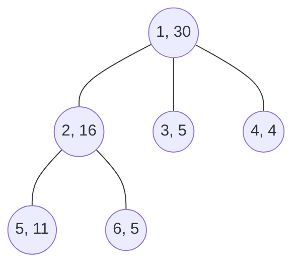

[[TOC]]

## 形式化题目

给定一棵 $n$ 个结点的有根树，每个结点 $i$ 有一个正整数权值 $c_i$（在该宫殿安置看守的费用）。

要求选出结点的一个子集 $S$，使得对每个结点 $u$，至少满足下列之一：

- $u \in S$；
- $u$ 的父亲 $\in S$；
- $u$ 的某个儿子 $\in S$。

也就是每个结点要么自己设看守，要么与一个设了看守的相邻结点（父亲或儿子）相连。求 $\sum_{u \in S} c_u$ 的最小值，即树的**最小权支配集**。

### 样例说明

输入给出的树结构如下，结点编号与安置费用为 $1:30,\ 2:16,\ 3:5,\ 4:4,\ 5:11,\ 6:5$：

在结点 $2, 3, 4$ 上设看守，总费用 $16 + 5 + 4 = 25$。此时：结点 $1$ 被儿子 $2,3,4$ 看到，结点 $2$ 自己被选中，结点 $5,6$ 被父亲 $2$ 看到，结点 $3,4$ 自己被选中，整棵树都被覆盖。

若改成只选结点 $1$，费用为 $30$，更贵；只选 $2,3,4$ 中任意两个则无法覆盖全部结点。所以最少经费为 $25$，与样例输出一致。

## 正解

### 思路

#### 1. 朴素做法与瓶颈

最直接的做法是枚举每个结点设不设看守，共 $2^n$ 种方案，逐个检查覆盖性并取最小费用，复杂度 $O(2^n \cdot n)$。当 $n$ 达到 $1500$ 时完全不可行。

观察覆盖条件：一个结点 $u$ 是否被覆盖，只取决于 $u$ 自己、它的父亲、它的儿子 —— 全是**父子两级以内的局部信息**。这正是树形 DP 的适用信号：以 $u$ 为根的子树内部如何安排，只受"$u$ 的覆盖由谁负责"这一个信息影响，与子树外无关。

#### 2. 为什么两个状态不够

如果只设"$u$ 是否已被覆盖"的 $0/1$ 两态，会丢掉关键区别：

- $u$ 已被**儿子**看到，子树已经**付过钱**了；
- $u$ 还没被覆盖，只是**等着父亲**来看它，这笔钱要留到父亲那一层再付。

这两种情况都表现为"$u$ 当前未设看守"，但允许儿子采取的取值不同，代价也不同。因此必须显式区分"指望父亲"，把状态拆成三个。

#### 3. 状态定义

对以 $u$ 为根的子树：

- $dp_0[u]$：$u$ **自己设看守**，子树内所有结点都被看守的最小费用；
- $dp_1[u]$：$u$ **不设看守，但已被某个儿子看到**，子树内所有结点都被看守的最小费用；
- $dp_2[u]$：$u$ **不设看守，儿子也没看到它**，$u$ 只能指望父亲来看它；此时子树内**除 $u$ 以外**的所有结点必须已被看守的最小费用。

三种状态互斥且穷尽：$u$ 的覆盖来源只有"自己 / 儿子 / 父亲"三种。

#### 4. 状态转移

设 $u$ 的儿子集合为 $sons(u)$。

**① $dp_0[u]$：$u$ 已设看守。**
此时每个儿子 $v$ 已被 $u$ 看到，需要自己解决的是 $v$ 的子树内部，且 $v$ 不再有"指望父亲"的必要（父亲已经看到了），三态都合法，取最小值：

$$dp_0[u] = c_u + \sum_{v \in sons(u)} \min\bigl(dp_0[v],\ dp_1[v],\ dp_2[v]\bigr)$$

**② $dp_2[u]$：$u$ 不设看守。**
每个儿子 $v$ 都不能再指望 $u$ 来看它，所以 $dp_2[v]$ 不合法，只能在"$v$ 自己设"和"$v$ 被它的儿子看到"之间选：

$$dp_2[u] = \sum_{v \in sons(u)} \min\bigl(dp_0[v],\ dp_1[v]\bigr)$$

**③ $dp_1[u]$：$u$ 不设看守，且被至少一个儿子看到。**
在 $dp_2[u]$ 的基础上，只要保证**至少有一个儿子**取 $dp_0$ 而不是 $\min(dp_0, dp_1)$ 即可。设把儿子 $v$ 从 $\min(dp_0[v], dp_1[v])$ 抬到 $dp_0[v]$ 的增量为

$$\Delta_v = dp_0[v] - \min\bigl(dp_0[v],\ dp_1[v]\bigr) \geqslant 0$$

只需挑**增量最小**的那个儿子承担这个"设看守"的职责：

$$dp_1[u] = dp_2[u] + \min_{v \in sons(u)} \Delta_v$$

叶子没有儿子，无法被子结点看到，故 $dp_1[\text{leaf}] = +\infty$（不可达）。

#### 5. 小规模转移演示

对样例中结点 $2$（费用 $16$，儿子 $5$ 费用 $11$、$6$ 费用 $5$，二者都是叶子）演示一次自底向上的完整转移：

| 结点 | 角色 | $dp_0$ | $dp_1$ | $dp_2$ | 说明 |
| --- | --- | --- | --- | --- | --- |
| 5 | 叶子 | 11 | $+\infty$ | 0 | 无儿子，$dp_1$ 不可达 |
| 6 | 叶子 | 5 | $+\infty$ | 0 | 同上 |
| 2 | 内部 | $16 + \min(11,\infty,0) + \min(5,\infty,0) = 16$ | $0 + 5 = 5$ | $0 + 0 = 0$ | $\Delta_5 = 11,\ \Delta_6 = 5$，取小的 |

表格中 $dp_0$ 是"自己出钱并替儿子兜底"，$dp_2$ 是"自己不出钱、把责任推给父亲"，因此叶子的 $dp_2 = 0$。结点 $2$ 的 $dp_1 = 5$ 表示"不选 $2$、改选儿子 $6$ 来看守 $2$"只需 $5$ 元，比对结点 $5$ 做同样的事（$11$ 元）便宜，所以 $dp_1$ 选中的增量来自 $\Delta_6$。这正是 $dp_1$ 转移中"挑增量最小的儿子"的具体体现。

#### 6. 答案与实现

根结点没有父亲，$dp_2[\text{root}]$ 不合法，因此整棵树的答案是

$$\min\bigl(dp_0[\text{root}],\ dp_1[\text{root}]\bigr)$$

转移必须自底向上进行。这里不用递归（链状树会爆栈）：输入本身给的就是"父亲 → 儿子"的有向描述，入度为 $0$ 的结点即为根；从根开始用栈收集自顶向下的访问序，把它**逆序**即为自底向上的转移序，直接迭代即可。

### 代码

@include-code(./main.py, python)

### 复杂度

- **时间复杂度**：$O(n)$。每个结点在自底向上的过程中只被转移一次，内部对儿子的三次求和合计只遍历该结点的每条父子边常数次。
- **空间复杂度**：$O(n)$。`cost`、`children` 邻接表、三个 DP 数组以及遍历序 `order` 均为 $O(n)$。

## 总结

1. **模型转化**：把"看守所有宫殿"翻译成树上的**最小权支配集** —— 每个点必须被自己或相邻的父亲/儿子覆盖，目标是最小化选中点的权值和。
2. **状态设计的动机**：一个点"已覆盖"与"未覆盖但等父亲"的代价不同，二态会丢失信息；按覆盖来源（自己 / 儿子 / 父亲）拆成 $dp_0/dp_1/dp_2$ 三态后，子树之间才互相独立。
3. **转移的关键技巧**：$dp_1$ 用"在 $dp_2$ 基础上挑增量最小的儿子改成必选"来表达"至少一个儿子设看守"这一约束，避免了对子集再枚举。答案取 $\min(dp_0[\text{root}], dp_1[\text{root}])$。
4. **实现注意**：树形 DP 依赖自底向上序，用显式栈 + 逆序迭代替代深度递归，既避免爆栈又保持 $O(n)$。
