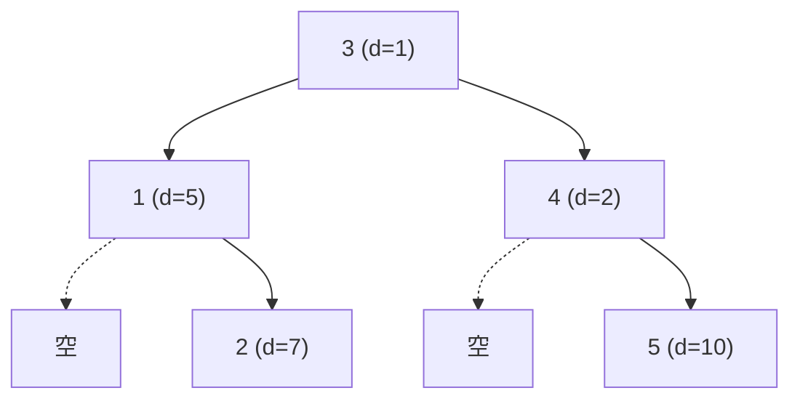

[[TOC]]

## 形式化题目

给定 $n$ 个正整数 $d_1, d_2, \dots, d_n$。考虑所有以 $1, 2, \dots, n$ 为节点、且**中序遍历恰为** $(1, 2, \dots, n)$ 的二叉树。对其中任意一棵子树 $T$（含整棵树本身），定义其加分为

$$
score(T) = score(L) \times score(R) + d_{root}
$$

其中 $L$、$R$ 分别是 $T$ 的左、右子树，$root$ 是 $T$ 的根。约定空子树的加分为 $1$，而**叶子不套用该公式**，其加分直接等于叶节点自身的分数。

求所有这些二叉树中加分的最大值，以及取得该最大值的一棵树的前序遍历。

以样例 $n = 5$、$d = (5, 7, 1, 2, 10)$ 为例，最优树如下：

这棵树的中序是 $1,2,3,4,5$，前序是 $3,1,2,4,5$。它的加分自底向上算：$2$ 号叶子得 $7$，$1$ 号子树得 $1 \times 7 + 5 = 12$；$5$ 号叶子得 $10$，$4$ 号子树得 $1 \times 10 + 2 = 12$；根 $3$ 号子树得 $12 \times 12 + 1 = 145$。观察重点在于：**把根选定为 $3$ 之后，左半边 $\{1,2\}$ 与右半边 $\{4,5\}$ 的构造完全互不干涉**。

## 正解

### 思路

**直接枚举为什么不行。** "中序遍历固定"意味着构造一棵树等价于反复做同一件事：在当前区间里挑一个节点当根，把它劈成左右两段。于是最直白的写法是递归

$$
g(l, r) = \max_{l \leqslant k \leqslant r}\bigl(g(l, k-1) \times g(k+1, r) + d_k\bigr)
$$

这个递归式本身完全正确，但它**没有记忆化**：同一个区间 $[l,r]$ 会被不同上层选择反复求解。展开递归树后，叶子数等于 $n$ 个节点能构成的二叉树形状数，也就是卡特兰数 $C_n$。$n$ 只到 $25$，可 $C_{25} \approx 4.9 \times 10^{13}$，显然不可行。

**瓶颈在哪里。** 瓶颈是重复子问题。一个区间 $[l,r]$ 的最优加分只由 $l, r$ 两个数决定，跟"它上面是谁、是被谁切出来的"毫无关系——这正是无后效性。所有不同的区间只有 $\binom{n+1}{2} + O(n) = O(n^2)$ 个，其余计算全是浪费。把重复子问题缓存下来，复杂度立刻从卡特兰数级掉到多项式级。

**状态怎么定。** 令 $f[l][r]$ 表示中序闭区间 $[l,r]$ 能得到的最大加分。为了让左右子树的下标写法对称，代码里改用**半开区间**存储：`score[l][r]` 表示闭区间 $[l, r-1]$。这样左右子树分别是 `score[l][k]` 与 `score[k+1][r]`，转移式与数学定义逐字对应，不用到处写 `k-1` / `k+1` 的偏移。空区间此时恰好是 `l == r`。

**为什么因子可以各自取最大。** 转移式是 $score_L \times score_R + d_k$。由于所有分数都是正整数，任何子树的加分都是正数（空为 $1$，叶子为 $d > 0$，内部为两正数之积再加正数），而正因子相乘对每个因子都单调递增。所以固定根 $k$ 时，让左右两边**各自取到最大值**就得到该 $k$ 下的最优值，不存在"牺牲一边换另一边"的耦合。这条性质是转移式能写成 $f[l][k-1] \times f[k+1][r]$ 而不是"两个数组做笛卡尔积"的依据。

**递推顺序。** 按区间长度 $L$ 从 $1$ 到 $n$ 递推即可。$L$ 层选根 $k$ 后，两个子区间的长度分别是 $k-l$ 和 $r-k-1$，都严格小于 $L$，引用时必然已经算好。

下表是样例 $d = (5,7,1,2,10)$ 的部分 DP 结果，行是左端点 $l$、列是右端点 $r$（均指半开区间 $[l,r)$，故 $[l,r)$ 对应节点编号 $l+1 \dots r$）：

| `score[l][r]` | $r=1$ | $r=2$ | $r=3$ | $r=4$ | $r=5$ |
| --- | --- | --- | --- | --- | --- |
| $l=0$ | 5 | 12 | 13 | 25 | **145** |
| $l=1$ | — | 7 | 8 | 15 | 85 |
| $l=2$ | — | — | 1 | 3 | 13 |
| $l=3$ | — | — | — | 2 | 12 |
| $l=4$ | — | — | — | — | 10 |

对角线上的 $5,7,1,2,10$ 是叶子层，直接取 $d_i$；空格子（$l = r$）是空区间，值为 $1$；右上角 `score[0][5] = 145` 就是答案。以它为例，枚举五个根的候选值分别是：

| 根 $k$（节点号） | 左因子 | 右因子 | 候选值 $score_L \times score_R + d_k$ |
| --- | --- | --- | --- |
| 1 | 1 | 85 | 90 |
| 2 | 5 | 13 | 72 |
| 3 | 12 | 12 | **145** |
| 4 | 13 | 10 | 132 |
| 5 | 25 | 1 | 35 |

可以看到根 $3$ 的 $12 \times 12$ 把两个中等大小的因子乘成了最大积，而两侧都取各自区间的最优值正是可行的。

**还原前序。** 转移时顺手把取到最大值的 $k$ 记进 `root[l][r]`。求完表后从 `root[0][n]` 出发，按"根 → 左 → 右"展开即可。代码里用显式栈代替递归：先压右子树再压左子树，栈的后进先出保证弹出顺序就是前序。

**叶子为什么要单独处理。** 题面明确写"叶子的加分就是叶节点本身的分数，不考虑它的空子树"。若误把叶子也套进 $l \times r + a$，会得到 $1 \times 1 + d_k = d_k + 1$，而分数都是正数，这会让答案系统性偏大。代码里在主循环之前一次性初始化叶子层，让这条特例只出现一处，不污染转移式。

### 代码

Python 版：

@include-code(./main.py, python)

C++ 版（同一算法）：

@include-code(./main.cpp, cpp)

### 复杂度

- 时间复杂度：$O(n^3)$。状态 $O(n^2)$ 个，每个状态枚举 $O(n)$ 个根；前序还原额外 $O(n)$，被主项吸收。
- 空间复杂度：$O(n^2)$。`score` 与 `root` 各是一张 $(n+1) \times (n+1)$ 的表。

$n < 30$ 时约 $2.6 \times 10^3$ 个状态、$5.5 \times 10^3$ 次转移，1 s 与 128 MB 的限制都很宽松。

## 总结

- 中序遍历固定为 $1, 2, \dots, n$ 是本题的题眼：它让"任意一棵子树"必然对应中序的一段**连续区间**，于是树的形状问题被压缩成区间问题。
- 枚举所有二叉树形状是卡特兰数级；瓶颈纯粹是重复子问题，加一层按区间记忆化即可降到 $O(n^3)$。
- 状态 `score[l][r]` 用半开区间定义，可与转移式逐字对应；空区间（`l == r`）的值恰为 $1$，同时充当了空子树的边界。
- 因子能各自取最大，靠的是分数均为正数带来的乘法单调性，这条性质值得单独说清楚。
- 记录每个区间的最优根，就能在求完 DP 后用一次 $O(n)$ 的遍历还原前序遍历。

## 图示解析

前面的 Mermaid 图展示了样例的最优树结构，上面的两张表展示了状态含义与根枚举过程，二者合起来覆盖了"从区间状态到具体一棵树"的完整链路：`score` 表回答"最大加分是多少"，`root` 表回答"这棵树长什么样"。
