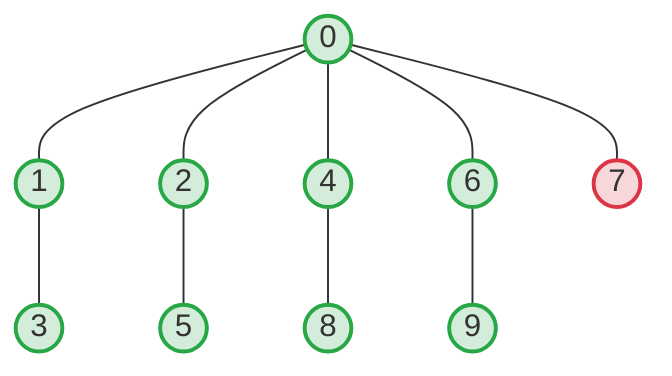

[[TOC]]

## 形式化题目

给定一棵包含 $n$ 个节点、$n-1$ 条无向边的无权树（节点编号 $0, 1, \dots, n-1$）。

定义树的最长简单路径长度为树的直径。若节点 $u$ 位于树的至少一条最长简单路径上，则称 $u$ 位于最长路径上。要求按节点编号升序输出所有位于最长路径上的节点编号。

> **图示说明**：上图为输入样例的树结构。直径为 $4$（如路径 $3 \to 1 \to 0 \to 2 \to 5$）。除了叶子节点 $7$ 到其他任意点的最长距离仅为 $3$ 外，其余 $9$ 个节点均在某条长度为 $4$ 的直径上。

## 正解

### 思路

#### 1. 判定条件的数学转化

设整棵树的直径长度为 $D$。

对于任意节点 $u$，经过 $u$ 的最长简单路径必然由从 $u$ 出发走向两个不同相邻分支的最长链拼接而成（若 $u$ 为端点，则仅有一条分支延伸；若 $n=1$，长度为 $0$）。

如果经过节点 $u$ 的最长简单路径长度等于全树直径 $D$，则意味着存在一条包含 $u$ 的路径长度达到 $D$，即 $u$ 位于某条最长路径上。反之，由于全树不存在长度大于 $D$ 的路径，若 $u$ 位于最长路径上，经过 $u$ 的最长路径长度必然恰好为 $D$。

因此，问题转化为：**计算每个节点 $u$ 经过两个不同邻居分支延伸出的最长简单路径长度，并判断其是否等于 $D$**。

#### 2. 两遍树形 DP（自底向上与自顶向下）

以节点 $0$ 为根将无向树转为有根树。对于每个节点 $u$，从它出发的路径方向分为两类：
1. **向下延伸（进入子树）**：
   - $d_1[u]$：以 $u$ 为起点在 $u$ 的子树内延伸的最长链长度。
   - $d_2[u]$：以 $u$ 为起点在 $u$ 的子树内、且与最长链不属于同一个直接子树分支的次长链长度。
   - $c_1[u]$：取得最长链 $d_1[u]$ 的子节点编号。
2. **向上延伸（进入父节点及祖先方向）**：
   - $up[u]$：从 $u$ 走向父节点并向树的其余部分延伸的最长链长度。

##### 第一遍：自底向上（计算 $d_1, d_2, c_1$）
利用 BFS 遍历得到拓扑分层序列 `order`，然后逆序遍历 `order`：
对每个节点 $u$ 及其子节点 $v$，令 $w = d_1[v] + 1$：
- 若 $w > d_1[u]$，则次长链更新为原最长链 $d_2[u] = d_1[u]$，最长链更新为 $d_1[u] = w$，并记录最优子分支 $c_1[u] = v$；
- 否则若 $w > d_2[u]$，则更新次长链 $d_2[u] = w$。

##### 第二遍：自顶向下（计算 $up$）
正序遍历拓扑序列 `order`，由父节点 $u$ 向各个子节点 $v$ 转移：
子节点 $v$ 向上延伸的最长链由两部分取最大值：
- 父节点继续向上延伸：$up[u] + 1$；
- 父节点拐入除 $v$ 以外的其他子树：
  - 若 $v = c_1[u]$（即 $v$ 本身是父节点向下最长链所在的子节点），则父节点只能使用次长链：$d_2[u] + 1$；
  - 否则，父节点可以使用最长链：$d_1[u] + 1$。

即状态转移方程为：
$$
up[v] = \max\Big(up[u] + 1,\, (d_2[u] \text{ if } c_1[u] = v \text{ else } d_1[u]) + 1\Big)
$$

#### 3. 直径与经过节点的最长路径计算

- **全树直径**：
  $$
  D = \max_{0 \leqslant u < n} (d_1[u] + up[u])
  $$
- **经过节点 $u$ 的最长路径**：
  从 $u$ 相邻的所有可能分支中取最长的两条：
  向下最长链为 $d_1[u]$；第二长链可能来自向上祖先方向 $up[u]$，也可能来自另一子树分支 $d_2[u]$。
  两项之和即为：
  $$
  d_1[u] + \max(up[u],\, d_2[u])
  $$
- **收集答案**：
  检查所有满足 $d_1[u] + \max(up[u],\, d_2[u]) = D$ 的节点 $u$，按 $0$ 到 $n-1$ 的自然升序收集并输出即可。

### 代码

@include-code(./main.py, python)

### 复杂度

- **时间复杂度**：$\mathcal{O}(n)$。BFS 序列获取、自底向上扫描与自顶向下扫描每个节点和每条边均被常数次访问，避免了递归函数调用的栈开销与深度限制。
- **空间复杂度**：$\mathcal{O}(n)$。邻接表和 DP 数组长度均为 $n$，在 $n = 2 \times 10^5$ 时内存占用约 $70\text{ MB}$，完全在评测机限制内。

## 总结

本题利用了树的直径与简单路径的局部特征：**经过一个节点的最长简单路径，等于从该节点出发向两个不同相邻分支延伸的最大长度之和**。

借助经典的换根树形 DP 技术，自底向上维护子树最长/次长链，自顶向下转移补图向上最长链，仅用两次线性遍历就求出了全部节点在所有方向上的极值链长，实现了 $\mathcal{O}(n)$ 的最优时间复杂度。
