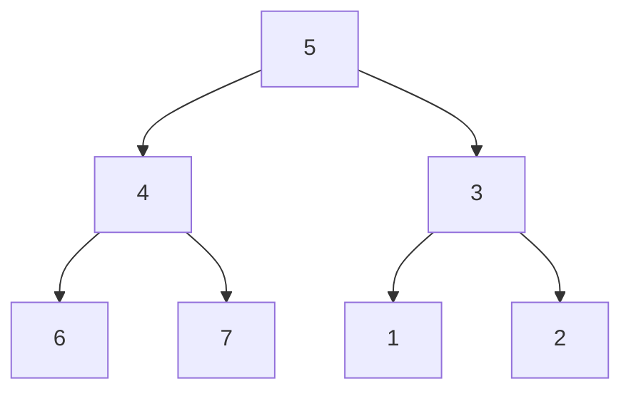

[[TOC]]

## 形式化题目

$N$ 个节点编号 $1..N$，构成一棵以校长为根的有根树；节点 $i$ 带一个可正可负的权值 $p_i$（欢乐度）。选出一个节点集合，要求集合中不含任何一条父子边，求权和的最大值。

样例 $N=7$、全员欢乐度 $1$；关系行 `L K`（$K$ 是 $L$ 的直接上司）读成下图——5 是校长，3 和 4 是中层，1、2、6、7 是基层：

选 $\{1,2,5,6,7\}$：选了校长 5 就不能再选其直接下属 3、4，其余节点互不为父子，欢乐度 $5 \times 1 = 5$。而不含父子边的名单最多容纳 5 个节点（选 3、4 就不能选 5，且选了 3 就要丢 1、2），故输出 $5$。

## 正解

### 思路

**朴素做法。** 枚举全部 $2^N$ 个名单，逐个检查是否含父子对、取最大和。本题 $N \leqslant 6000$，$2^{6000}$ 毫无希望；把树当成 $N$ 个互不相关的 0/1 变量去搜索，也还是指数级。

**关键观察。** 约束只发生在父子之间：兄弟、堂兄弟互不影响；而且 $u$ 的子树内部怎么选，外界唯一能感知的信息就是"$u$ 自己来没来"——

- $u$ 不来：每个孩子 $v$ 的子树自由选/不选（各自内部仍合法）；
- $u$ 来了：所有直接孩子必须都不来，但孩子的孩子恢复自由。

也就是说，子树只通过"根来不来"这**一位信息**与外界耦合。于是按"孩子先于父亲"的顺序自底向上合并，每个节点只需保留两个值：

$$dp0[u] = u\text{ 不参加时，}u\text{ 子树的最大欢乐度}, \qquad dp1[u] = u\text{ 参加时，}u\text{ 子树的最大欢乐度}$$

设 $v$ 遍历 $u$ 的直接下属，转移只有两条：

- $u$ 不来，下属随意：$dp0[u] = \sum_v \max(dp0[v], dp1[v])$；
- $u$ 来了，下属都不能来：$dp1[u] = p_u + \sum_v dp0[v]$。

**正确性。** 对子树大小归纳：叶子处 $dp0=0$、$dp1=p_u$ 显然最优；若每个孩子的两值都已是各自子树最优，则"$u$ 来 / 不来"两种情形恰好穷尽该子树的全部合法方案（约束只在父子边），按上面两式独立合并各孩子即得该情形最优，取大即 $u$ 子树最优。根处取大 $\max(dp0[\text{root}], dp1[\text{root}])$ 就是答案。

**遍历顺序。** 递归天然后序，但链深可达 6000，会撞上 Python 默认递归深度限制，因此改成迭代：先做一遍"父先于子"的遍历收集 `order`（`for u in order: order += children[u]`，列表边遍历边变长），再 `reversed(order)` 倒着合并，孩子必然先算完。树根用"从没当过下属的人"识别，$N=1$ 无关系行时也成立。

下表按后序展示样例两列 DP 每一格的来源（行 = 计算顺序，列 = 两种状态与合并依据，单元格 = 该节点该状态下的子树最优欢乐度）：

| 计算顺序 | 节点 $u$ | $dp0[u]$（$u$ 不来） | $dp1[u]$（$u$ 来） | 合并依据 |
| --- | --- | --- | --- | --- |
| 1 | 1 | 0 | 1 | 叶子没有下属：不来为 0，来拿 $p_1=1$ |
| 2 | 2 | 0 | 1 | 同叶子 |
| 3 | 6 | 0 | 1 | 同叶子 |
| 4 | 7 | 0 | 1 | 同叶子 |
| 5 | 3 | 2 | 1 | $dp0=\max(0,1)+\max(0,1)=2$；$dp1=1+0+0$ |
| 6 | 4 | 2 | 1 | 与节点 3 完全对称 |
| 7 | 5 | 4 | 5 | $dp0=2+2=4$；$dp1=1+dp0[4]+dp0[3]=5$ |

注意最后两列的对比：根**不来**时可以收下 1、2、6、7 得 4，根**来了**虽然要放弃 3、4 却保住了自己与四个基层得 5，答案 $\max(4,5)=5$。负权也不会出错——$dp0$ 从不小于 0，全员欢乐度为负时 `max` 自然取到空名单的 0。

### 代码

@include-code(./main.py, python)

### 复杂度

- 时间复杂度：$O(N)$。收集遍历序访问每个节点一次，合并阶段每条父子边恰好处理一次（共 $N-1$ 条），读入 $O(N)$。
- 空间复杂度：$O(N)$。欢乐度数组、邻接表、遍历序与两个 DP 数组各存线性规模。

## 总结

- "相邻两节点不能同时选 + 结构是树"就是树形 DP 的标准信号：每个节点记**选/不选**两个状态，$O(1)$ 合并。
- 状态合并顺序由树的依赖决定：孩子先于父亲（后序），父先于子的遍历序倒过来就是后序。
- 欢乐度可负时，让"不选"状态从 0 起步，答案天然涵盖空名单，不需要特判。
- Python 写树形 DP 用迭代后序代替递归，链深 6000 也不会爆栈。
