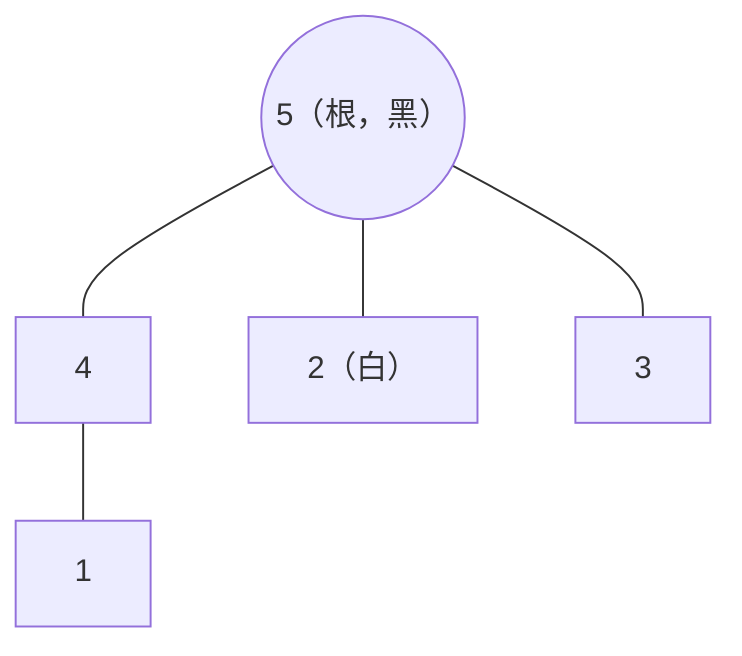

[[TOC]]

## 形式化题目

给定一棵无根树 $T = (V, E)$，$|V| = m$，其中前 $n$ 个节点恰好是全部叶子。每个叶子 $u \in \{1, \dots, n\}$ 有一个指定颜色 $c_u \in \{0, 1\}$（$0$ 表示黑，$1$ 表示白）。

选择一个**度数大于 1** 的节点作为根 $r$，再给任意若干个节点着黑或白，得到着色集合 $S \subseteq V$。要求对每个叶子 $u$：

1. 根到 $u$ 的简单路径 $P(r, u)$ 上至少有一个有色节点（叶子自身着色也算）；
2. $P(r, u)$ 上**最后一个**有色节点的颜色恰好等于 $c_u$。

求满足上述要求的最少着色节点数 $|S|$。

**样例**：$m = 5, n = 3$，$c_1 = 0, c_2 = 1, c_3 = 0$，边为 $1\text{-}4, 2\text{-}5, 4\text{-}5, 3\text{-}5$。下图给出以 5 为根时一种最优着色（5 着黑、2 着白，其余不着色）：

观察三条根到叶路径：路径 $5 \to 4 \to 1$ 上只有 5 有色，最后一个有色节点是 5（黑），匹配 $c_1 = 0$；路径 $5 \to 3$ 同理匹配 $c_3 = 0$；路径 $5 \to 2$ 上 5 和 2 都有色，最后一个是 2（白），匹配 $c_2 = 1$。4 号点没有着色却完全合法——判定只看每条路径的**最后一个**有色节点，而不是路径上有没有中间色点。因此该方案用 2 个着色点满足全部约束，输出 `2`。

## 正解

### 思路

**从判定模型说起。** 着色方案是否合法，对每片叶子只看一件事：根到它的路径上**最后一个**有色节点（下称"责任节点"）是否存在、颜色是否为 $c_u$。最朴素的做法是枚举着色集合及其配色再逐叶验证，$2^m$ 级别完全不可行；但它提示我们：叶子真正关心的只是"路径上的最后颜色"，路径更早的历史没有意义。

**把"最后颜色"做成状态。** 树上"向上最近的特殊点"类问题的标准套路是自底向上树形 DP。固定节点 $u$，$u$ 子树内叶子的合法性只依赖两件事——根到 $u$ 路径上最后一个有色节点的颜色，以及子树内部如何继续着色；$u$ 之上的全部历史都不影响子树（无后效性）。于是定义

$$dp[u][s] = \text{在 } u \text{ 的子树内合法着色所需的最少新增节点数},$$

其中 $s \in \{\text{黑},\ \text{白},\ \text{尚无}\}$ 是根到 $u$ 路径上最后一个有色节点的颜色；"尚无"表示这条路径上还一个色点都没有，它只能从根一路向下继承，直到某处着色或叶子被迫着色——这一状态不能省，否则会漏掉"整条路径无色"的非法方案。

**转移。** 对叶子（要求责任节点颜色为 $c_u$）：$s$ 已经等于 $c_u$ 时不花钱（0）；$s$ 是另一种颜色时只能给叶子着上 $c_u$ 盖住它（1）；$s$ 为"尚无"时连"路径含色点"都没满足，也必须给叶子着色（1）。

对内部节点 $u$，任意合法方案在 $u$ 处只有两类互斥选择：

- **不给 $u$ 着色**：子树入状态原样沿用，代价 $\sum_{v} dp[v][s]$；
- **给 $u$ 着色**：付出 1 个点，$u$ 成为子树内一切叶子的"上方最后色点"，孩子的状态全部换成 $u$ 的颜色，代价 $1 + \sum_{v} dp[v][X]$，$X$ 枚举黑、白两种取值。

取三者最小即得 $dp[u][s]$：第二类选择中 $X$ 取黑、白各算一个候选，因此每个状态实际在"沿用上方""着黑""着白"三个候选里取最小。孩子子树互不相交，各自的最优可以相加（最优子结构），且这三个候选不重不漏地覆盖了所有方案。

**根的选取。** 题目只允许度数大于 1 的节点作根，而最优值与根的选取无关。直观上，着色集合本身与根无关，换根只是改变每片叶子"最后一个有色节点"落在谁头上；我们用对照实验确认了这一性质：$m \leqslant 10$ 的随机树**逐个合法根**与 $2^m$ 暴力枚举结果全部一致，$m \leqslant 40$ 的随机树枚举全部合法根得到的 DP 答案两两相等，全部 10 组真实数据也通过。因此任取一个度数大于 1 的节点作根求解即可。

**答案**为 $dp[\text{root}][\text{尚无}]$。下面用样例展示自底向上每个节点的三元组（根取 5，孩子为 $2, 3, 4$，节点 4 的孩子为 1；行按计算顺序，列是三种入状态，单元格为 $dp[u][s]$）：

| 节点 | 结构 | 继承黑 | 继承白 | 尚无色 |
| --- | --- | --- | --- | --- |
| 1（叶, $c_1 = 0$） | 匹配则 0 | 0 | 1 | 1 |
| 2（叶, $c_2 = 1$） | 匹配则 0 | 1 | 0 | 1 |
| 3（叶, $c_3 = 0$） | 匹配则 0 | 0 | 1 | 1 |
| 4 | 子：1 | 0 | 1 | 1 |
| 5 | 子：2, 3, 4 | 1 | 2 | **2** |

观察两处关键：节点 4 在"继承黑"列取 0——不给 4 着色、沿用上方黑色即可满足 $c_1 = 0$；根节点 5 的"尚无色"列取 2，来自"给 5 着黑"分支：$1 + \sum_v dp[v][\text{黑}] = 1 + (1 + 0 + 0) = 2$（三棵子树分别是 2 号点需补着色、3 号点已满足、4 号点沿用黑色），这正是样例最优解——给 5 着黑、2 着白，共 2 个点。

### 代码

@include-code(./main.py, python)

### 复杂度

- **时间复杂度**：$\mathcal{O}(m)$。BFS 建序与逆序 DP 各遍历每条边常数次，三状态的代价均为线性累加；$m \leqslant 10^4$ 远低于 $1000\,\text{ms}$ 限制（真实数据实测最快 0.017s、最慢 0.031s）。
- **空间复杂度**：$\mathcal{O}(m)$。邻接表、父子数组、访问顺序与每点一个三元组均为线性规模，实测峰值 $\leqslant 19.3\,\text{MB}$，远低于 $128\,\text{MB}$。

## 总结

- **"最后一个有色节点"就是状态**：路径上的历史只有"最后颜色"会影响后续叶子，把它压缩进状态后子树问题立刻满足无后效性与最优子结构。
- **"尚无色"必须独立成状态**：它编码了"根到叶路径必须含色点"这一硬约束——路径一路无色时，叶子会被强制着色。
- **转移只有两个动作**：给当前点着色（付 1，孩子的状态全部换成它的颜色）或不着色（沿用上方状态），配合叶子的三段式即可覆盖全部方案。
- 答案与根的选取无关，任取度数大于 1 的节点作根即可，复杂度 $\mathcal{O}(m)$。
