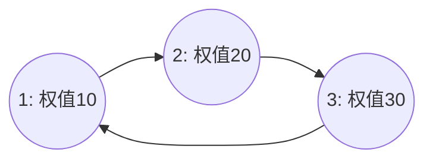

[[TOC]]

## 形式化题目

给定一个包含 $N$ 个顶点的有向图，每个顶点 $i$ 有一个正整数点权 $v_i$ 以及唯一的一条有向出边 $i \to h_i$（$h_i \neq i$）。

如果视所有的有向边为无向边，求该图的一个**最大权独立集**：选出一个顶点子集 $S$，使得对于图中的任意边 $(u, v)$，$u$ 和 $v$ 不同时属于 $S$，且 $\sum_{u \in S} v_u$ 最大。

## 正解

### 思路

#### 1. 问题建模与图的结构

每个骑士 $i$ 厌恶 $h_i$，即 $i$ 与 $h_i$ 之间不能同时被选入军团。在无向图的角度，这对应一条无向边 $(i, h_i)$。我们要选出一个点集，任意两点之间没有边相连，且点权和最大——这是经典的**最大权独立集问题**。

一般图的最大权独立集是 NP-hard 的，但本题给出的图具有特殊结构：每个顶点恰有一条出边，因此在无向图意义下，每个连通块的边数等于顶点数（$|V| = |E|$）。这样的连通块称为**基环树（内向基环树）**，整张图是由若干个基环树组成的**基环树森林**。不同连通块之间相互独立，总的最大战斗力等于各个连通块最大权独立集之和。

#### 2. 拓扑排序剪枝：收缩树枝

对于单一基环树连通块，它由一个核心的“简单环”以及挂在环上若干节点的“外向树枝”构成。

由于有向边是 $i \to h_i$（从树枝指向环），所有叶子节点的入度为 $0$。我们可以仿照拓扑排序（Kahn 算法）自底向上剥除所有树枝节点：
- 设 $f_0[u]$ 表示不选节点 $u$ 时，$u$ 子树内的最大点权和；$f_1[u]$ 表示选节点 $u$ 时，$u$ 子树内的最大点权和。初始 $f_0[u] = 0, f_1[u] = v_u$。
- 将所有入度为 $0$ 的节点加入队列；
- 每次取出队首节点 $u$，转移给它的唯一出边邻居 $p = h_i$：
  $$f_0[p] \leftarrow f_0[p] + \max(f_0[u], f_1[u])$$
  $$f_1[p] \leftarrow f_1[p] + f_0[u]$$
- 将 $p$ 的入度减 $1$。若 $p$ 的入度变为 $0$，则将其加入队列继续剪枝。

当拓扑排序结束时：
- 所有树枝上的节点均已完成树形 DP 并被移除；
- 剩下的入度大于 $0$ 的节点恰好构成该连通块的唯一简单环；
- 环上每个节点 $u$ 的 $f_0[u]$ 和 $f_1[u]$ 已经包含了挂在它上面的整棵树枝的最优贡献。

#### 3. 破环为链：环上的两次 DP

设环上的节点按拓扑出边顺序依次为 $c_0, c_1, \dots, c_{k-1}$，由于存在边 $(c_{k-1}, c_0)$，$c_0$ 与 $c_{k-1}$ 不能同时选。我们通过枚举 $c_0$ 的取舍破除环的环形后效性：

1. **方案 1：强制不选 $c_0$**
   - 初始化：$dp_0 = f_0[c_0], dp_1 = -\infty$；
   - 沿环递推 $i = 1, \dots, k-1$：
     $$dp'_0 = \max(dp_0, dp_1) + f_0[c_i]$$
     $$dp'_1 = dp_0 + f_1[c_i]$$
   - 递推结束后，由于 $c_0$ 未选，$c_{k-1}$ 可选可不选，该方案的最优值为 $\max(dp_0, dp_1)$。

2. **方案 2：强制选 $c_0$**
   - 初始化：$dp_0 = -\infty, dp_1 = f_1[c_0]$；
   - 沿环同样规则递推到 $c_{k-1}$；
   - 递推结束后，由于 $c_0$ 已经被选，$c_{k-1}$ 绝对不能选，故该方案的最优值为 $dp_0$。

该环连通块的最大权独立集即为 $\max(\text{方案1最优值}, \text{方案2最优值})$。遍历所有连通块将结果累加，即可得到全局答案。

### 代码

@include-code(./main.py, python)

### 复杂度

- **时间复杂度**：$\mathcal{O}(N)$。每个节点在拓扑排序中入队与出队至多一次；所有环上的节点被遍历两次用于破环 DP，常数极小，能在线性时间内快速处理 $N = 10^6$。
- **空间复杂度**：$\mathcal{O}(N)$。需要存储图的指向数组、度数数组及 DP 状态数组，占用线性内存。

## 总结

- **基环树标准套路**：对于每个点恰好一条出边的函数图（基环树森林），利用拓扑排序“剥叶子”可以在避免显式建反向邻接表的同时，自然地完成外向树枝的自底向上树形 DP。
- **破环为链**：环上的冲突限制只需针对一个关键基准点讨论其“选”与“不选”两种互斥状态，即可彻底拆解环的循环依赖，退化为两遍标准的线性序列 DP。

## 图示解析

这张图展示了基环树最大权独立集的求解脉络：

```text
基环树森林 (每个节点一条出边)
|- 拓扑排序剪枝
|  `- 从入度为 0 的叶子自底向上做树形 DP
|     `- 树枝贡献完全收缩到环上节点 (f0, f1)
`- 环上破环两次 DP
   |- 方案 1: 强制不选起点 c0 -> 终点 ck-1 可选可不选
   |- 方案 2: 强制选起点 c0   -> 终点 ck-1 强制不选
   `- 取两方案较大值，累加每个连通块的答案
```

### 样例 1 结构示意

输入数据构建的关系如下：
$1 \to 2$（1 厌恶 2），$2 \to 3$（2 厌恶 3），$3 \to 1$（3 厌恶 1）。
三个节点构成一个长度为 3 的简单环：



- 若选 3，则 1 和 2 均不能选，收益为 30；
- 若选 2，则 3 和 1 均不能选，收益为 20；
- 若选 1，则 2 和 3 均不能选，收益为 10；
最优解为选 3，最大战斗力为 30。
