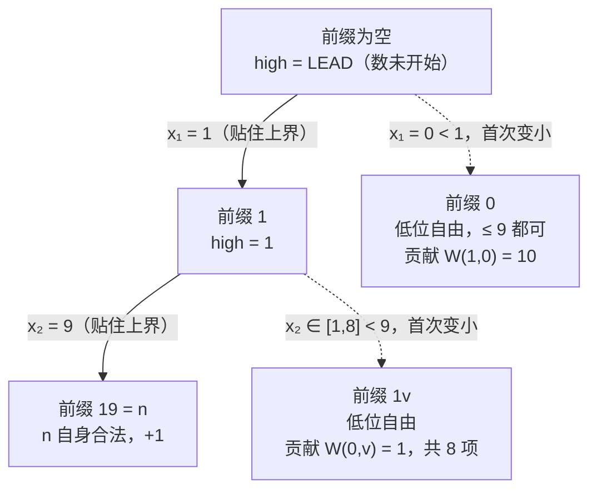

[[TOC]]

## 形式化题目

一个正整数是**不降数**，当且仅当把它写成十进制串 $d_1 d_2 \dots d_k$（$d_1 \neq 0$）后，从左到右每一位都不小于前一位，即

$$d_1 \leqslant d_2 \leqslant \dots \leqslant d_k .$$

给定 $a, b$（$1 \leqslant a \leqslant b \leqslant 2^{31} - 1$），求 $[a, b]$ 中不降数的个数。输入有多组，每组一行两个整数，读到文件结束；每组输出一行答案。

**样例**：`1 9` 输出 `9`，`1 19` 输出 `18`。

- `1 9`：一位数 $1 \sim 9$ 全部符合，共 $9$ 个。
- `1 19`：在 $1 \sim 9$ 的 $9$ 个之外，两位的 $11, 12, \dots, 19$ 也都满足 $1 \leqslant$ 个位，共 $9$ 个，合计 $18$。

注意 $10$ 不是不降数（$1 > 0$），$20$、$110$ 也都不是。

## 正解

### 思路

**朴素做法与它的瓶颈。** 最直接的想法是从 $a$ 枚举到 $b$，对每个数把数位串排序后与原串比较。复杂度 $O\big((b-a)\log b\big)$，而 $b - a$ 最大接近 $2 \times 10^9$，必然超时。瓶颈在于**逐个枚举数字**：相邻两个数是否不降几乎无关（$123$ 是，$130$ 就不是），枚举过程中攒不出可跳过的增量信息。

换个角度看，"不降"只约束**相邻两位**，是一个纯数位性质。而 $[0, n]$ 中的数完全由"前 $i$ 位是什么、第 $i+1$ 位起是否还贴着上界"决定。于是把枚举单位从"数字"改成"数位前缀"。

**第一步：区间拆成两个前缀计数。** 记

$$F(n) = \#\{x \in [0, n] : x \text{ 是不降数}\},$$

则答案为

$$F(b) - F(a-1).$$

**第二步：把 $[0, n]$ 按"首次小于上界的位置"分类。** 设 $n$ 的数位为 $d_1 d_2 \dots d_k$。任何与 $n$ 位数相同且小于 $n$ 的 $x$，都存在**唯一**的位置 $i$，使得前 $i-1$ 位与 $n$ 完全相同，而第 $i$ 位 $x_i < d_i$。

对固定位置 $i$，设 $r = k - i$ 是它后面还剩的位数，$\ell$ 是**上一位的数字**（若前面全是前导零则令 $\ell = 0$）：

- 分支要求 $x_i = v$ 且 $v \geqslant \ell$（否则前缀就已违反不降，这些 $v$ 直接不合法），所以 $v \in [\ell,\ d_i - 1]$；
- 由于 $v < d_i$ 已经把 $x$ 压到 $n$ 以下，**后 $r$ 位不再受上界约束**，只需非降且每位 $\geqslant v$。

这一段的数量记作 $W(r, v)$，于是第 $i$ 位贡献 $\sum_{v=\ell}^{d_i-1} W(r, v)$。

**第三步：前导零让长短不一的数自动纳入。** $F(n)$ 还要统计位数比 $n$ 少的数（$n = 150$ 时的 $1 \sim 99$）。技巧是把**前导零也当成数位**：从最高位开始扫描时，只要前面全是 $0$ 就认为"这个数还没开始"，此时令 $\ell = 0$ 而不是沿用上一位的 $0$。这样在位置 $i$ 取 $v = 0$ 就恰好代表"更短的数 / 数还没开始"，短位数被自动计入，无需额外枚举。代码里用哨兵 `LEAD = 10` 表示"上一位不存在"，避免和合法数位 $0 \sim 9$ 混淆。

**第四步：自由段的闭式解。** $W(r, \ell)$ 是"从 $\ell, \ell+1, \dots, 9$ 这 $10 - \ell$ 种数字里，可重复地取 $r$ 个组成非降序列"的方案数。这不就是隔板法吗——把 $r$ 个取值和 $9 - \ell$ 块隔板排成一列，选出 $r$ 个位置当取值即可：

$$W(r, \ell) = \binom{r + 9 - \ell}{r}.$$

代码不必真去算组合数，按 $r$ 递推更省事：

$$W(0, \ell) = 1, \qquad W(r, \ell) = W(r-1, \ell) \cdot \frac{r + 9 - \ell}{r}.$$

因为 $W(r-1,\ell) \cdot (r + 9 - \ell)$ 恰好是 $\binom{r+9-\ell}{r}$ 的 $r$ 倍，整除总成立，用整数运算无精度问题。递推用 `@cache` 记忆化，状态只有 $r \leqslant 10$、$\ell \leqslant 10$ 共百余个。

**第五步：若 $n$ 自身在某一断裂掉。** 沿主链走时若发现 $d_i < \ell$，说明 $n$ 的前 $i$ 位已经不是不降前缀，后面不存在任何合法分支，可以**立即返回**；此时 $n$ 自己也不是不降数，不加最后那 $1$。若走完全程都合法，说明 $n$ 本身是不降数，答案再 $+1$。

**以 $n = 19$ 为例逐位累加**（`count_upto(19)`，数位 `[1, 9]`；列的含义：`i` 是位置、`cur` 是 $n$ 在该位的数字、`rest` 是剩下位数、候选 `v` 与它们的 $W$ 值）：

| $i$ | `cur` | `rest` | 允许的 $v$ | 各项 $W(\text{rest}, v)$ | 本行小计 |
| --- | --- | --- | --- | --- | --- |
| 0 | 1 | 1 | 0 | $W(1,0) = 10$ | 10 |
| 1 | 9 | 0 | 1, 2, …, 8 | $W(0,v) = 1$ 共 8 项 | 8 |

两行都走完后 $n$ 自身合法，再 $+1$：$F(19) = 10 + 8 + 1 = 19$。而 $F(0) = 1$，故 $[1, 19]$ 得 $19 - 1 = 18$，与样例一致。第一行的 $W(1,0) = 10$ 正是"$0 \sim 9$ 开头、后面随便填一位"的那批数，也就是一位数 $0 \sim 9$ 本身——前导零分支一次性覆盖了它们。

下图展示"贴着上界"的主链与每个位置挂出去的分支（以 $n = 19$ 为例）：

粗看这张图可以得到两点：**实线只有一条**（贴着上界走的主链），这正是逐位扫描的循环；**虚线是从主链节点挂出去的子树**，每棵子树内低位完全自由，因而能用闭式 $W$ 一次算完，不必递归展开。所谓"数位 DP 的记忆化"在这里被压缩成了 $O(1)$ 的组合数——这也是本解与记忆化搜索写法复杂度同阶、常数却更小的原因。

### 代码

@include-code(./main.py, python)

### 复杂度

设 $n$ 的位数为 $k \leqslant 10$，数据组数为 $T$。

- **时间复杂度**：$O(Tk)$。`count_upto` 的主循环 $k$ 次，每次至多求和 $10$ 项，而每项 `ways(r, v)` 在 `@cache` 下摊还 $O(1)$（`r` 和 `low` 都至多取 $11$ 种值，状态总数有常数上界 $121$；实测 $n = 2^{31}-1$ 时只生成 $20$ 项）。参考实现 `12.cpp` 的记忆化数位 DP 状态 $O(10k)$、转移 $O(10)$，量级相同；本解把自由段用组合闭式一次结清，常数更小。$k \leqslant 10$ 意味着每组数据只有几十次基本运算，$1000\,\text{ms}$ 绰绰有余（12 组真实数据实测 0.017 s）。
- **空间复杂度**：$O(1)$。`@cache` 的条目数有常数上界，加上 $O(k)$ 的数位表与输出缓冲，实测峰值 14.7 MB，远低于 $128\,\text{MB}$。

## 总结

- **数位性质就按位处理**：区间计数先差分成 $F(b) - F(a-1)$，再把 $[0, n]$ 按"第 $i$ 位首次小于上界"唯一分类，做到不重不漏。
- **一旦某位变小，低位就彻底自由**：自由段的约束只剩"非降且不小于该位"，由隔板法得闭式 $W(r,\ell) = \binom{r+9-\ell}{r}$，$O(1)$ 结清——这是把记忆化搜索压成组合计数的关键。
- **前导零是"数还没开始"的标记**：用哨兵 `LEAD` 把它和真正的数位 $0$ 区分开，短位数就自动被覆盖，不必为每种长度单独统计。
- **断裂即停**：一旦 $d_i < \ell$，$n$ 自身与更深的链全部不合法，立即返回，同时决定是否补上 $+1$。
- 整体复杂度 $O(Tk)$，$k \leqslant 10$，Python 实测 0.017 s / 14.6 MB，稳定通过。
