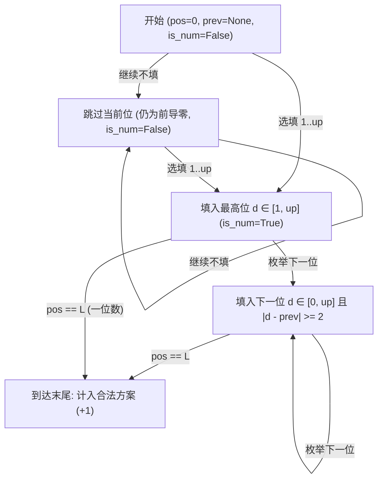

[[TOC]]

## 形式化题目

给定两个正整数 $A, B$（$1 \le A \le B \le 2 \times 10^9$），统计闭区间 $[A, B]$ 内有多少个正整数 $x$，其十进制表示 $x = \overline{d_k d_{k-1} \dots d_1}$ 满足：
1. 无前导零，即最高位 $d_k \ne 0$；
2. 任意相邻两个数位的绝对差至少为 $2$，即对所有 $1 \le i < k$，均有 $|d_{i+1} - d_i| \ge 2$。

## 数位 DP 解法

### 思路

根据区间计数的可减性，闭区间 $[A, B]$ 内的答案可以转化为前缀计数的差值：
$$
\text{ans}(A, B) = \text{count}(B) - \text{count}(A - 1)
$$
因此问题转化为：给定正整数 $n$，如何快速统计 $[1, n]$ 内所有满足条件的 Windy 数个数。

#### 1. 朴素枚举的瓶颈
若暴力枚举区间内的每一个整数并拆位验证，总次数可达 $O((B - A + 1) \log_{10} B)$。当 $B \approx 2 \times 10^9$ 时，运算量达到 $10^{10}$ 级别，远超 1 秒的时限。

#### 2. 数位 DP 建模
一个数字是否为 Windy 数，只由其从高位到低位的连续数字决定，且仅依赖相邻上一位所填的数字。这具有极强的无后效性与重复子结构特征。

我们采用记忆化搜索从高位到低位依次确定数位，设计状态函数：
$$
\text{dfs}(\text{pos}, \text{prev}, \text{is\_limit}, \text{is\_num})
$$
各参数含义如下：
- $\text{pos}$：当前正考虑填第 $\text{pos}$ 位（从左到右，从最高位 $0$ 到最低位 $L-1$）；
- $\text{prev}$：前一位所填的具体数字（若尚未开始填入有效最高位，则设为 $\text{None}$）；
- $\text{is\_limit}$：布尔值，表示前面已填的数位是否都紧贴上限 $n$。若为真，则当前位至多只能填到 $n$ 的当前位数值；若为假，则可自由填 $0 \sim 9$；
- $\text{is\_num}$：布尔值，表示前面是否已经填入过非零数字（即是否已经跳过了前导零阶段）。

#### 3. 状态转移与决策
根据是否已经进入有效数字阶段分两种情况转移：
1. **尚未填入有效数字（$\text{is\_num} = \text{False}$）**：
   - 可以继续跳过当前位，保持前导零：递归至 $\text{dfs}(\text{pos} + 1, \text{None}, \text{False}, \text{False})$；
   - 可以在当前位填入首个非零数字 $d \in [1, \text{up}]$，作为数字的最高位：递归至 $\text{dfs}(\text{pos} + 1, d, \text{is\_limit} \land (d = \text{up}), \text{True})$。
2. **已经填入有效数字（$\text{is\_num} = \text{True}$）**：
   - 枚举当前位数字 $d \in [0, \text{up}]$；
   - 检查相邻约束：仅当 $|d - \text{prev}| \ge 2$ 时才为合法转移，递归至 $\text{dfs}(\text{pos} + 1, d, \text{is\_limit} \land (d = \text{up}), \text{True})$。

#### 4. 转移过程可视化
以下展示在填数字时，前导零状态与有效数字状态之间的流转逻辑：

### 代码

@include-code(./main.py, python)

### 复杂度

- **时间复杂度**：数字长度 $L = \lfloor \log_{10} B \rfloor + 1 \le 10$。状态四元组 $(\text{pos}, \text{prev}, \text{is\_limit}, \text{is\_num})$ 的不同组合数不超过 $10 \times 11 \times 2 \times 2 = 440$ 个，每次转移仅需枚举 $0 \sim 9$ 共 10 个数字。总操作次数在 $10^3 \sim 10^4$ 级别，运行时间 $< 20\text{ ms}$，远低于 $1000\text{ ms}$。
- **空间复杂度**：递归深度至多为 $L \le 10$，记忆化哈希缓存最多容纳数百个键值对，额外空间开销 $< 1\text{ MB}$，远低于 $128\text{ MB}$。

## 总结

Windy 数是数位 DP 的经典问题。解决此类问题的关键结构是：
1. 用前缀差分 $[A, B] \to [1, B] - [1, A - 1]$ 消除双侧边界约束；
2. 采用记忆化搜索（DFS）自顶向下逐位确定数位，借助 `is_limit` 控制上界，借助 `is_num` 精确处理前导零与数字长度变化；
3. 将上一位的数字作为 `prev` 传入状态，完美刻画相邻位差值不小于 2 的局部合法性。
