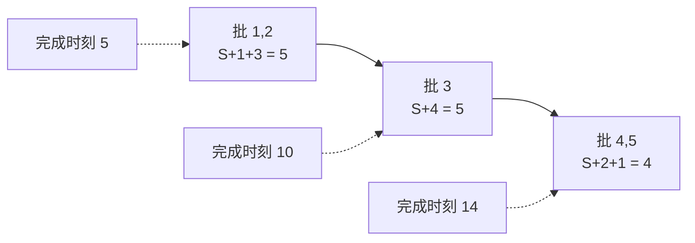

[[TOC]]

## 形式化题目

$N$ 个任务排成固定序列，顺序不可变，只能把它们切成若干段**连续**的批。每批开始前机器要付出固定启动时间 $S$，批的耗时 = $S$ + 批内各任务耗时之和；批内任务在该批**全部执行完毕的同一时刻**完成。任务 $i$ 的费用 = 它的完成时刻 $\times$ 费用系数 $C_i$，求所有任务的最小总费用。

形式化地：设划分点 $0 = b_0 < b_1 < \dots < b_k = N$，第 $r$ 批为 $(b_{r-1}, b_r]$，任务 $i$ 的完成时刻是它所在批及之前所有批的耗时之和，目标是 $\min \sum_{i=1}^{N} C_i \cdot \text{finish}(i)$。

样例的最优方案是 $\{1,2\},\{3\},\{4,5\}$：完成时刻 $\{5,5,10,14,14\}$，总费用 $5\times3+5\times2+10\times3+14\times3+14\times4 = 153$。

## 正解

### 思路

**朴素想法与瓶颈。** 最自然的 DP 是设 $f[i]$ = 前 $i$ 个任务的最小费用、枚举最后一段 $(j,i]$，但转移要用"前 $j$ 个任务跑完的时刻"，而它取决于前 $j$ 个任务**怎么分批**：同一个 $j$ 对应多种完成时刻，一个 $f[j]$ 数值记不下；把时刻并入状态又会维数爆炸。卡点在于每批的 $S$ 不只推迟本批任务，还推迟它后面**所有**批次任务的完成时刻——这是跨段的全局耦合，正着按"完成时刻"算就必须知道未来。

下图展示样例三条批的时间线，观察完成时刻如何逐批累加、前批的耗时被后批任务共享：

批 1 的 $5$ 同时出现在任务 3、4、5 的完成时刻里，正说明"一批的耗时会被它之后的所有任务共享"。

**换一种记账方式。** 把总费用按**批**分组（交换求和次序）：批 $b$ 的 $(S+\sum T)$ 出现在它自己及之后每一批的完成时刻中，被这些批里任务的 $C_i$ 各加一次，于是

$$\sum_i C_i\cdot\text{finish}(i) \;=\; \sum_{\text{批 } b=(j,i]} \big(S + \textstyle\sum T\big)_{(j,i]} \times \sum_{k=j+1}^{N} C_k .$$

批 $(j,i]$ 的贡献 = $(S + \text{该批时间和}) \times (j \text{ 之后所有任务的} C \text{ 之和})$，两项只依赖前缀和，$O(1)$ 可算。这样每批的账在切它时一次记清，"影响未来"的耦合随记账方式的改变消失了，DP 重新获得无后效性。

**DP 定义。** 用前缀和 $\mathrm{preT}[i]=\sum_{k\le i} T_k$、$\mathrm{preC}[i]=\sum_{k\le i} C_k$（下标 0 处为 0），$f[i]$ = 前 $i$ 个任务分批的最小总费用，$f[0]=0$：

$$f[i] = \min_{0 \leqslant j < i} \Big\{\, f[j] + \big(S + \mathrm{preT}[i]-\mathrm{preT}[j]\big) \times \big(\mathrm{preC}[N]-\mathrm{preC}[j]\big) \Big\}.$$

下表是样例（$N=5,\ S=1$）的完整转移过程：行 = 右端点 $i$，列 = 枚举的切点 $j$，单元格 = 该切点的转移值，末列 $f[i]$ 取行内最小值。

| 行 $i$ ↓ / 列 $j$ → | 0 | 1 | 2 | 3 | 4 | $f[i]$（取到最小的 $j$） |
| --- | --- | --- | --- | --- | --- | --- |
| 1 | 30 | — | — | — | — | 30（$j=0$） |
| 2 | 75 | 78 | — | — | — | 75（$j=0$） |
| 3 | 135 | 126 | 125 | — | — | 125（$j=2$） |
| 4 | 165 | 150 | 145 | 146 | — | 145（$j=2$） |
| 5 | 180 | 162 | 155 | 153 | 153 | 153（$j=3$ 或 $j=4$） |

注意 $j=0$ 表示"整个前缀一批打完"；$i=5$ 时 $j=3$ 对应样例方案 $\{1,2\},\{3\},\{4,5\}$，$j=4$ 对应 $\{1,2\},\{3,4\},\{5\}$，两者同为最优 153，说明多个划分可以共享同一最优值。最后一批之后没有任务，$\mathrm{preC}[N]-\mathrm{preC}[j]$ 恰是真实后缀，记账值等于真实费用，故 $f[N]$ 就是答案。

### 代码

@include-code(./main.py, python)

### 复杂度

- 时间复杂度：前缀和 $O(N)$，DP 双层枚举 $O(N^2)$；$N \leqslant 5000$ 时约 $1.25\times10^7$ 次 $O(1)$ 转移，与标准 C++ 解法同阶。
- 空间复杂度：两条前缀和 + 一个 `f` 数组，$O(N)$。
- 费用可达约 $2.5\times10^{11}$，超过 32 位整数；Python `int` 任意精度，无需额外处理。

## 总结

- 顺序固定 + 连续分批，是标准的区间划分 DP 结构；难点只在启动费 $S$ 的跨段耦合。
- 用交换求和次序把"每批影响未来"改写成"每批乘以它之后的 $C$ 后缀和"，耦合在记账层面消失，转移量全部前缀和化。
- 朴素的"完成时刻入状态"不可行，是因为完成时刻依赖前缀的**具体划分**而非仅依赖 $j$；换记账后状态只需 $j$ 这一个切点。
- $O(N^2)$ 即为本题正解量级，$N \leqslant 5000$ 下不需要斜率优化。
